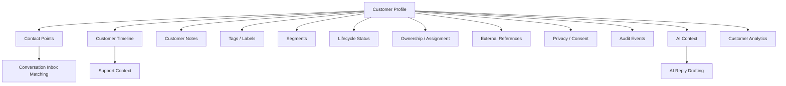

# PART-04 — Customer CRM

> *"Customer CRM is the memory layer for business relationships."*

---

# Purpose

Part IV defines CLARA's Customer CRM product domain.

It explains:

- Customer profile.
- Contact points.
- Customer timeline.
- Customer notes.
- Tags and labels.
- Segments.
- Customer lifecycle.
- Customer ownership and assignment.
- Search and filtering.
- Import and export.
- Duplicate customers and merge behavior.
- External references.
- Privacy and consent.
- Audit behavior.
- AI customer context.
- Customer analytics.
- MVP CRM scope.

---

# Why This Part Matters

Customer CRM is the foundation for:

- Conversation identity.
- Support context.
- Sales follow-up.
- Ticketing.
- AI reply drafting.
- Customer timeline.
- Analytics.
- Workflow automation.
- Integration sync.

Without Customer CRM, CLARA would have messages and tickets without reliable customer context.

---

# Chapter Map

| Chapter | Title |
|---:|---|
| 41 | Customer CRM Overview |
| 42 | Customer Profile |
| 43 | Contact Points |
| 44 | Customer Timeline |
| 45 | Customer Notes |
| 46 | Customer Tags and Labels |
| 47 | Customer Segments |
| 48 | Customer Lifecycle |
| 49 | Customer Ownership and Assignment |
| 50 | Customer Search and Filtering |
| 51 | Customer Import |
| 52 | Customer Export |
| 53 | Duplicate Customers and Merge |
| 54 | External References |
| 55 | Customer Privacy and Consent |
| 56 | Customer Audit Behavior |
| 57 | Customer AI Context |
| 58 | Customer Analytics |
| 59 | MVP Customer CRM Scope |
| 60 | Part 04 Summary |

---

# Customer CRM Map



---

# Scope Rule

Customer records are Workspace-scoped by default.

Every customer-owned record should include:

```text
organization_id
workspace_id
customer_id
```

Cross-workspace visibility is not allowed by default unless the actor has explicit permission.

---

# Critical Security Rule

Customer CRM data must be treated as sensitive business data.

CLARA must enforce:

```text
Authentication
Authorization
Organization scope
Workspace scope
Resource ownership or visibility
Audit for sensitive actions
Privacy-aware export/import
```

---

# MVP Customer CRM Baseline

MVP Customer CRM should include:

```text
Customer list
Customer detail
Create customer
Update customer
Archive customer
Contact points
Notes
Tags
Timeline
Basic search
Workspace scope
Audit basics
AI-safe context for reply drafting
```

---

# Related Documents

- ../PART-01-Product-Vision-and-Scope/README.md
- ../PART-02-User-Roles-and-Permissions/README.md
- ../PART-03-Organization-and-Workspace/README.md
- ../../BOOK-03-Implementation-Architecture/PART-11-Product-Implementation-Architecture/211-Customer-CRM-Module.md
- ../../BOOK-03-Implementation-Architecture/PART-07-Security-Implementation/README.md

---

# Navigation

**Previous:** `../PART-03-Organization-and-Workspace/40-Part-03-Summary.md`

**Next:** `41-Customer-CRM-Overview.md`
