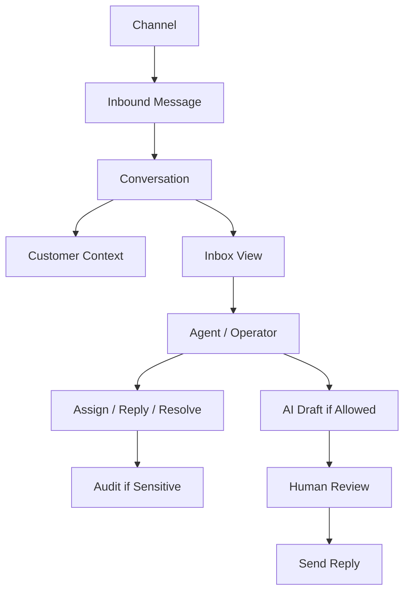
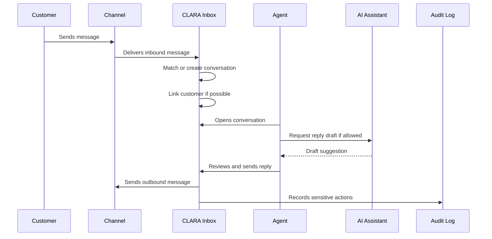

# Conversation Privacy and Retention

> *"Defines privacy and retention behavior for conversation and message data."*

---

# Purpose

Defines privacy and retention behavior for conversation and message data.

---

# User / Product Problem

Messages may contain PII, secrets, payment details, or sensitive customer context. Poor retention and access rules create risk.

---

# Product Decision

## Decision

CLARA should treat conversation content as sensitive customer communication and apply access, retention, redaction, and audit controls.

## Status

Accepted.

## Reason

- Centralizes customer communication.
- Gives agents and managers a clear operational queue.
- Links conversations to Customer CRM context.
- Supports AI reply drafting with human control.
- Creates a foundation for ticketing, automation, and analytics.
- Keeps communication access scoped and auditable.

## Product Trade-offs

| Direction | Benefit | Trade-off |
|---|---|---|
| Unified inbox | Less context switching | Requires channel normalization |
| Human-reviewed AI drafts | Safer customer communication | Less automation speed |
| Workspace-scoped conversations | Stronger privacy | Cross-workspace views need explicit permission |
| Simple status model first | Faster MVP | Less advanced workflow control |
| Manual assignment first | Easier to understand | Less automation than routing engine |

---

# Primary Users / Actors

- Admin
- Security Reviewer
- Support Agent

---

# Domain Objects

- Message Content
- PII
- Retention Policy
- Redaction
- Deletion Request
- Export Restriction

---

# Permission Baseline

| Permission | Meaning | Enforcement |
|---|---|---|
| `conversation_privacy:read` | Product action permission | Protected by backend authorization |
| `message:redact` | Product action permission | Protected by backend authorization |
| `conversation_export:create` | Product action permission | Protected by backend authorization |

---

# Product Flow

---

# Conversation Sequence

---

# MVP Behavior

MVP must minimize sensitive data exposure and restrict access by workspace and permission.

---

# Future Behavior

Future versions may support redaction, retention policy, legal hold, privacy request workflows, and compliance exports.

---

# Product Requirements

## Functional Requirements

- Conversations must belong to an Organization and Workspace.
- Messages must belong to a Conversation.
- Inbound and outbound message direction must be clear.
- Internal notes must be visually and structurally separate from customer-visible messages.
- Conversation customer link must be visible where known.
- Users must be able to filter conversations by basic operational state.
- Authorized users must be able to assign, reply, and resolve.
- AI draft must require human review before send in MVP.
- Sensitive actions must be auditable.

## Non-Functional Requirements

- Conversation list must be paginated.
- Message timeline must load predictably.
- Channel payloads must be normalized safely.
- Duplicate inbound messages must be prevented through idempotency.
- Message content must not be logged unsafely.
- Attachment handling must be secure if enabled.
- AI context must be scoped by permission and workspace.
- Search must not leak cross-workspace data.

---

# UX Expectations

- Users should clearly see conversation status.
- Users should clearly see customer context.
- Users should clearly see whether a message is internal or customer-visible.
- Users should clearly see if a reply is AI-generated draft.
- Users should have a safe confirmation path before sending sensitive replies where needed.
- Denied access should be explained safely.
- Conversation errors should be recoverable and understandable.

---

# Security and Privacy Considerations

- Do not expose conversations across Workspaces by default.
- Do not trust external channel payloads without validation.
- Do not send AI draft automatically in MVP.
- Do not allow reply without permission.
- Do not expose internal notes to customers.
- Do not allow attachment access without authorization.
- Do not log sensitive message content.
- Do audit reply, assignment, customer relink, status changes, and AI draft usage.

---

# Acceptance Criteria

- [ ] Conversation scope is defined.
- [ ] Message behavior is defined.
- [ ] Channel behavior is defined.
- [ ] Primary users are defined.
- [ ] Permissions are named.
- [ ] MVP behavior is clear.
- [ ] Future behavior is separated from MVP.
- [ ] Privacy concerns are documented.
- [ ] Audit behavior is considered.
- [ ] AI behavior is constrained where relevant.

---

# Anti-patterns

Avoid:

- Treating all messages as the same type.
- Mixing internal notes with customer-visible replies.
- Auto-sending AI responses in MVP.
- Allowing channel payloads to create trusted records without validation.
- Showing conversations across workspace boundaries without explicit permission.
- Adding many channels before one channel workflow is reliable.
- Building SLA automation before basic assignment and status work.
- Logging full message content in unsafe logs.

---

# Related Book III References

- ../../BOOK-03-Implementation-Architecture/PART-03-AI-Architecture/README.md
- ../../BOOK-03-Implementation-Architecture/PART-05-Integration-Architecture/README.md
- ../../BOOK-03-Implementation-Architecture/PART-07-Security-Implementation/README.md
- ../../BOOK-03-Implementation-Architecture/PART-11-Product-Implementation-Architecture/212-Conversation-Inbox-Module.md
- ../../BOOK-03-Implementation-Architecture/APPENDIX/APPENDIX-C-Security-Checklist.md

---

# Navigation

**Previous:** `77-Inbox-Analytics.md`

**Next:** `79-MVP-Conversations-Inbox-Scope.md`
