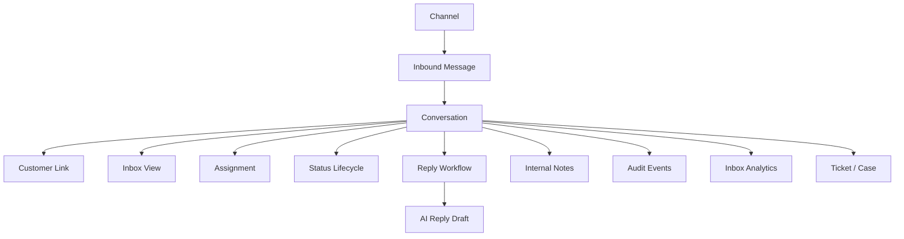

# PART-05 — Conversations and Inbox

> *"The inbox is where CLARA becomes daily operational work."*

---

# Purpose

Part V defines CLARA's Conversations and Inbox product domain.

It explains:

- Conversation model.
- Message model.
- Channel model.
- Inbox views.
- Conversation assignment.
- Conversation status lifecycle.
- Reply workflow.
- AI reply drafting.
- Internal notes.
- Customer linking.
- Attachments and media.
- Search and filters.
- SLA and priority.
- Audit behavior.
- Notifications.
- Inbox analytics.
- Privacy and retention.
- MVP scope.

---

# Why This Part Matters

Conversations and Inbox are core to CLARA because they connect:

- Customer CRM.
- Customer support.
- Sales follow-up.
- AI reply assistance.
- Knowledge base usage.
- Ticket creation.
- Workflow automation.
- Channel integrations.
- Analytics.

Without a clear inbox model, CLARA becomes a set of disconnected customer records and messages.

---

# Chapter Map

| Chapter | Title |
|---:|---|
| 61 | Conversations Inbox Overview |
| 62 | Conversation Model |
| 63 | Message Model |
| 64 | Channel Model |
| 65 | Inbox Views |
| 66 | Conversation Assignment |
| 67 | Conversation Status Lifecycle |
| 68 | Reply Workflow |
| 69 | AI Reply Drafting |
| 70 | Internal Notes |
| 71 | Conversation Customer Linking |
| 72 | Attachments and Media |
| 73 | Conversation Search and Filters |
| 74 | Conversation SLA and Priority |
| 75 | Conversation Audit Behavior |
| 76 | Conversation Notifications |
| 77 | Inbox Analytics |
| 78 | Conversation Privacy and Retention |
| 79 | MVP Conversations Inbox Scope |
| 80 | Part 05 Summary |

---

# Conversation Inbox Map



---

# Scope Rule

Conversation records are Workspace-scoped by default.

Every conversation-owned record should include:

```text
organization_id
workspace_id
conversation_id
customer_id when known
channel_id
```

---

# Critical Security Rule

CLARA must treat conversation content as sensitive customer communication.

Backend services must enforce:

```text
Authentication
Authorization
Organization scope
Workspace scope
Conversation visibility
Message visibility
Attachment access control
Audit for sensitive actions
```

---

# MVP Conversations Baseline

MVP should include:

```text
Conversation list
Conversation detail
Message timeline
Inbound message display
Outbound reply
Internal notes
Assignment
Open/resolved status
Customer link
Basic inbox filters
Workspace scope
Audit basics
Optional AI reply draft
```

---

# Related Documents

- ../PART-02-User-Roles-and-Permissions/README.md
- ../PART-03-Organization-and-Workspace/README.md
- ../PART-04-Customer-CRM/README.md
- ../../BOOK-03-Implementation-Architecture/PART-11-Product-Implementation-Architecture/212-Conversation-Inbox-Module.md
- ../../BOOK-03-Implementation-Architecture/PART-03-AI-Architecture/README.md
- ../../BOOK-03-Implementation-Architecture/PART-07-Security-Implementation/README.md

---

# Navigation

**Previous:** `../PART-04-Customer-CRM/60-Part-04-Summary.md`

**Next:** `61-Conversations-Inbox-Overview.md`
