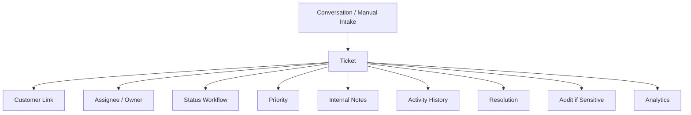
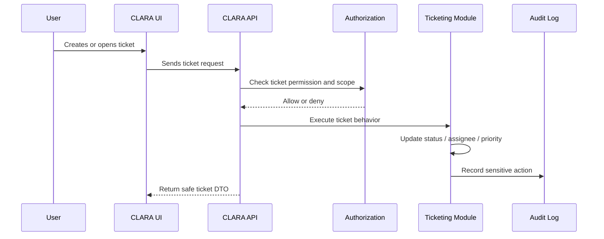

# Ticket Notes and Activity

> *"Defines the ticket activity stream, including notes, status changes, assignments, priority changes, and system events."*

---

# Purpose

Defines the ticket activity stream, including notes, status changes, assignments, priority changes, and system events.

---

# User / Product Problem

Teams need to understand what happened, who changed what, and why a ticket is in its current state.

---

# Product Decision

## Decision

CLARA Ticket Activity should provide a chronological history of important case actions.

## Status

Accepted.

## Reason

- Turns unresolved customer issues into trackable work.
- Creates clear ownership and responsibility.
- Connects support workflows to Customer CRM and Conversation Inbox.
- Supports manager visibility into backlog and resolution progress.
- Creates a foundation for Knowledge Base and Workflow Automation.
- Keeps sensitive customer support data auditable and permission-scoped.

## Product Trade-offs

| Direction | Benefit | Trade-off |
|---|---|---|
| Simple ticket workflow first | Faster MVP and easier adoption | Less flexibility than custom workflows |
| Internal tickets by default | Safer privacy posture | No customer portal in MVP |
| Manual assignment first | Clear responsibility | Less automation initially |
| Simple priority first | Easy for users | Less advanced SLA behavior |
| AI suggestions with review | Safer support assistance | Less automation speed |

---

# Primary Users / Actors

- Support Agent
- Manager
- Admin
- Auditor

---

# Domain Objects

- Activity Event
- Ticket Note
- Status Change
- Assignment Change
- Priority Change
- System Event

---

# Permission Baseline

| Permission | Meaning | Enforcement |
|---|---|---|
| `ticket_activity:read` | Product action permission | Protected by backend authorization |
| `ticket_note:create` | Product action permission | Protected by backend authorization |

---

# Product Flow

---

# Ticket Sequence

---

# MVP Behavior

MVP must show notes, status changes, assignment changes, and creation/resolution events.

---

# Future Behavior

Future versions may support filtering, pinned notes, activity export, and AI-generated activity summaries.

---

# Product Requirements

## Functional Requirements

- Tickets must belong to an Organization and Workspace.
- Tickets must link to a Customer.
- Tickets may link to a source Conversation.
- Users must be able to create tickets if authorized.
- Users must be able to assign tickets if authorized.
- Users must be able to update status if authorized.
- Users must be able to add internal notes.
- Ticket activity must preserve important state changes.
- Sensitive ticket actions must be auditable.
- Ticket list must support basic filters and pagination.

## Non-Functional Requirements

- Ticket list must be paginated.
- Ticket queries must be workspace-scoped.
- Ticket activity must be chronological and understandable.
- Ticket notes must not be exposed to customers unless explicitly designed.
- AI ticket assistance must use scoped context only.
- Ticket automation must be visible and auditable.
- SLA/priority behavior must be deterministic where used.
- Sensitive fields must not be logged unsafely.

---

# UX Expectations

- Users should clearly see ticket status.
- Users should clearly see ticket owner/assignee.
- Users should clearly see linked customer and conversation.
- Internal notes should be visually distinct.
- Priority should be understandable and not overly complex in MVP.
- Resolution action should ask for enough context to be useful.
- Denied access should be explained safely.
- AI-generated summaries or suggestions should be labeled.

---

# Security and Privacy Considerations

- Do not expose tickets across Workspace boundaries by default.
- Do not expose internal notes to customers.
- Do not allow ticket update without permission.
- Do not allow AI to summarize inaccessible tickets.
- Do not log sensitive ticket content.
- Audit assignment, status, priority, escalation, AI assistance, and resolution changes.
- Treat attachments as unsafe until validated if enabled.
- Restrict export or bulk access to elevated roles.

---

# Acceptance Criteria

- [ ] Ticket scope is defined.
- [ ] Ticket ownership behavior is defined.
- [ ] Status workflow is defined.
- [ ] Primary users are defined.
- [ ] Permissions are named.
- [ ] MVP behavior is clear.
- [ ] Future behavior is separated from MVP.
- [ ] Privacy concerns are documented.
- [ ] Audit behavior is considered.
- [ ] AI behavior is constrained where relevant.

---

# Anti-patterns

Avoid:

- Creating tickets without customer link.
- Treating tickets and conversations as the same object.
- Exposing internal ticket notes to customers.
- Auto-closing tickets with hidden automation.
- Letting AI change ticket status without permission and review.
- Building custom workflow engine before basic ticketing is stable.
- Adding customer portal before internal case model is mature.
- Allowing cross-workspace ticket visibility without explicit permission.

---

# Related Book III References

- ../../BOOK-03-Implementation-Architecture/PART-04-Data-Architecture/README.md
- ../../BOOK-03-Implementation-Architecture/PART-07-Security-Implementation/README.md
- ../../BOOK-03-Implementation-Architecture/PART-08-Testing-Quality-Architecture/README.md
- ../../BOOK-03-Implementation-Architecture/PART-11-Product-Implementation-Architecture/213-Ticket-Case-Module.md
- ../../BOOK-03-Implementation-Architecture/APPENDIX/APPENDIX-C-Security-Checklist.md

---

# Navigation

**Previous:** `93-Related-Tickets-and-Linking.md`

**Next:** `95-Ticket-Attachments.md`
