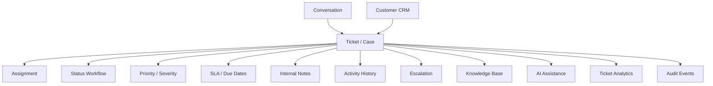

# PART-06 — Ticketing and Case Management

> *"Tickets turn customer problems into owned, trackable, resolvable work."*

---

# Purpose

Part VI defines CLARA's Ticketing and Case Management product domain.

It explains:

- Ticket model.
- Case lifecycle.
- Ticket creation from conversation.
- Manual ticket creation.
- Assignment and ownership.
- Priority and severity.
- SLA policy.
- Status workflow.
- Collaboration.
- Customer-visible behavior.
- Escalation.
- Related tickets and linking.
- Notes and activity.
- Attachments.
- Automation rules.
- AI ticket assistance.
- Analytics.
- MVP scope.

---

# Why This Part Matters

Conversations capture communication.

Tickets capture work that must be tracked until resolution.

Ticketing connects:

- Customer CRM.
- Conversations and Inbox.
- Knowledge Base.
- Workflow Automation.
- AI Assistant.
- Analytics.
- Audit and operations.

Without ticketing, teams may reply to messages but lose track of unresolved customer issues.

---

# Chapter Map

| Chapter | Title |
|---:|---|
| 81 | Ticketing Case Management Overview |
| 82 | Ticket Model |
| 83 | Case Lifecycle |
| 84 | Ticket Creation from Conversation |
| 85 | Manual Ticket Creation |
| 86 | Ticket Assignment and Ownership |
| 87 | Ticket Priority and Severity |
| 88 | Ticket SLA Policy |
| 89 | Ticket Status Workflow |
| 90 | Ticket Collaboration |
| 91 | Customer Visible Ticket Behavior |
| 92 | Ticket Escalation |
| 93 | Related Tickets and Linking |
| 94 | Ticket Notes and Activity |
| 95 | Ticket Attachments |
| 96 | Ticket Automation Rules |
| 97 | AI Ticket Assistance |
| 98 | Ticket Analytics |
| 99 | MVP Ticketing Scope |
| 100 | Part 06 Summary |

---

# Ticketing Map



---

# Scope Rule

Ticket records are Workspace-scoped by default.

Every ticket-owned record should include:

```text
organization_id
workspace_id
ticket_id
customer_id
conversation_id when created from conversation
```

---

# Critical Security Rule

CLARA must treat ticket content as sensitive customer support data.

Backend services must enforce:

```text
Authentication
Authorization
Organization scope
Workspace scope
Ticket visibility
Customer visibility
Audit for sensitive actions
```

---

# MVP Ticketing Baseline

MVP should include:

```text
Ticket list
Ticket detail
Create ticket
Create ticket from conversation
Assign ticket
Update status
Set priority
Internal notes
Activity history
Customer link
Conversation link
Basic audit
```

---

# Related Documents

- ../PART-03-Organization-and-Workspace/README.md
- ../PART-04-Customer-CRM/README.md
- ../PART-05-Conversations-and-Inbox/README.md
- ../../BOOK-03-Implementation-Architecture/PART-11-Product-Implementation-Architecture/213-Ticket-Case-Module.md
- ../../BOOK-03-Implementation-Architecture/PART-07-Security-Implementation/README.md
- ../../BOOK-03-Implementation-Architecture/PART-08-Testing-Quality-Architecture/README.md

---

# Navigation

**Previous:** `../PART-05-Conversations-and-Inbox/80-Part-05-Summary.md`

**Next:** `81-Ticketing-Case-Management-Overview.md`
