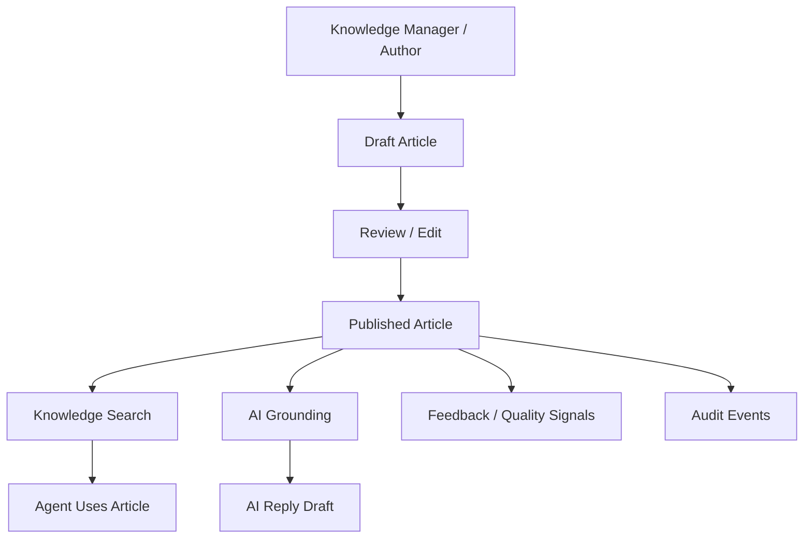
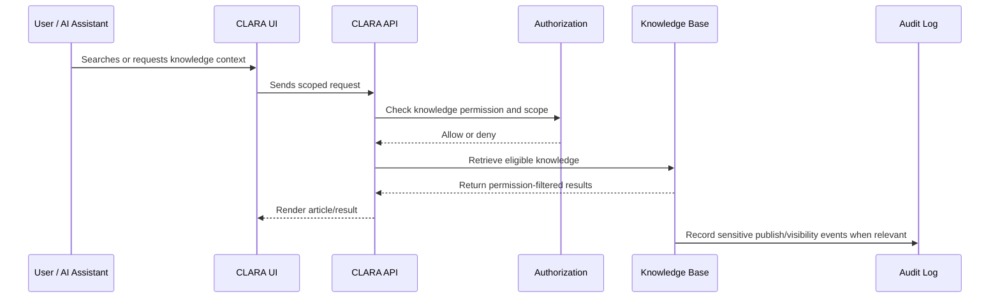

# Knowledge Visibility

> *"Defines internal, workspace, organization, and public visibility rules for knowledge articles."*

---

# Purpose

Defines internal, workspace, organization, and public visibility rules for knowledge articles.

---

# User / Product Problem

Knowledge articles may contain internal procedures, customer-sensitive context, or public help content. Visibility must be clear.

---

# Product Decision

## Decision

CLARA Knowledge Visibility should be explicit and permission-controlled to prevent accidental exposure of internal content.

## Status

Accepted.

## Reason

- Makes operational knowledge reusable.
- Reduces repeated manual answers.
- Improves agent speed and answer consistency.
- Provides safer grounding for AI features.
- Creates a maintainable knowledge lifecycle.
- Makes knowledge visibility and permissions explicit.

## Product Trade-offs

| Direction | Benefit | Trade-off |
|---|---|---|
| Internal knowledge first | Faster MVP and safer launch | Public help center comes later |
| Published content for AI grounding | Higher AI trust | Requires lifecycle discipline |
| Workspace-scoped knowledge | Better isolation | Cross-workspace knowledge sharing needs explicit design |
| Basic search first | Simple delivery | Less powerful than semantic search |
| Quality review later | Faster authoring | Higher risk of stale knowledge if not managed manually |

---

# Primary Users / Actors

- Knowledge Manager
- Admin
- Support Agent
- Customer

---

# Domain Objects

- Visibility
- Internal Article
- Public Article
- Workspace Visibility
- Organization Visibility

---

# Permission Baseline

| Permission | Meaning | Enforcement |
|---|---|---|
| `knowledge:read` | Product action permission | Protected by backend authorization |
| `knowledge_visibility:update` | Product action permission | Protected by backend authorization |
| `knowledge_public:publish` | Product action permission | Protected by backend authorization |

---

# Product Flow

---

# Knowledge Retrieval Sequence

---

# MVP Behavior

MVP should support internal workspace-visible articles only, unless public help center is part of MVP.

---

# Future Behavior

Future versions may support public help center, customer-segment visibility, role-based visibility, and article sharing.

---

# Product Requirements

## Functional Requirements

- Knowledge articles must belong to an Organization and Workspace.
- Articles must have lifecycle state.
- Articles must have visibility rules.
- Users must be able to read eligible articles.
- Authorized users must be able to create and edit articles.
- Published knowledge must be distinguishable from drafts.
- Search must only return authorized articles.
- AI grounding must only use eligible scoped knowledge.
- Sensitive knowledge changes must be auditable.

## Non-Functional Requirements

- Article list must be paginated.
- Search must be permission-filtered.
- Knowledge retrieval for AI must include scope filters.
- Article content must avoid storing secrets.
- Public visibility must require explicit permission.
- Versioning must preserve trust where implemented.
- Audit logs must avoid exposing full sensitive article bodies.
- Knowledge quality workflows should be easy for non-technical users.

---

# UX Expectations

- Users should clearly see whether an article is draft, published, or archived.
- Knowledge Managers should understand what content AI can use.
- Support Agents should find answers quickly from conversations and tickets.
- Public/internal visibility must be visually obvious.
- AI-used knowledge should be traceable where possible.
- Empty search states should help users request or create missing knowledge.
- Editing should reduce accidental content loss.

---

# Security and Privacy Considerations

- Do not expose internal articles publicly by default.
- Do not use draft content as AI grounding by default.
- Do not allow users to publish without permission.
- Do not store API keys, passwords, or secrets inside articles.
- Do not allow AI to retrieve knowledge outside actor scope.
- Do not return private knowledge in search snippets to unauthorized users.
- Audit publish, archive, visibility changes, and AI grounding configuration.
- Treat imported or AI-generated knowledge as untrusted until reviewed.

---

# Acceptance Criteria

- [ ] Knowledge scope is defined.
- [ ] Article lifecycle is defined.
- [ ] Visibility behavior is defined.
- [ ] Primary users are defined.
- [ ] Permissions are named.
- [ ] MVP behavior is clear.
- [ ] Future behavior is separated from MVP.
- [ ] AI grounding behavior is constrained where relevant.
- [ ] Security and privacy concerns are documented.
- [ ] Audit behavior is considered.

---

# Anti-patterns

Avoid:

- Letting drafts become AI grounding content by default.
- Mixing internal and public content without explicit visibility.
- Allowing all users to publish articles.
- Storing secrets or sensitive credentials in knowledge articles.
- Building semantic/RAG features before basic lifecycle and permissions exist.
- Returning cross-workspace knowledge results by default.
- Treating AI-generated content as trusted without review.
- Ignoring stale knowledge.

---

# Related Book III References

- ../../BOOK-03-Implementation-Architecture/PART-03-AI-Architecture/README.md
- ../../BOOK-03-Implementation-Architecture/PART-04-Data-Architecture/README.md
- ../../BOOK-03-Implementation-Architecture/PART-07-Security-Implementation/README.md
- ../../BOOK-03-Implementation-Architecture/PART-11-Product-Implementation-Architecture/214-Knowledge-Base-Module.md
- ../../BOOK-03-Implementation-Architecture/APPENDIX/APPENDIX-C-Security-Checklist.md

---

# Navigation

**Previous:** `106-Article-Versioning.md`

**Next:** `108-Knowledge-Search.md`
