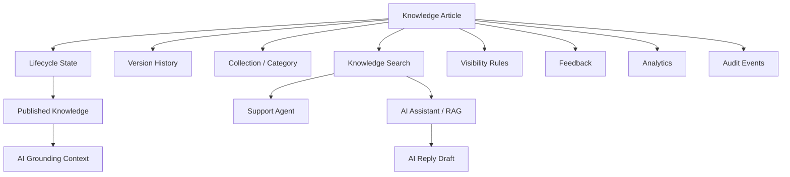

# PART-07 — Knowledge Base

> *"Knowledge Base is the trusted memory CLARA uses to help people and ground AI."*

---

# Purpose

Part VII defines CLARA's Knowledge Base product domain.

It explains:

- Knowledge article model.
- Collections and categories.
- Article authoring.
- Article lifecycle.
- Article versioning.
- Knowledge visibility.
- Knowledge search.
- RAG grounding.
- Quality review.
- Feedback.
- Templates.
- Localization.
- Public help center.
- Permissions.
- Audit behavior.
- Analytics.
- Security and privacy.
- MVP scope.

---

# Why This Part Matters

Knowledge Base connects:

- Customer support.
- Conversation replies.
- Ticket resolution.
- AI reply drafting.
- AI summaries.
- Workflow automation.
- Customer self-service.
- Quality improvement.

Without trusted knowledge, CLARA's AI features become less reliable and agents repeat the same answers manually.

---

# Chapter Map

| Chapter | Title |
|---:|---|
| 101 | Knowledge Base Overview |
| 102 | Knowledge Article Model |
| 103 | Collections and Categories |
| 104 | Article Authoring Experience |
| 105 | Article Lifecycle |
| 106 | Article Versioning |
| 107 | Knowledge Visibility |
| 108 | Knowledge Search |
| 109 | Knowledge and RAG Grounding |
| 110 | Knowledge Quality Review |
| 111 | Knowledge Feedback |
| 112 | Knowledge Templates |
| 113 | Knowledge Localization |
| 114 | Public Help Center |
| 115 | Knowledge Permissions |
| 116 | Knowledge Audit Behavior |
| 117 | Knowledge Analytics |
| 118 | Knowledge Security and Privacy |
| 119 | MVP Knowledge Base Scope |
| 120 | Part 07 Summary |

---

# Knowledge Base Map



---

# Scope Rule

Knowledge records are Workspace-scoped by default.

Every knowledge-owned record should include:

```text
organization_id
workspace_id
article_id
visibility
status
```

Public knowledge, if enabled later, must still belong to an Organization and Workspace or explicit help center scope.

---

# Critical Security Rule

CLARA must never allow unapproved internal knowledge to become customer-visible or AI-grounding content without explicit permission and lifecycle state.

Backend services must enforce:

```text
Authentication
Authorization
Organization scope
Workspace scope
Article visibility
Article lifecycle state
AI grounding eligibility
Audit for sensitive changes
```

---

# MVP Knowledge Base Baseline

MVP should include:

```text
Article list
Article detail
Create article
Edit article
Draft/published/archive state
Basic collections or tags
Basic search
Workspace scope
Permission checks
Audit basics
AI-readable published content if AI reply draft is enabled
```

---

# Related Documents

- ../PART-03-Organization-and-Workspace/README.md
- ../PART-04-Customer-CRM/README.md
- ../PART-05-Conversations-and-Inbox/README.md
- ../PART-06-Ticketing-and-Case-Management/README.md
- ../../BOOK-03-Implementation-Architecture/PART-03-AI-Architecture/README.md
- ../../BOOK-03-Implementation-Architecture/PART-11-Product-Implementation-Architecture/214-Knowledge-Base-Module.md
- ../../BOOK-03-Implementation-Architecture/PART-07-Security-Implementation/README.md

---

# Navigation

**Previous:** `../PART-06-Ticketing-and-Case-Management/100-Part-06-Summary.md`

**Next:** `101-Knowledge-Base-Overview.md`
