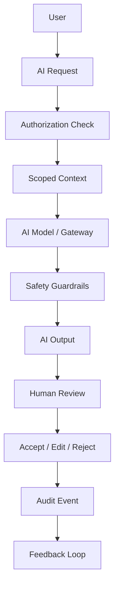
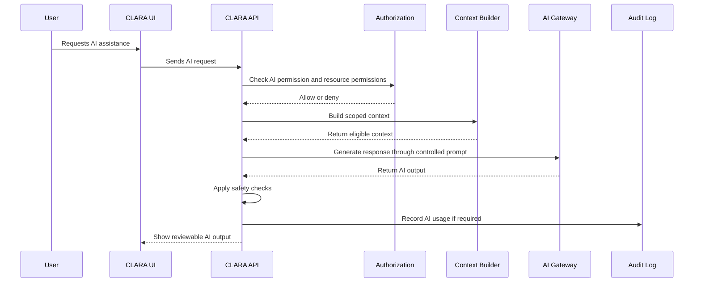

# AI Evaluation and Feedback

> *"Defines how CLARA evaluates AI quality and collects user feedback."*

---

# Purpose

Defines how CLARA evaluates AI quality and collects user feedback.

---

# User / Product Problem

AI quality cannot be assumed. Product teams need feedback and evaluation data to improve prompts, retrieval, and safety.

---

# Product Decision

## Decision

CLARA AI features should include lightweight feedback loops and offline evaluation before expanding autonomy.

## Status

Accepted.

## Reason

- Makes AI behavior predictable and reviewable.
- Prevents AI from bypassing product permissions.
- Protects customer and workspace data.
- Keeps human users accountable for customer-visible actions.
- Enables safer AI adoption in production workflows.
- Creates a foundation for Workflow Automation and future AI tool usage.

## Product Trade-offs

| Direction | Benefit | Trade-off |
|---|---|---|
| Human-governed AI | Safer customer outcomes | Less autonomous speed |
| Scoped context | Better privacy and security | Requires stronger context assembly |
| Reviewable output | Higher trust | More user interaction |
| Audit AI usage | Better accountability | More metadata and storage design |
| MVP assistance first | Faster safe launch | Advanced agents come later |

---

# Primary Users / Actors

- Support Agent
- Manager
- Knowledge Manager
- AI Engineer
- Product Team

---

# Domain Objects

- Feedback
- Rating
- Correction
- Evaluation Dataset
- Quality Metric
- Failure Case

---

# Permission Baseline

| Permission | Meaning | Enforcement |
|---|---|---|
| `ai.feedback:create` | Product action permission | Protected by backend authorization |
| `ai.feedback:read` | Product action permission | Protected by backend authorization |
| `ai.evaluation:read` | Product action permission | Protected by backend authorization |

---

# Product Flow

---

# AI Interaction Sequence

---

# MVP Behavior

MVP may support thumbs up/down or simple user feedback for AI drafts.

---

# Future Behavior

Future versions may support evaluation datasets, regression tests, RAG evaluation, model comparison, and quality dashboards.

---

# Product Requirements

## Functional Requirements

- AI features must require explicit AI permissions.
- AI features must also require permission for the underlying resource.
- AI output must be clearly labeled as AI-generated.
- Customer-visible AI replies must require human review in MVP.
- AI context must be scoped by Organization and Workspace.
- Knowledge grounding must use eligible published knowledge.
- AI tool actions must be permission-checked and auditable.
- Unsafe or low-confidence outputs must have safe fallback behavior.
- AI feedback must be collectable where practical.

## Non-Functional Requirements

- AI requests must not block core manual workflows when AI fails.
- AI outputs must not expose hidden system prompts or secrets.
- AI context must minimize sensitive data exposure.
- AI logs must avoid storing unnecessary sensitive content.
- AI audit events must include actor, feature, resource references, and decision metadata.
- AI evaluation should support regression testing for critical workflows.
- AI provider errors must be handled gracefully.
- AI model behavior should be observable through metrics.

---

# UX Expectations

- Users should understand what AI is helping with.
- Users should understand what context AI used where practical.
- Users should be able to edit AI drafts before sending.
- Users should be able to reject AI output.
- Users should see safe errors when AI is unavailable.
- Users should not be forced to use AI for core workflows.
- AI-generated content must not be visually identical to human-authored content.
- Risky AI actions should require confirmation or approval.

---

# Security and Privacy Considerations

- Do not allow AI to access data outside actor scope.
- Do not allow AI to bypass resource authorization.
- Do not expose system prompts, hidden instructions, secrets, or internal policies.
- Do not store sensitive prompts/responses longer than necessary without policy.
- Do not use draft/unpublished knowledge as grounding by default.
- Do not auto-send AI replies in MVP.
- Do not allow destructive tool actions without review and permission.
- Treat AI output as untrusted until reviewed or validated.

---

# Acceptance Criteria

- [ ] AI feature scope is defined.
- [ ] Primary users are defined.
- [ ] AI permissions are named.
- [ ] Underlying resource permissions are considered.
- [ ] Context boundaries are defined.
- [ ] Human review behavior is defined.
- [ ] Safety guardrails are documented.
- [ ] Audit behavior is considered.
- [ ] MVP behavior is clear.
- [ ] Future behavior is separated from MVP.

---

# Anti-patterns

Avoid:

- Treating AI as an admin bypass.
- Auto-sending AI replies in MVP.
- Giving AI unrestricted workspace context.
- Using draft knowledge as trusted grounding.
- Hiding AI usage from users or managers.
- Logging full sensitive prompts and outputs without controls.
- Allowing AI tool execution without permission checks.
- Measuring only usage volume and ignoring quality/safety.

---

# Related Book III References

- ../../BOOK-03-Implementation-Architecture/PART-03-AI-Architecture/README.md
- ../../BOOK-03-Implementation-Architecture/PART-04-Data-Architecture/README.md
- ../../BOOK-03-Implementation-Architecture/PART-07-Security-Implementation/README.md
- ../../BOOK-03-Implementation-Architecture/PART-11-Product-Implementation-Architecture/215-AI-Assistant-Module.md
- ../../BOOK-03-Implementation-Architecture/APPENDIX/APPENDIX-C-Security-Checklist.md

---

# Navigation

**Previous:** `133-AI-Memory-and-Context-Boundaries.md`

**Next:** `135-AI-Audit-and-Traceability.md`
