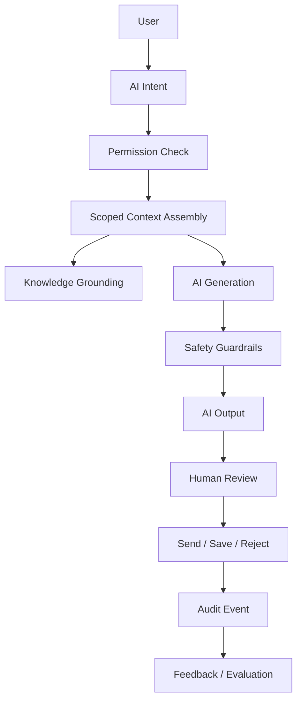

# PART-08 — AI Assistant Product

> *"CLARA AI should help humans move faster without taking away human control."*

---

# Purpose

Part VIII defines CLARA's AI Assistant product domain.

It explains:

- AI Assistant overview.
- AI use cases.
- AI chat experience.
- AI reply drafting.
- AI conversation summary.
- AI ticket assistance.
- AI customer insight.
- AI knowledge grounding.
- AI tool actions.
- Human review and approval.
- AI safety guardrails.
- Prompt and context policy.
- AI memory and context boundaries.
- AI evaluation and feedback.
- AI audit and traceability.
- AI permissions and access control.
- AI error handling and fallbacks.
- AI analytics and quality metrics.
- MVP AI Assistant scope.

---

# Why This Part Matters

CLARA is an AI-native Business Operating System.

That means AI is not a decorative feature.

AI must be part of daily workflows while still respecting:

- Permissions.
- Organization scope.
- Workspace scope.
- Customer privacy.
- Knowledge lifecycle.
- Human review.
- Auditability.
- Safety guardrails.
- Production reliability.

---

# Chapter Map

| Chapter | Title |
|---:|---|
| 121 | AI Assistant Product Overview |
| 122 | AI Assistant Use Cases |
| 123 | AI Chat Experience |
| 124 | AI Reply Drafting Product Behavior |
| 125 | AI Conversation Summary |
| 126 | AI Ticket Assistance Product Behavior |
| 127 | AI Customer Insight Assistance |
| 128 | AI Knowledge Grounding |
| 129 | AI Tool Actions |
| 130 | Human Review and Approval |
| 131 | AI Safety Guardrails |
| 132 | Prompt and Context Policy |
| 133 | AI Memory and Context Boundaries |
| 134 | AI Evaluation and Feedback |
| 135 | AI Audit and Traceability |
| 136 | AI Permissions and Access Control |
| 137 | AI Error Handling and Fallbacks |
| 138 | AI Analytics and Quality Metrics |
| 139 | MVP AI Assistant Scope |
| 140 | Part 08 Summary |

---

# AI Assistant Product Map



---

# AI Product Rule

CLARA AI must never bypass normal product permissions.

Every AI feature must check:

```text
Actor identity
AI feature permission
Underlying resource permission
Organization scope
Workspace scope
Context eligibility
Action risk level
Human review requirement
Audit requirement
```

---

# Critical Safety Rule

In MVP, CLARA AI can suggest but must not silently execute sensitive actions.

Customer-visible or data-changing AI outputs must be:

```text
Visible
Reviewable
Editable
Rejectable
Auditable
```

---

# MVP AI Assistant Baseline

MVP should include:

```text
AI reply drafting
Optional conversation summary
Scoped knowledge grounding
Human review before send
AI usage audit
Safe error fallback
Basic user feedback
No autonomous customer reply sending
No unrestricted tool execution
No cross-workspace context leakage
```

---

# Related Documents

- ../PART-04-Customer-CRM/README.md
- ../PART-05-Conversations-and-Inbox/README.md
- ../PART-06-Ticketing-and-Case-Management/README.md
- ../PART-07-Knowledge-Base/README.md
- ../../BOOK-03-Implementation-Architecture/PART-03-AI-Architecture/README.md
- ../../BOOK-03-Implementation-Architecture/PART-07-Security-Implementation/README.md
- ../../BOOK-03-Implementation-Architecture/PART-11-Product-Implementation-Architecture/215-AI-Assistant-Module.md

---

# Navigation

**Previous:** `../PART-07-Knowledge-Base/120-Part-07-Summary.md`

**Next:** `121-AI-Assistant-Product-Overview.md`
