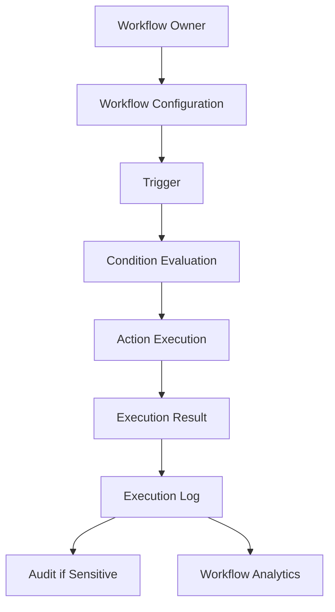
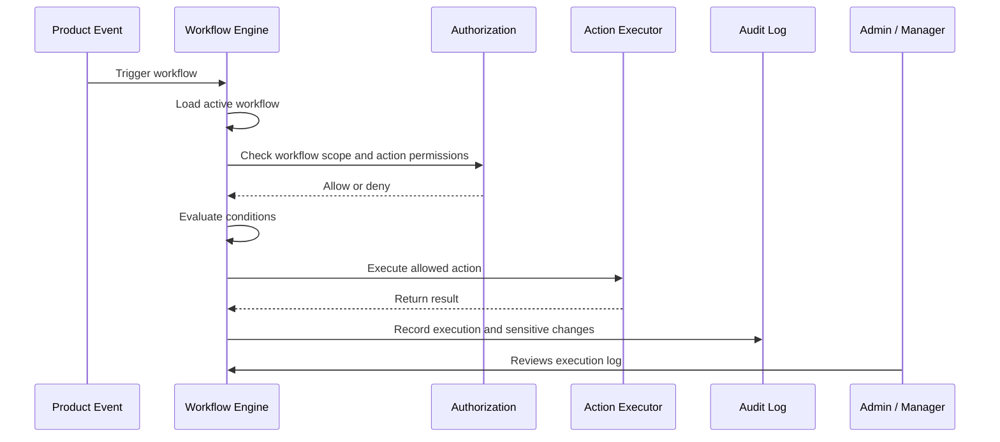

# Workflow Audit and Traceability

> *"Defines audit behavior for workflow configuration changes and workflow executions."*

---

# Purpose

Defines audit behavior for workflow configuration changes and workflow executions.

---

# User / Product Problem

Automation can change business data. Teams need to know which workflow ran, why it ran, what it changed, and who configured it.

---

# Product Decision

## Decision

CLARA should audit workflow creation, updates, activation, deactivation, approvals, and execution outcomes.

## Status

Accepted.

## Reason

- Reduces repetitive operational work.
- Keeps automation visible and explainable.
- Prevents unsafe hidden side effects.
- Supports consistent business workflows.
- Gives managers and admins operational control.
- Creates a safe foundation for integrations and AI-assisted automation.

## Product Trade-offs

| Direction | Benefit | Trade-off |
|---|---|---|
| Simple rules first | Faster MVP and safer delivery | Less flexible than full builder |
| Low-risk actions first | Safer automation adoption | Less powerful initially |
| Explicit execution logs | Better trust and debugging | More storage and UI design |
| Approval for risky actions | Better accountability | More operational friction |
| AI as assistant first | Safer AI adoption | Less autonomous automation |

---

# Primary Users / Actors

- Admin
- Manager
- Security Reviewer
- Auditor

---

# Domain Objects

- Workflow Audit Event
- Configuration Change
- Execution Event
- Actor
- Before/After Metadata

---

# Permission Baseline

| Permission | Meaning | Enforcement |
|---|---|---|
| `workflow_audit:read` | Product action permission | Protected by backend authorization |
| `audit:read` | Product action permission | Protected by backend authorization |

---

# Product Flow

---

# Workflow Execution Sequence

---

# MVP Behavior

MVP must record workflow configuration changes and execution results where automation exists.

---

# Future Behavior

Future versions may support audit export, execution trace viewer, diff view, anomaly detection, and compliance evidence.

---

# Product Requirements

## Functional Requirements

- Workflows must belong to an Organization and Workspace.
- Workflows must have enabled/disabled status.
- Workflows must define trigger, conditions, and actions.
- Workflow actions must be permission-checked.
- Workflow executions must be logged.
- Failed executions must be visible.
- Sensitive actions must be auditable.
- High-risk actions must require approval or be deferred.
- AI-created workflows must not become active automatically in MVP.

## Non-Functional Requirements

- Workflow execution must be idempotent where side effects are possible.
- Workflow engine must avoid duplicate side effects.
- Execution logs must include trigger, status, and result.
- Workflow errors must be safe and diagnosable.
- Automation must not block core product workflows unexpectedly.
- Workflow conditions must be deterministic.
- Workflow configuration must be validated before activation.
- Logs must avoid storing unnecessary sensitive data.

---

# UX Expectations

- Admins should understand what a workflow does before enabling it.
- Workflow actions should be previewable where practical.
- Risky actions should be visually marked.
- Failed executions should be easy to find.
- Users should understand why a workflow ran.
- Users should be able to pause or disable workflows.
- Approval-required actions should clearly show pending decision state.
- AI-suggested workflows must be labeled and reviewable.

---

# Security and Privacy Considerations

- Do not let workflow actions bypass user permissions.
- Do not execute high-risk actions silently.
- Do not allow external webhook actions without validation and secret handling.
- Do not allow AI to activate workflows without human approval.
- Do not store sensitive payloads in execution logs unnecessarily.
- Do not execute workflows across workspace boundaries by default.
- Audit workflow creation, updates, activation, deactivation, approvals, and executions.
- Treat external event payloads as untrusted input.

---

# Acceptance Criteria

- [ ] Workflow scope is defined.
- [ ] Trigger behavior is defined.
- [ ] Condition behavior is defined.
- [ ] Action behavior is defined.
- [ ] Primary users are defined.
- [ ] Permissions are named.
- [ ] Risk level is considered.
- [ ] Audit behavior is considered.
- [ ] MVP behavior is clear.
- [ ] Future behavior is separated from MVP.

---

# Anti-patterns

Avoid:

- Building a full workflow builder before simple automation works.
- Allowing workflows to run without execution logs.
- Allowing automation to send customer messages silently.
- Allowing AI-generated workflows to activate automatically.
- Running workflow actions without permission checks.
- Ignoring duplicate events and idempotency.
- Hiding failed executions from admins.
- Storing sensitive event payloads in logs without policy.

---

# Related Book III References

- ../../BOOK-03-Implementation-Architecture/PART-05-Integration-Architecture/README.md
- ../../BOOK-03-Implementation-Architecture/PART-07-Security-Implementation/README.md
- ../../BOOK-03-Implementation-Architecture/PART-10-Operations-Architecture/README.md
- ../../BOOK-03-Implementation-Architecture/PART-11-Product-Implementation-Architecture/216-Workflow-Automation-Module.md
- ../../BOOK-03-Implementation-Architecture/APPENDIX/APPENDIX-C-Security-Checklist.md

---

# Navigation

**Previous:** `155-Workflow-Permissions-and-Risk-Levels.md`

**Next:** `157-Workflow-Error-Handling-and-Retry.md`
