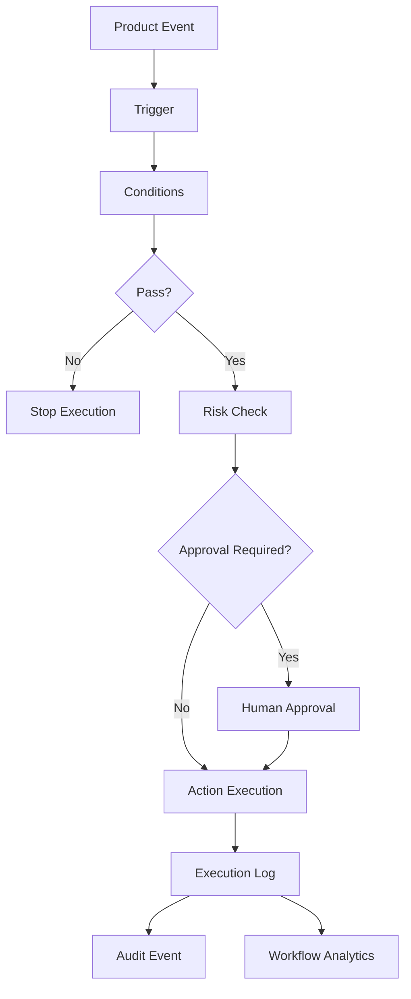

# PART-09 — Workflow Automation

> *"Automation should reduce repetitive work without hiding responsibility."*

---

# Purpose

Part IX defines CLARA's Workflow Automation product domain.

It explains:

- Workflow model.
- Trigger model.
- Condition model.
- Action model.
- Workflow builder experience.
- Workflow lifecycle.
- Workflow execution.
- Approval and human-in-the-loop.
- Workflow templates.
- Conversation automation.
- Ticket automation.
- Customer CRM automation.
- AI-assisted workflow automation.
- Workflow permissions and risk levels.
- Workflow audit and traceability.
- Error handling and retry.
- Workflow analytics.
- MVP scope.

---

# Why This Part Matters

Workflow Automation connects many CLARA domains:

- Customer CRM.
- Conversations and Inbox.
- Ticketing and Case Management.
- Knowledge Base.
- AI Assistant.
- Integrations and Channels.
- Notifications.
- Analytics.
- Audit.

Automation must be powerful, but it must also be safe.

The goal is not hidden magic.

The goal is visible, explainable, permission-controlled operational acceleration.

---

# Chapter Map

| Chapter | Title |
|---:|---|
| 141 | Workflow Automation Overview |
| 142 | Workflow Model |
| 143 | Trigger Model |
| 144 | Condition Model |
| 145 | Action Model |
| 146 | Workflow Builder Experience |
| 147 | Workflow Lifecycle |
| 148 | Workflow Execution |
| 149 | Approval and Human in the Loop |
| 150 | Workflow Templates |
| 151 | Automation for Conversations |
| 152 | Automation for Tickets |
| 153 | Automation for Customers and CRM |
| 154 | AI Assisted Workflow Automation |
| 155 | Workflow Permissions and Risk Levels |
| 156 | Workflow Audit and Traceability |
| 157 | Workflow Error Handling and Retry |
| 158 | Workflow Analytics |
| 159 | MVP Workflow Automation Scope |
| 160 | Part 09 Summary |

---

# Workflow Automation Map



---

# Workflow Product Rule

Every workflow must define:

```text
Owner
Organization scope
Workspace scope
Trigger
Conditions
Actions
Risk level
Permission requirements
Execution policy
Audit behavior
Failure handling
```

---

# Critical Safety Rule

CLARA must not allow workflow automation to silently perform high-risk actions without permission, visibility, and approval where required.

High-risk actions include:

```text
Sending customer-visible messages
Bulk updating customer data
Exporting data
Deleting or archiving records
Calling external systems with sensitive data
Executing AI-generated actions
```

---

# MVP Workflow Automation Baseline

MVP should include:

```text
Simple/predefined automation rules
Enabled/disabled state
Basic event triggers
Simple conditions
Low-risk actions
Execution logs
Permission checks
Audit basics
Safe failure behavior
No unrestricted visual builder yet
No autonomous AI-created active workflows
```

---

# Related Documents

- ../PART-04-Customer-CRM/README.md
- ../PART-05-Conversations-and-Inbox/README.md
- ../PART-06-Ticketing-and-Case-Management/README.md
- ../PART-08-AI-Assistant-Product/README.md
- ../../BOOK-03-Implementation-Architecture/PART-05-Integration-Architecture/README.md
- ../../BOOK-03-Implementation-Architecture/PART-07-Security-Implementation/README.md
- ../../BOOK-03-Implementation-Architecture/PART-11-Product-Implementation-Architecture/216-Workflow-Automation-Module.md

---

# Navigation

**Previous:** `../PART-08-AI-Assistant-Product/140-Part-08-Summary.md`

**Next:** `141-Workflow-Automation-Overview.md`
