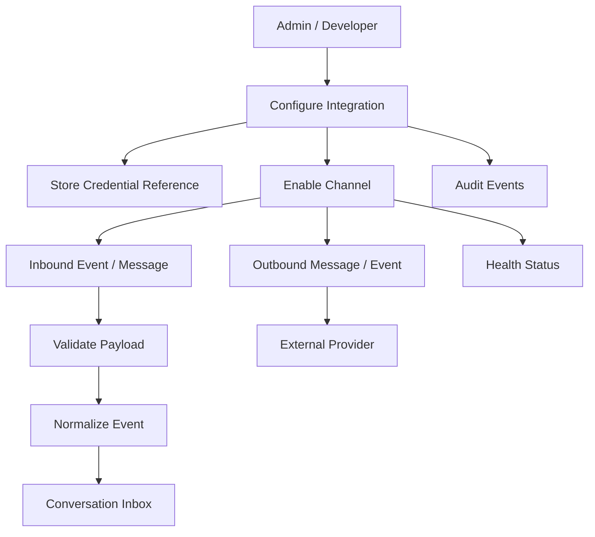
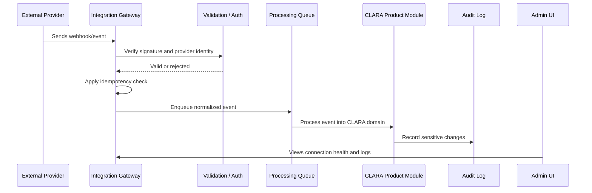

# Integration Model

> *"Defines the Integration object and how CLARA represents external system connections."*

---

# Purpose

Defines the Integration object and how CLARA represents external system connections.

---

# User / Product Problem

External connections need clear ownership, configuration, status, credentials, and lifecycle behavior.

---

# Product Decision

## Decision

CLARA Integration should represent a configured external system connection scoped to an Organization or Workspace.

## Status

Accepted.

## Reason

- Enables CLARA to connect with real external systems.
- Keeps communication channels consistent with Conversation Inbox.
- Prevents credentials and external payloads from becoming hidden risk.
- Supports reliable webhook ingestion and provider error handling.
- Makes integration ownership and governance explicit.
- Creates a safe foundation for automation and future marketplace connectors.

## Product Trade-offs

| Direction | Benefit | Trade-off |
|---|---|---|
| Fewer reliable channels first | Higher MVP stability | Slower channel coverage |
| Official provider APIs first | Better compliance and reliability | Requires approval and setup |
| Secure credential references | Lower secret leakage risk | More infrastructure discipline |
| Validated webhooks | Safer ingestion | More provider-specific work |
| Visible health status | Better operations | More observability design |

---

# Primary Users / Actors

- Admin
- Developer/Integrator
- System Service

---

# Domain Objects

- Integration ID
- Provider
- Connection Status
- Scope
- Configuration
- Credential Reference

---

# Permission Baseline

| Permission | Meaning | Enforcement |
|---|---|---|
| `integration:read` | Product action permission | Protected by backend authorization |
| `integration:create` | Product action permission | Protected by backend authorization |
| `integration:update` | Product action permission | Protected by backend authorization |

---

# Product Flow

---

# Integration Event Sequence

---

# MVP Behavior

MVP must support a basic Integration object with provider, status, workspace scope, and safe configuration storage.

---

# Future Behavior

Future versions may support integration templates, marketplace installation, multi-account providers, and tenant-level policy controls.

---

# Product Requirements

## Functional Requirements

- Integrations must belong to an Organization and Workspace where applicable.
- Channels must connect external communication to Conversation Inbox.
- Integration credentials must be stored as secure references, not raw config text.
- Inbound webhook payloads must be validated.
- Inbound events must be idempotent.
- Provider-specific IDs must be preserved for traceability.
- Integration connection status must be visible to admins.
- Sensitive integration changes must be audited.
- Integration setup must be permission-controlled.

## Non-Functional Requirements

- Integration processing must tolerate provider outages.
- Webhook ingestion must avoid duplicate side effects.
- Logs must avoid storing raw secrets or unnecessary sensitive payloads.
- Provider rate limits must be handled safely.
- Integration failures must be diagnosable.
- Credentials must support revocation or disconnect behavior.
- Channel adapters must normalize payloads without hiding provider constraints.
- Integration code must treat all external input as untrusted.

---

# UX Expectations

- Admins should understand whether a connection is active, failing, disabled, or needs reauthorization.
- Connector setup should explain required permissions/scopes.
- Dangerous disconnect actions should show impact.
- Integration errors should be clear without exposing secrets.
- Channel configuration should be separate from normal inbox usage.
- Support agents should see channel identity in conversations.
- Developer/integrator users should have access to safe logs and diagnostics.

---

# Security and Privacy Considerations

- Do not store raw secrets in database fields shown to users.
- Do not log authorization headers, tokens, or secret payloads.
- Do not trust external webhook payloads without validation.
- Do not process duplicate provider events without idempotency protection.
- Do not use unofficial scraping as a production-grade integration foundation where official APIs are required.
- Do not expose cross-workspace integration data by default.
- Do not allow low-privilege users to connect high-risk integrations.
- Audit connect, disconnect, credential rotation, webhook failures, and sensitive sync actions.

---

# Acceptance Criteria

- [ ] Integration scope is defined.
- [ ] Channel boundary is defined.
- [ ] Credential behavior is defined.
- [ ] Webhook validation is considered.
- [ ] Primary users are defined.
- [ ] Permissions are named.
- [ ] Error handling is considered.
- [ ] Security and privacy risks are documented.
- [ ] MVP behavior is clear.
- [ ] Future behavior is separated from MVP.

---

# Anti-patterns

Avoid:

- Hard-coding provider credentials.
- Logging raw webhook payloads with secrets or PII.
- Treating external provider payloads as trusted.
- Building many channels before one channel is reliable.
- Using fragile scraping as the core production integration strategy.
- Mixing integration setup with normal agent workflows.
- Allowing integrations to bypass tenant/workspace scope.
- Ignoring rate limits and retry behavior.

---

# Related Book III References

- ../../BOOK-03-Implementation-Architecture/PART-05-Integration-Architecture/README.md
- ../../BOOK-03-Implementation-Architecture/PART-07-Security-Implementation/README.md
- ../../BOOK-03-Implementation-Architecture/PART-10-Operations-Architecture/README.md
- ../../BOOK-03-Implementation-Architecture/PART-11-Product-Implementation-Architecture/217-Integration-Hub-Module.md
- ../../BOOK-03-Implementation-Architecture/APPENDIX/APPENDIX-C-Security-Checklist.md

---

# Navigation

**Previous:** `161-Integrations-and-Channels-Overview.md`

**Next:** `163-Channel-vs-Integration-Boundary.md`
