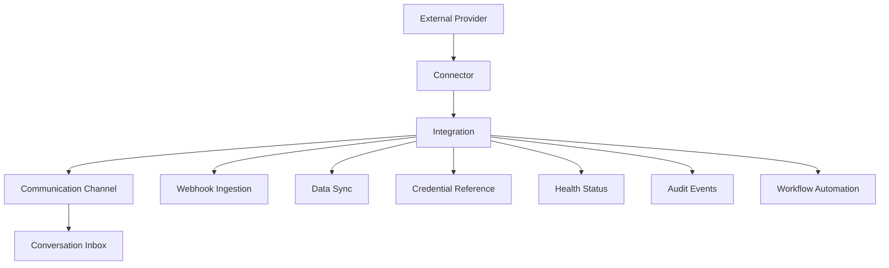

# PART-10 — Integrations and Channels

> *"Integrations connect CLARA to the outside world, so every connection must be treated as a trust boundary."*

---

# Purpose

Part X defines CLARA's Integrations and Channels product domain.

It explains:

- Integration model.
- Channel vs integration boundary.
- Connector lifecycle.
- OAuth and credentials.
- Webhook ingestion.
- Outbound webhooks.
- Email channel.
- Web chat channel.
- WhatsApp channel.
- Social DM channels.
- Custom API channel.
- Data sync and mapping.
- Rate limits and quotas.
- Error handling and retry.
- Permissions and governance.
- Security and privacy.
- Audit and observability.
- MVP scope.

---

# Why This Part Matters

CLARA is only useful if it can connect to real customer communication channels and business systems.

Integrations connect CLARA to:

- Website chat.
- Email.
- WhatsApp.
- Social DMs.
- External CRMs.
- Webhooks.
- Automation systems.
- Developer APIs.
- Third-party tools.

But integrations are also one of the highest-risk parts of the product.

They can expose data, ingest malicious payloads, leak tokens, duplicate events, or silently fail.

---

# Chapter Map

| Chapter | Title |
|---:|---|
| 161 | Integrations and Channels Overview |
| 162 | Integration Model |
| 163 | Channel vs Integration Boundary |
| 164 | Connector Lifecycle |
| 165 | OAuth and Credentials |
| 166 | Webhook Ingestion |
| 167 | Outbound Webhooks |
| 168 | Email Channel |
| 169 | Web Chat Channel |
| 170 | WhatsApp Channel |
| 171 | Social DM Channels |
| 172 | Custom API Channel |
| 173 | Data Sync and Mapping |
| 174 | Rate Limits and Quotas |
| 175 | Integration Error Handling and Retry |
| 176 | Integration Permissions and Governance |
| 177 | Integration Security and Privacy |
| 178 | Integration Audit and Observability |
| 179 | MVP Integrations and Channels Scope |
| 180 | Part 10 Summary |

---

# Integrations and Channels Map



---

# Integration Product Rule

Every integration must define:

```text
Provider
Owner
Organization scope
Workspace scope
Credential storage model
Inbound data behavior
Outbound data behavior
Webhook validation
Rate-limit handling
Retry behavior
Audit behavior
Disconnect behavior
Security/privacy review
```

---

# Critical Security Rule

CLARA must treat every external provider as an untrusted boundary.

Every integration must enforce:

```text
Input validation
Signature verification when available
Credential protection
Least privilege scopes
Idempotency
Rate-limit handling
Safe logging
Auditability
```

---

# MVP Integrations Baseline

MVP should include:

```text
One reliable communication channel
Integration object
Channel object
Credential reference pattern
Connection status
Webhook validation if inbound webhooks are used
Idempotent event ingestion
Basic audit events
Basic error handling
No fragile unofficial scraping as production foundation
```

---

# Related Documents

- ../PART-05-Conversations-and-Inbox/README.md
- ../PART-08-AI-Assistant-Product/README.md
- ../PART-09-Workflow-Automation/README.md
- ../../BOOK-03-Implementation-Architecture/PART-05-Integration-Architecture/README.md
- ../../BOOK-03-Implementation-Architecture/PART-07-Security-Implementation/README.md
- ../../BOOK-03-Implementation-Architecture/PART-11-Product-Implementation-Architecture/217-Integration-Hub-Module.md

---

# Navigation

**Previous:** `../PART-09-Workflow-Automation/160-Part-09-Summary.md`

**Next:** `161-Integrations-and-Channels-Overview.md`
