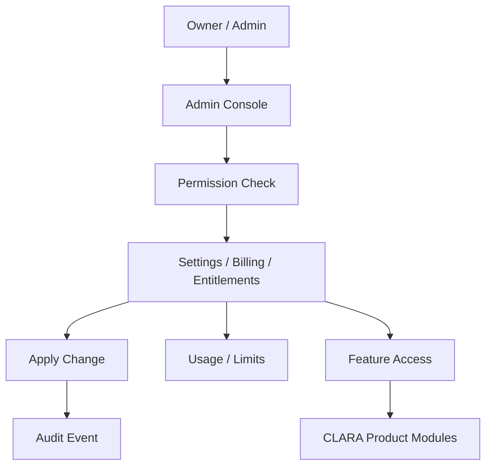
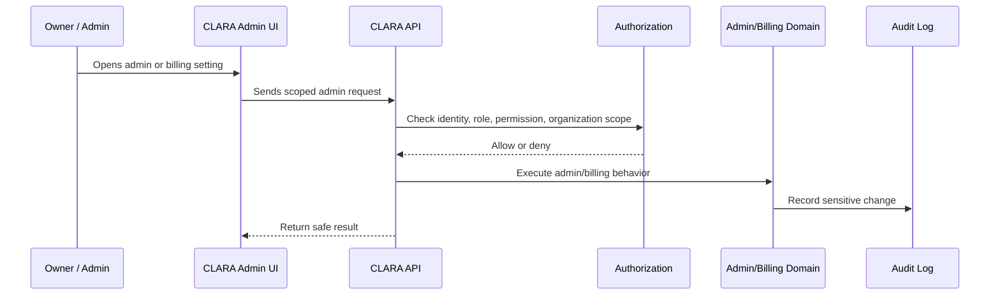

# Seats and Members Billing

> *"Defines how user seats, members, role-based access, and billing limits interact."*

---

# Purpose

Defines how user seats, members, role-based access, and billing limits interact.

---

# User / Product Problem

Teams need to invite users, but billing plans may limit active seats or bill per member.

---

# Product Decision

## Decision

CLARA should separate membership authorization from seat entitlement, while ensuring plan limits control billable access consistently.

## Status

Accepted.

## Reason

- Gives organization owners and admins safe control over CLARA.
- Keeps plan access and feature availability consistent.
- Prevents billing and entitlement logic from being scattered.
- Protects sensitive admin and billing operations.
- Creates a foundation for enterprise governance.
- Makes product limits and administrative behavior auditable.

## Product Trade-offs

| Direction | Benefit | Trade-off |
|---|---|---|
| Admin console first | Better governance | More upfront product structure |
| Entitlements over hard-coded checks | Flexible plans | Requires access decision discipline |
| Usage counters early | Future billing ready | More data tracking |
| Payment automation later | Faster MVP | Manual billing may be needed early |
| Strong admin audit | Better accountability | More event design |

---

# Primary Users / Actors

- Organization Owner
- Admin
- Billing Admin

---

# Domain Objects

- Seat
- Billable Member
- Organization Member
- Workspace Member
- Seat Limit
- Seat Assignment

---

# Permission Baseline

| Permission | Meaning | Enforcement |
|---|---|---|
| `seat:read` | Product action permission | Protected by backend authorization |
| `seat:manage` | Product action permission | Protected by backend authorization |
| `membership:invite` | Product action permission | Protected by backend authorization |

---

# Product Flow

---

# Admin Action Sequence

---

# MVP Behavior

MVP may track active members as seat usage and enforce or warn on member limit depending on plan maturity.

---

# Future Behavior

Future versions may support seat pools, role-based billing, guest users, suspended seats, and seat true-up.

---

# Product Requirements

## Functional Requirements

- Admin capabilities must belong to an Organization.
- Sensitive admin actions must require explicit permission.
- Billing actions must require billing-specific permission.
- Plan and subscription state must be readable by authorized roles.
- Entitlement checks must be available to backend modules.
- Usage counters must be consistently named and scoped.
- Admin settings must be auditable when sensitive.
- AI and integration controls must be admin-governed.
- UI must clearly separate organization, workspace, billing, security, AI, and integration settings.

## Non-Functional Requirements

- Admin pages must not expose sensitive data to unauthorized roles.
- Billing records must be treated as sensitive business data.
- Entitlement checks must be deterministic and testable.
- Usage counters must avoid double-counting where possible.
- Admin action errors must be safe and understandable.
- Billing provider references must not expose secrets.
- Feature flags must fail safely.
- Audit logs must avoid unnecessary sensitive payloads.

---

# UX Expectations

- Owners and admins should understand what each admin section controls.
- Billing status should be easy to understand.
- Plan limits should be visible where relevant.
- Dangerous changes should require confirmation.
- Feature availability should explain whether access is blocked by role, plan, or configuration.
- Admin errors should not leak sensitive system details.
- AI and integration controls should clearly show impact before disabling.
- Usage warnings should be actionable.

---

# Security and Privacy Considerations

- Do not rely on Admin Console UI for final authorization.
- Do not expose billing data to non-billing roles.
- Do not allow entitlement override without audit.
- Do not store payment provider secrets in normal config.
- Do not expose full credential values in admin UI.
- Audit plan changes, billing updates, entitlement overrides, security setting changes, AI toggles, and integration changes.
- Require strong permissions for destructive or high-impact admin actions.
- Keep feature flags and plan checks server-enforced.

---

# Acceptance Criteria

- [ ] Admin scope is defined.
- [ ] Billing scope is defined.
- [ ] Plan behavior is defined.
- [ ] Entitlement behavior is defined.
- [ ] Usage limit behavior is defined.
- [ ] Primary users are defined.
- [ ] Permissions are named.
- [ ] Audit behavior is considered.
- [ ] MVP behavior is clear.
- [ ] Future behavior is separated from MVP.

---

# Anti-patterns

Avoid:

- Hard-coding plan logic throughout product modules.
- Letting Admin UI visibility act as authorization.
- Exposing billing information to every admin role by default.
- Storing payment or credential secrets in plain configuration.
- Allowing entitlement overrides without audit.
- Mixing organization settings and workspace settings.
- Adding payment complexity before product-market validation if not needed.
- Ignoring usage counters until pricing launch.

---

# Related Book III References

- ../../BOOK-03-Implementation-Architecture/PART-04-Data-Architecture/README.md
- ../../BOOK-03-Implementation-Architecture/PART-07-Security-Implementation/README.md
- ../../BOOK-03-Implementation-Architecture/PART-10-Operations-Architecture/README.md
- ../../BOOK-03-Implementation-Architecture/PART-11-Product-Implementation-Architecture/218-Billing-Admin-Module.md
- ../../BOOK-03-Implementation-Architecture/APPENDIX/APPENDIX-C-Security-Checklist.md

---

# Navigation

**Previous:** `187-Usage-Limits-and-Quotas.md`

**Next:** `189-Invoices-and-Payment-Records.md`
