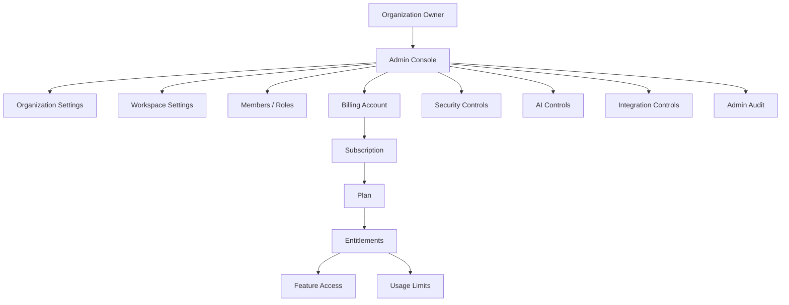

# PART-11 — Billing and Admin

> *"Admin defines who controls the system. Billing defines what the organization can use."*

---

# Purpose

Part XI defines CLARA's Billing and Admin product domain.

It explains:

- Billing and Admin overview.
- Admin Console model.
- Billing Account model.
- Plan and Pricing model.
- Subscription lifecycle.
- Entitlement system.
- Usage limits and quotas.
- Seats and members billing.
- Invoices and payment records.
- Plan upgrade and downgrade.
- Admin organization settings.
- Admin workspace settings.
- Feature flags and rollouts.
- Admin security controls.
- Admin AI controls.
- Admin integration controls.
- Admin audit and billing events.
- Admin notifications and alerts.
- MVP scope.

---

# Why This Part Matters

Billing and Admin is where CLARA becomes governable as a real SaaS product.

It controls:

- Organization settings.
- Workspace settings.
- Members and roles.
- Plan access.
- Feature availability.
- Usage limits.
- AI feature controls.
- Integration controls.
- Security controls.
- Billing visibility.
- Admin auditability.

Without this domain, CLARA may have strong product modules but weak operational governance.

---

# Chapter Map

| Chapter | Title |
|---:|---|
| 181 | Billing and Admin Overview |
| 182 | Admin Console Model |
| 183 | Billing Account Model |
| 184 | Plan and Pricing Model |
| 185 | Subscription Lifecycle |
| 186 | Entitlement System |
| 187 | Usage Limits and Quotas |
| 188 | Seats and Members Billing |
| 189 | Invoices and Payment Records |
| 190 | Plan Upgrade and Downgrade |
| 191 | Admin Organization Settings |
| 192 | Admin Workspace Settings |
| 193 | Feature Flags and Rollouts |
| 194 | Admin Security Controls |
| 195 | Admin AI Controls |
| 196 | Admin Integration Controls |
| 197 | Admin Audit and Billing Events |
| 198 | Admin Notifications and Alerts |
| 199 | MVP Billing and Admin Scope |
| 200 | Part 11 Summary |

---

# Billing and Admin Map



---

# Admin Product Rule

Every admin capability must define:

```text
Owner role
Required permission
Organization scope
Workspace scope when applicable
Affected resource
Risk level
Audit requirement
User-facing confirmation requirement
```

---

# Billing Product Rule

Every billable capability must define:

```text
Plan entitlement
Usage counter if applicable
Limit behavior
Over-limit behavior
Admin visibility
Upgrade path
Audit requirement if sensitive
```

---

# Critical Security Rule

CLARA must never treat Admin Console UI visibility as authorization.

Backend services must enforce:

```text
Authentication
Authorization
Organization scope
Admin permission
Billing permission
Entitlement checks
Audit for sensitive actions
```

---

# MVP Billing and Admin Baseline

MVP should include:

```text
Admin Console basics
Organization settings
Workspace settings
Member and role management links
Plan display
Entitlement checks
Usage counter foundation
AI enable/disable if AI exists
Integration controls
Audit basics
No full payment automation required yet
```

---

# Related Documents

- ../PART-02-User-Roles-and-Permissions/README.md
- ../PART-03-Organization-and-Workspace/README.md
- ../PART-08-AI-Assistant-Product/README.md
- ../PART-10-Integrations-and-Channels/README.md
- ../../BOOK-03-Implementation-Architecture/PART-07-Security-Implementation/README.md
- ../../BOOK-03-Implementation-Architecture/PART-11-Product-Implementation-Architecture/218-Billing-Admin-Module.md

---

# Navigation

**Previous:** `../PART-10-Integrations-and-Channels/180-Part-10-Summary.md`

**Next:** `181-Billing-and-Admin-Overview.md`
