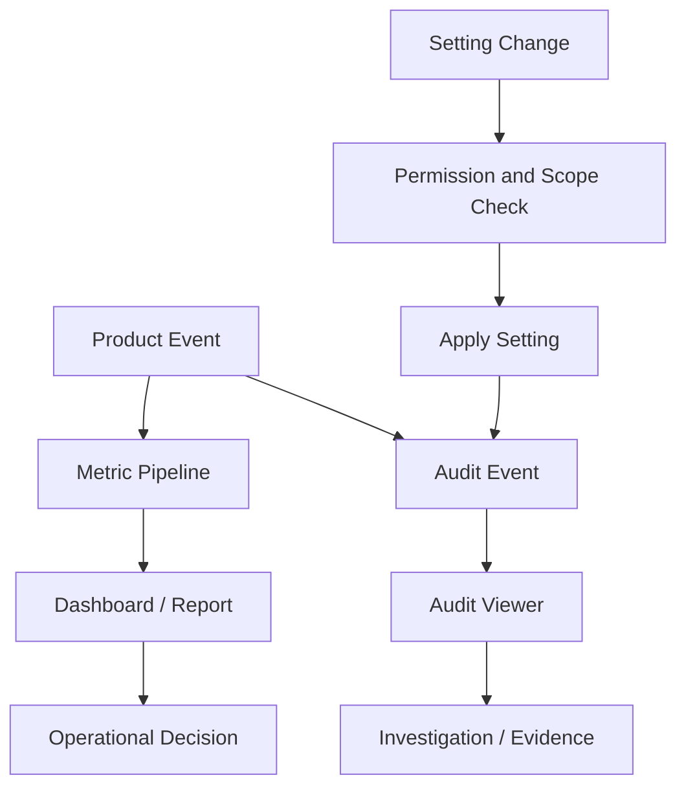
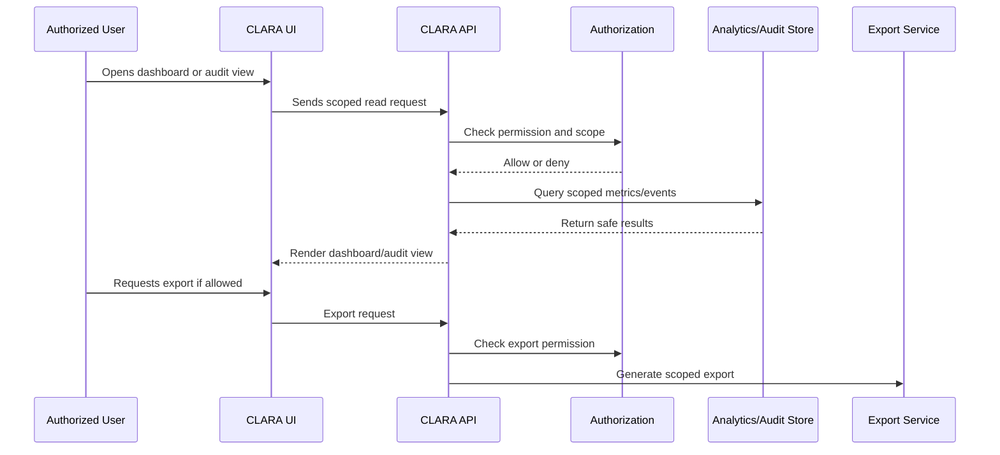

# Data Export and Retention Settings

> *"Defines settings for data export, retention, deletion, archiving, and compliance-related lifecycle control."*

---

# Purpose

Defines settings for data export, retention, deletion, archiving, and compliance-related lifecycle control.

---

# User / Product Problem

Customer and operational data must be retained, archived, exported, or deleted under clear policy. Wrong handling creates compliance and trust risks.

---

# Product Decision

## Decision

CLARA Data Export and Retention Settings should be admin-controlled, permission-checked, privacy-aware, and auditable.

## Status

Accepted.

## Reason

- Gives teams visibility into CLARA operations.
- Gives admins traceability for sensitive changes.
- Keeps configuration behavior scoped and understandable.
- Protects analytics and audit data from unnecessary exposure.
- Enables production governance for product modules.
- Completes the product-domain baseline for Book IV.

## Product Trade-offs

| Direction | Benefit | Trade-off |
|---|---|---|
| Curated metrics first | Easier to trust | Less flexible than raw BI |
| Basic audit first | Faster accountability | Less compliance depth initially |
| Scoped settings | Safer configuration | More UX structure needed |
| Privacy-aware analytics | Lower data leakage risk | Less granular reports by default |
| Export restrictions | Better security | More admin friction |

---

# Primary Users / Actors

- Organization Owner
- Admin
- Security Reviewer
- Auditor

---

# Domain Objects

- Retention Policy
- Export Setting
- Deletion Request
- Archive Rule
- Legal Hold
- Data Lifecycle

---

# Permission Baseline

| Permission | Meaning | Enforcement |
|---|---|---|
| `data_export:create` | Product action permission | Protected by backend authorization |
| `retention_policy:read` | Product action permission | Protected by backend authorization |
| `retention_policy:update` | Product action permission | Protected by backend authorization |

---

# Product Flow

---

# Analytics and Audit Sequence

---

# MVP Behavior

MVP should document retention posture and restrict exports to elevated roles, even if advanced retention settings are deferred.

---

# Future Behavior

Future versions may support configurable retention, legal hold, data subject requests, export approval, and deletion workflows.

---

# Product Requirements

## Functional Requirements

- Analytics must be scoped by Organization and Workspace where applicable.
- Audit events must include actor, action, resource, scope, timestamp, outcome, and safe metadata.
- Settings must define scope: user, workspace, organization, or system.
- Settings changes must be permission-controlled.
- Sensitive settings changes must be audited.
- Reports and dashboards must be permission-filtered.
- Export actions must be restricted and auditable.
- Analytics must avoid exposing raw sensitive customer content by default.
- User preferences must not override security controls.

## Non-Functional Requirements

- Dashboard queries must be performant enough for daily operational use.
- Audit logs must be append-oriented and tamper-resistant where practical.
- Metrics should be reproducible and consistently defined.
- Audit metadata should avoid storing unnecessary sensitive payloads.
- Exports must be generated with scoped filters.
- Settings changes must be validated before applying.
- Reporting must handle empty and partial data gracefully.
- Privacy and data minimization must guide analytics design.

---

# UX Expectations

- Dashboards should answer operational questions quickly.
- Metrics should have clear names and definitions.
- Audit logs should be searchable by time range and action.
- Settings pages should clearly show whether changes affect user, workspace, or organization.
- Dangerous settings should require confirmation.
- Export actions should explain scope and sensitivity.
- Permission-denied states should be safe and understandable.
- Analytics should avoid overwhelming users with vanity metrics.

---

# Security and Privacy Considerations

- Do not expose raw customer messages in analytics by default.
- Do not expose audit logs to normal users.
- Do not allow exports without elevated permission.
- Do not allow user preferences to weaken organization security policy.
- Do not store secrets in settings.
- Do not log sensitive payloads unnecessarily in audit events.
- Audit sensitive settings changes and exports.
- Apply data minimization to dashboards and reports.

---

# Acceptance Criteria

- [ ] Analytics scope is defined.
- [ ] Audit behavior is defined.
- [ ] Settings scope is defined.
- [ ] Primary users are defined.
- [ ] Permissions are named.
- [ ] Export behavior is considered.
- [ ] Privacy concerns are documented.
- [ ] Audit behavior is considered where relevant.
- [ ] MVP behavior is clear.
- [ ] Future behavior is separated from MVP.

---

# Anti-patterns

Avoid:

- Treating analytics as raw database access.
- Showing sensitive customer content in dashboards by default.
- Allowing audit export to normal users.
- Mixing user preferences with organization security controls.
- Building too many metrics before metric definitions are stable.
- Creating settings without owners or scopes.
- Logging full sensitive payloads in audit metadata.
- Ignoring retention and export implications.

---

# Related Book III References

- ../../BOOK-03-Implementation-Architecture/PART-04-Data-Architecture/README.md
- ../../BOOK-03-Implementation-Architecture/PART-07-Security-Implementation/README.md
- ../../BOOK-03-Implementation-Architecture/PART-10-Operations-Architecture/README.md
- ../../BOOK-03-Implementation-Architecture/PART-11-Product-Implementation-Architecture/219-Analytics-Audit-Settings-Module.md
- ../../BOOK-03-Implementation-Architecture/APPENDIX/APPENDIX-C-Security-Checklist.md

---

# Navigation

**Previous:** `215-Notification-Settings.md`

**Next:** `217-Reporting-Permissions-and-Visibility.md`
