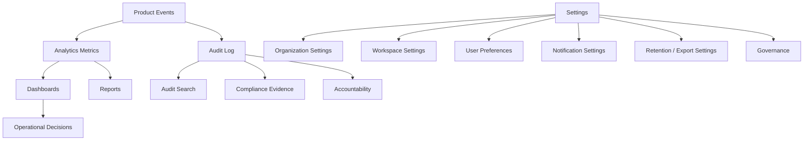

# PART-12 — Analytics, Audit, and Settings

> *"Analytics explains what is happening. Audit explains what changed. Settings define how CLARA behaves."*

---

# Purpose

Part XII defines CLARA's Analytics, Audit, and Settings product domain.

It explains:

- Analytics, Audit, and Settings overview.
- Analytics product model.
- Dashboard model.
- Operational metrics.
- Customer analytics reporting.
- Inbox and support analytics.
- AI analytics reporting.
- Workflow and integration analytics.
- Audit log product model.
- Audit event taxonomy.
- Audit search and filtering.
- Audit export and compliance evidence.
- Settings architecture product behavior.
- User preferences.
- Notification settings.
- Data export and retention settings.
- Reporting permissions and visibility.
- Analytics privacy and data minimization.
- MVP scope.
- Book IV completion summary.

---

# Why This Part Matters

CLARA needs visibility and governance.

Analytics helps teams answer:

```text
What is happening?
Where are bottlenecks?
Are customers being served well?
Is AI helping?
Are automations working?
Are integrations healthy?
```

Audit helps teams answer:

```text
Who changed what?
When did it happen?
What resource was affected?
Was it a user, system, AI, workflow, or integration action?
Can we investigate safely?
```

Settings helps teams answer:

```text
How should this organization behave?
How should this workspace behave?
What can this user personalize?
What should be controlled by admins?
```

---

# Chapter Map

| Chapter | Title |
|---:|---|
| 201 | Analytics Audit Settings Overview |
| 202 | Analytics Product Model |
| 203 | Dashboard Model |
| 204 | Operational Metrics |
| 205 | Customer Analytics Reporting |
| 206 | Inbox and Support Analytics |
| 207 | AI Analytics Reporting |
| 208 | Workflow and Integration Analytics |
| 209 | Audit Log Product Model |
| 210 | Audit Event Taxonomy |
| 211 | Audit Search and Filtering |
| 212 | Audit Export and Compliance Evidence |
| 213 | Settings Architecture Product Behavior |
| 214 | User Preferences |
| 215 | Notification Settings |
| 216 | Data Export and Retention Settings |
| 217 | Reporting Permissions and Visibility |
| 218 | Analytics Privacy and Data Minimization |
| 219 | MVP Analytics Audit Settings Scope |
| 220 | Part 12 Summary |

---

# Analytics, Audit, and Settings Map



---

# Product Rule

Every analytics, audit, and settings feature must define:

```text
Scope
Viewer role
Permission
Data source
Sensitivity level
Export behavior
Retention behavior
Audit requirement
```

---

# Critical Security Rule

CLARA must not expose raw sensitive customer data through analytics or audit views unless explicitly authorized and justified.

Backend services must enforce:

```text
Authentication
Authorization
Organization scope
Workspace scope
Report visibility
Audit visibility
Export permission
Data minimization
```

---

# MVP Analytics, Audit, and Settings Baseline

MVP should include:

```text
Basic operational dashboard
Customer count metrics
Conversation count metrics
Ticket count metrics
AI usage basics if AI exists
Workflow/integration health basics if available
Audit log for sensitive actions
Organization settings
Workspace settings
User preferences
Notification preferences
Restricted export behavior
Privacy-aware reporting
```

---

# Related Documents

- ../PART-02-User-Roles-and-Permissions/README.md
- ../PART-03-Organization-and-Workspace/README.md
- ../PART-08-AI-Assistant-Product/README.md
- ../PART-09-Workflow-Automation/README.md
- ../PART-11-Billing-and-Admin/README.md
- ../../BOOK-03-Implementation-Architecture/PART-10-Operations-Architecture/README.md
- ../../BOOK-03-Implementation-Architecture/PART-11-Product-Implementation-Architecture/219-Analytics-Audit-Settings-Module.md

---

# Navigation

**Previous:** `../PART-11-Billing-and-Admin/200-Part-11-Summary.md`

**Next:** `201-Analytics-Audit-Settings-Overview.md`
