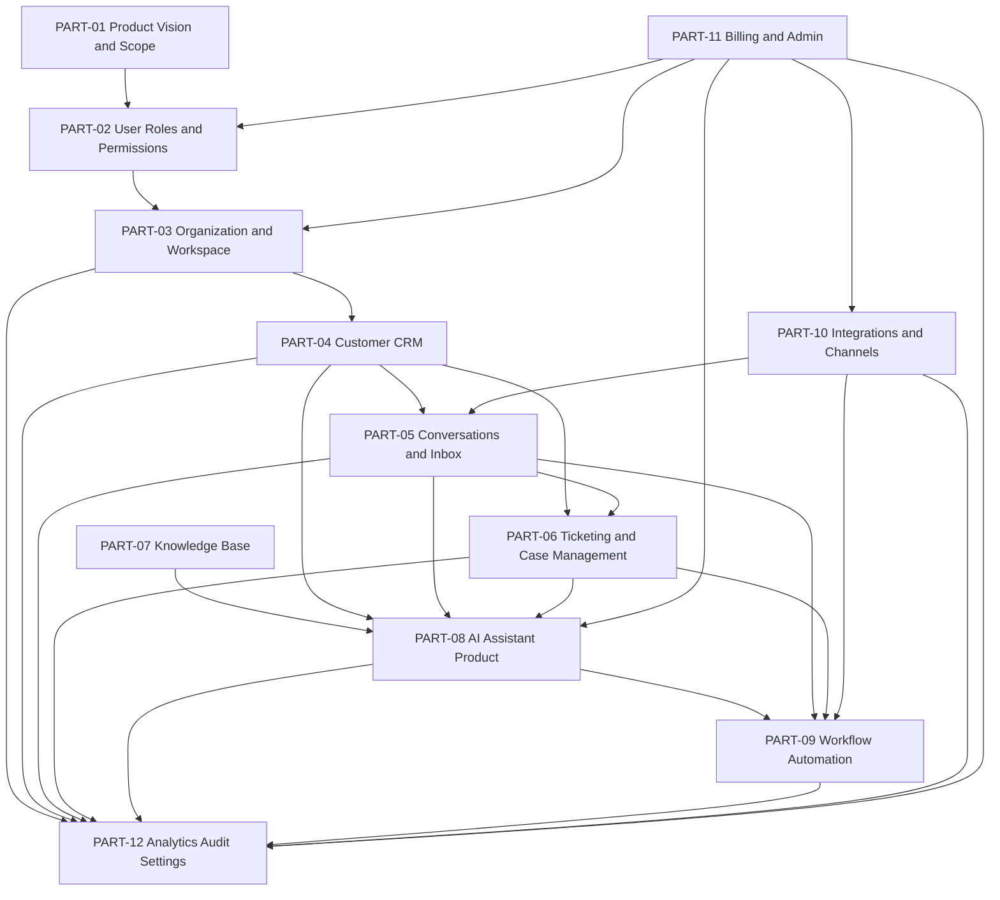

# BOOK-04 — Product & Domain Specification

> *"Book IV defines what CLARA is as a product before CLARA becomes implementation."*

---

# Purpose

Book IV is the **product-domain source of truth** for CLARA.

It defines:

- What CLARA does.
- Who uses CLARA.
- What product domains exist.
- What each domain owns.
- What is included in MVP.
- What is intentionally deferred.
- What requires permission checks.
- What must be audited.
- What AI is allowed to assist with.
- What integrations and channels must support.
- What settings, analytics, and admin controls are required.

Book IV should be used before writing:

```text
PRD
TDD
UX Flow
Wireframe
API Spec
Database Migration Spec
Security Checklist
Test Plan
Backlog
Runbook
Demo Script
Implementation Plan
```

---

# Product Identity

CLARA is an **AI-native Business Operating System** focused on:

- CRM.
- Customer support.
- Conversation inbox.
- Ticketing and case management.
- Knowledge base.
- AI assistant.
- Workflow automation.
- Integrations and communication channels.
- Admin and billing governance.
- Analytics, audit, and settings.

CLARA is not a trading assistant.

Any trading-related assistant should be treated as a separate product/domain.

---

# Book IV Completion Status

Book IV currently contains:

```text
12 product-domain parts
220 chapters
1 master index pack
```

Status:

```text
Completed
```

---

# Folder Structure

Recommended repository location:

```text
docs/
└── BOOK-04-Product-Domain-Specification/
    ├── README.md
    ├── PART-01-Product-Vision-and-Scope/
    ├── PART-02-User-Roles-and-Permissions/
    ├── PART-03-Organization-and-Workspace/
    ├── PART-04-Customer-CRM/
    ├── PART-05-Conversations-and-Inbox/
    ├── PART-06-Ticketing-and-Case-Management/
    ├── PART-07-Knowledge-Base/
    ├── PART-08-AI-Assistant-Product/
    ├── PART-09-Workflow-Automation/
    ├── PART-10-Integrations-and-Channels/
    ├── PART-11-Billing-and-Admin/
    ├── PART-12-Analytics-Audit-and-Settings/
    └── BOOK-04-Master-Index/
```

---

# Part Map

| Part | Title | Chapters | Status |
|---|---|---:|---|
| PART-01 | Product Vision and Scope | 01–10 | Complete |
| PART-02 | User Roles and Permissions | 11–25 | Complete |
| PART-03 | Organization and Workspace | 26–40 | Complete |
| PART-04 | Customer CRM | 41–60 | Complete |
| PART-05 | Conversations and Inbox | 61–80 | Complete |
| PART-06 | Ticketing and Case Management | 81–100 | Complete |
| PART-07 | Knowledge Base | 101–120 | Complete |
| PART-08 | AI Assistant Product | 121–140 | Complete |
| PART-09 | Workflow Automation | 141–160 | Complete |
| PART-10 | Integrations and Channels | 161–180 | Complete |
| PART-11 | Billing and Admin | 181–200 | Complete |
| PART-12 | Analytics, Audit, and Settings | 201–220 | Complete |
| Master Index | Book IV Master Index | Index Pack | Complete |

---

# Product Domain Overview

## PART-01 — Product Vision and Scope

Defines the foundation of CLARA as a product:

- Product definition.
- Product scope.
- Target users.
- Core use cases.
- Product principles.
- MVP scope.
- Non-goals.
- Product risks.

Path:

```text
PART-01-Product-Vision-and-Scope/
```

---

## PART-02 — User Roles and Permissions

Defines who uses CLARA and what they are allowed to do:

- User personas.
- Organization Owner.
- Admin.
- Manager.
- Support Agent.
- Sales Operator.
- Knowledge Manager.
- Developer/Integrator.
- System/service actors.
- Role model.
- Permission catalog.
- Permission scope.
- Access review and delegation.

Path:

```text
PART-02-User-Roles-and-Permissions/
```

---

## PART-03 — Organization and Workspace

Defines CLARA's tenant model:

- Organization.
- Workspace.
- Membership.
- Invitations.
- Workspace switching.
- Multi-workspace visibility.
- Organization audit behavior.
- Workspace governance.
- Organization/workspace permissions.
- MVP organization/workspace scope.

Path:

```text
PART-03-Organization-and-Workspace/
```

---

## PART-04 — Customer CRM

Defines CLARA's customer relationship domain:

- Customer profile.
- Contact points.
- Customer timeline.
- Customer notes.
- Tags and labels.
- Segments.
- Lifecycle.
- Ownership and assignment.
- Search and filtering.
- Import/export.
- Duplicate merge.
- Privacy and consent.
- Customer AI context.
- Customer analytics.

Path:

```text
PART-04-Customer-CRM/
```

---

## PART-05 — Conversations and Inbox

Defines CLARA's customer communication center:

- Conversation model.
- Message model.
- Channel model.
- Inbox views.
- Assignment.
- Status lifecycle.
- Reply workflow.
- AI reply drafting.
- Internal notes.
- Customer linking.
- Attachments.
- Search and filters.
- SLA and priority.
- Notifications.
- Inbox analytics.
- Privacy and retention.

Path:

```text
PART-05-Conversations-and-Inbox/
```

---

## PART-06 — Ticketing and Case Management

Defines issue tracking and case resolution:

- Ticket model.
- Case lifecycle.
- Ticket creation from conversation.
- Manual ticket creation.
- Assignment and ownership.
- Priority and severity.
- SLA policy.
- Status workflow.
- Collaboration.
- Customer-visible behavior.
- Escalation.
- Related tickets.
- Notes and activity.
- Attachments.
- Automation rules.
- AI ticket assistance.
- Ticket analytics.

Path:

```text
PART-06-Ticketing-and-Case-Management/
```

---

## PART-07 — Knowledge Base

Defines trusted operational knowledge:

- Knowledge article model.
- Collections and categories.
- Article authoring.
- Article lifecycle.
- Versioning.
- Visibility.
- Search.
- RAG grounding.
- Quality review.
- Feedback.
- Templates.
- Localization.
- Public help center.
- Permissions.
- Audit.
- Analytics.
- Security and privacy.

Path:

```text
PART-07-Knowledge-Base/
```

---

## PART-08 — AI Assistant Product

Defines CLARA's AI assistant as a governed product layer:

- AI use cases.
- AI chat experience.
- AI reply drafting.
- Conversation summary.
- Ticket assistance.
- Customer insight.
- Knowledge grounding.
- Tool actions.
- Human review.
- Safety guardrails.
- Prompt/context policy.
- Memory/context boundaries.
- Evaluation and feedback.
- Audit and traceability.
- Permissions and access control.
- Error handling.
- AI analytics.

Path:

```text
PART-08-AI-Assistant-Product/
```

---

## PART-09 — Workflow Automation

Defines safe automation behavior:

- Workflow model.
- Trigger model.
- Condition model.
- Action model.
- Workflow builder.
- Lifecycle.
- Execution.
- Approval and human-in-the-loop.
- Templates.
- Conversation automation.
- Ticket automation.
- CRM automation.
- AI-assisted automation.
- Permissions and risk levels.
- Audit and traceability.
- Error handling and retry.
- Analytics.

Path:

```text
PART-09-Workflow-Automation/
```

---

## PART-10 — Integrations and Channels

Defines how CLARA connects to external systems:

- Integration model.
- Channel vs integration boundary.
- Connector lifecycle.
- OAuth and credentials.
- Webhook ingestion.
- Outbound webhooks.
- Email channel.
- Web chat channel.
- WhatsApp channel.
- Social DM channels.
- Custom API channel.
- Data sync and mapping.
- Rate limits and quotas.
- Error handling and retry.
- Governance.
- Security and privacy.
- Audit and observability.

Path:

```text
PART-10-Integrations-and-Channels/
```

---

## PART-11 — Billing and Admin

Defines account administration and monetization controls:

- Admin console.
- Billing account.
- Plan and pricing model.
- Subscription lifecycle.
- Entitlement system.
- Usage limits and quotas.
- Seats and members billing.
- Invoices and payment records.
- Plan upgrade/downgrade.
- Organization settings.
- Workspace settings.
- Feature flags.
- Security controls.
- AI controls.
- Integration controls.
- Admin audit and billing events.
- Admin notifications and alerts.

Path:

```text
PART-11-Billing-and-Admin/
```

---

## PART-12 — Analytics, Audit, and Settings

Defines visibility, traceability, and configuration:

- Analytics model.
- Dashboards.
- Operational metrics.
- Customer analytics.
- Inbox/support analytics.
- AI analytics.
- Workflow/integration analytics.
- Audit log model.
- Audit taxonomy.
- Audit search/filtering.
- Audit export.
- Settings architecture.
- User preferences.
- Notification settings.
- Data export and retention.
- Reporting permissions.
- Privacy and data minimization.

Path:

```text
PART-12-Analytics-Audit-and-Settings/
```

---

# Master Index

The Master Index is the navigation and closure pack for Book IV.

Path:

```text
BOOK-04-Master-Index/
```

Recommended files:

```text
README.md
BOOK-04-PART-MAP.md
BOOK-04-CHAPTER-MAP.md
BOOK-04-DOMAIN-DEPENDENCY-MAP.md
BOOK-04-MVP-SCOPE-MAP.md
BOOK-04-PERMISSION-MAP.md
BOOK-04-AI-GOVERNANCE-MAP.md
BOOK-04-IMPLEMENTATION-READINESS-GUIDE.md
BOOK-04-CROSS-REFERENCE.md
BOOK-04-NEXT-STEPS-TO-BOOK-05.md
```

---

# Complete Domain Dependency Map



---

# MVP Product Baseline

CLARA MVP should focus on this vertical slice:

```text
Organization + Workspace
Roles + Permissions
Customer CRM
Conversation Inbox with one reliable channel
Knowledge Base
AI Reply Drafting with human review
Basic Ticketing
Basic Admin
Basic Audit
Basic Analytics
```

The MVP should not try to support every advanced feature at once.

---

# MVP Non-Negotiables

Even in MVP, CLARA must enforce:

```text
Authentication
Authorization
Organization scope
Workspace scope
Input validation
Output encoding
Secure secret handling
Audit for sensitive actions
Safe AI human review
No cross-workspace data leakage
No hard-coded credentials
No auto-sending AI replies
No unrestricted automation
No fragile unofficial scraping as production foundation
```

---

# AI Governance Baseline

CLARA AI must be:

```text
Permission-aware
Context-scoped
Knowledge-grounded where possible
Human-reviewable
Auditable
Safe by default
Non-autonomous for high-risk MVP actions
```

In MVP, CLARA AI must not:

- Auto-send customer replies.
- Access cross-workspace data without permission.
- Use draft/unpublished knowledge as trusted grounding by default.
- Reveal hidden prompts, secrets, or internal policies.
- Execute destructive tool actions.
- Create active workflows without human approval.
- Bypass normal product permissions.

---

# Security Baseline

Book IV assumes CLARA will be used in a production-like environment.

Every implementation derived from Book IV must consider:

- RBAC.
- Tenant isolation.
- Workspace isolation.
- Secure session handling.
- Input validation.
- Output encoding.
- CSRF protection where relevant.
- XSS prevention.
- SQL/NoSQL injection prevention.
- SSRF prevention for integrations/webhooks.
- RCE prevention for automation and integrations.
- Secret management.
- Safe logging.
- Auditability.
- Rate limiting.
- Abuse prevention.
- Secure AI context handling.

---

# Permission Enforcement Rule

Frontend UI visibility is not authorization.

Every sensitive action must be enforced in the backend.

Permission evaluation should include:

```text
actor
role
permission key
organization_id
workspace_id
resource_id
resource visibility
risk level
approval requirement
audit requirement
```

---

# Implementation Readiness Rule

A domain is ready for implementation only when it has:

- Product purpose.
- Primary users.
- Domain objects.
- MVP scope.
- Future scope.
- Permissions.
- Security concerns.
- Audit behavior.
- UX expectations.
- Acceptance criteria.
- Anti-patterns.
- Related architecture references.

---

# Recommended Next Book

The next recommended book is:

```text
BOOK V — Engineering Execution Plan
```

Book V should convert Book IV into engineering execution:

```text
Execution strategy
Repository workflow
Backend implementation plan
Frontend implementation plan
Database and migration plan
AI implementation plan
Integration implementation plan
Security implementation plan
Testing and QA execution
DevOps and release execution
MVP milestones and backlog
Production readiness and handover
```

---

# Recommended Next Action

Start with:

```text
BOOK V — PART 01: Execution Strategy
```

Suggested first chapters:

```text
01-Book-V-Overview.md
02-Execution-Principles.md
03-MVP-Build-Strategy.md
04-Vertical-Slice-Strategy.md
05-Module-Dependency-Execution.md
06-Team-Workflow.md
07-Definition-of-Ready.md
08-Definition-of-Done.md
09-Execution-Risks.md
10-Part-01-Summary.md
```

---

# Repository Maintenance Checklist

Before continuing to Book V:

- [ ] Ensure all Book IV parts are committed.
- [ ] Ensure folder name uses `Specification`, not `Spesification`.
- [ ] Ensure project name is consistently `CLARA`.
- [ ] Search and remove old `Athena` references where not intentionally historical.
- [ ] Update root repository README.
- [ ] Update `docs/README.md`.
- [ ] Add Book IV Master Index.
- [ ] Validate Markdown links.
- [ ] Run Markdown lint if available.
- [ ] Align `AGENTS.md` so AI coding assistants reference Book IV before coding.

Recommended local commands:

```bash
rg -n "Athena|ATHENA|athena" . --glob '!.git'
rg -n "Spesification" docs --glob '*.md'
```

---

# Final Status

Book IV is complete.

Book IV is now ready to be used as input for:

```text
BOOK V — Engineering Execution Plan
```

---

# Navigation

**Master Index:** `BOOK-04-Master-Index/README.md`

**Next Book:** `../BOOK-05-Engineering-Execution-Plan/README.md`
