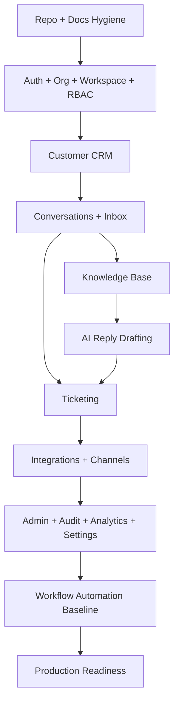

# BOOK-05 Execution Dependency Map

This file defines the recommended dependency order for CLARA implementation.

---

# High-Level Dependency Graph



---

# Dependency Rules

| Rule | Reason |
|---|---|
| Do not build CRM before org/workspace/RBAC | Customer data must be scoped and permission-controlled |
| Do not build Inbox before Customer CRM baseline | Conversations need customer context |
| Do not build AI reply drafting before Inbox and Knowledge | AI needs safe conversation context and trusted knowledge |
| Do not build integrations before idempotency/security patterns | External events are untrusted |
| Do not build workflow automation before audit and permissions | Automation mutates data and needs traceability |
| Do not go production before backup/restore/smoke tests | Production requires recovery evidence |

---

# Technical Dependency Map

| Area | Depends On | Unlocks |
|---|---|---|
| Repository Workflow | Book V Part 01 | Controlled coding |
| Backend Foundation | Repo workflow | Auth, RBAC, API modules |
| Frontend Shell | Repo workflow + auth APIs | Product UI |
| Database Schema | Product domains + backend plan | Durable data |
| AI Gateway | Auth/RBAC + DB + Knowledge | AI features |
| Integration Gateway | Auth/RBAC + DB + Inbox | External channels |
| Security Gates | Backend + Frontend + DB + AI + Integrations | Safe release |
| Testing/QA | All implementation plans | Release confidence |
| DevOps | Testing + security gates | Deployment |
| Handover | MVP milestones + DevOps | Production operation |

---

# Practical Coding Order

```text
1. Root repo setup
2. Documentation placement
3. AGENTS.md placement
4. API skeleton
5. Web skeleton
6. Database/migration skeleton
7. Auth/session baseline
8. Organization/workspace model
9. RBAC helper
10. Customer CRM vertical slice
11. Conversation Inbox vertical slice
12. Knowledge Base vertical slice
13. AI reply drafting vertical slice
14. Ticketing vertical slice
15. Integration channel vertical slice
16. Admin/audit/analytics baseline
17. Workflow baseline
18. Production readiness
```
