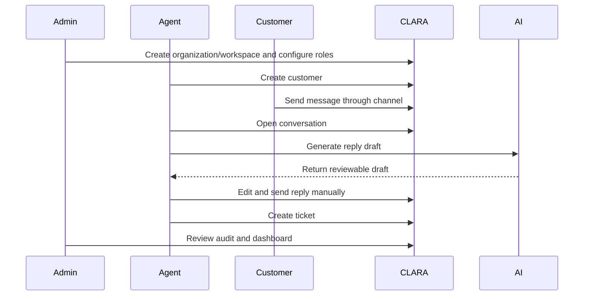

# BOOK-05 MVP Milestone Map

This file maps CLARA MVP phases, deliverables, and gates.

---

# MVP Phase Map

| Phase | Name | Main Deliverable | Must Pass |
|---:|---|---|---|
| 0 | Repo and Docs Hygiene | Repo structure, docs, AGENTS.md, tooling baseline | Docs and coding assistant alignment |
| 1 | Foundation Auth Org Workspace | Identity, organization, workspace, RBAC | Cross-scope denial tests |
| 2 | Customer CRM | Customer records, notes, tags, timeline | Workspace-scoped customer access |
| 3 | Conversations and Inbox | Conversation list/detail, replies, internal notes, one channel | Reply flow and internal note separation |
| 4 | Knowledge Base | Article lifecycle, search, visibility, AI eligibility | Draft/private content protection |
| 5 | AI Reply Drafting | AI Gateway, RAG, prompt versioning, review flow | No auto-send; context boundary tests |
| 6 | Ticketing | Ticket lifecycle linked to customer/conversation | Assignment/status audit |
| 7 | Integrations and Channels | Integration Gateway, one reliable channel | Validation, idempotency, credential safety |
| 8 | Admin Audit Analytics Settings | Admin console, audit viewer, dashboards, settings | Permission-controlled admin/audit |
| 9 | Workflow Automation Baseline | Low-risk automation rules and logs | Permission, idempotency, audit |
| 10 | Production Readiness | Smoke tests, monitoring, backups, runbooks | Go-live decision evidence |

---

# MVP Demo Flow



---

# MVP Completion Definition

MVP is complete only when:

```text
Core flow works
Security gates pass
Tests pass
Docs updated
Demo validates workflow
Known limitations documented
Deployment/recovery plan exists
```
