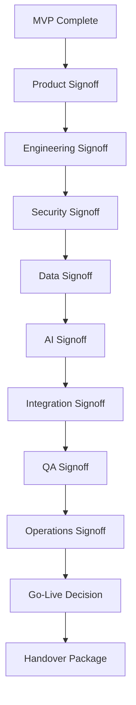

# BOOK-05 Production Readiness Map

This file maps CLARA production readiness requirements.

---

# Production Readiness Flow



---

# Readiness Gates

| Gate | Required Evidence |
|---|---|
| Product | MVP demo, acceptance checklist, known out-of-scope items |
| Engineering | CI pass, code review, docs updated, architecture alignment |
| Security | Auth/RBAC/scope tests, secret scan, security checklist |
| Data | Migration test, backup configured, restore tested |
| AI | Context tests, review flow, prompt versions, fallback |
| Integration | Webhook tests, idempotency, health, credential safety |
| QA | Regression, E2E, API, security, AI, integration tests |
| DevOps | Deployment runbook, monitoring, alerts, rollback |
| Support | FAQ, escalation path, known limitations |
| Handover | Owners, access, runbooks, release notes, roadmap |

---

# Go-Live Decision Options

```text
Not ready
Staging only
Internal alpha
Private beta
Limited production
General production
```

---

# Go-Live Rule

Deadline pressure is not readiness evidence.

The decision must be based on gates, risk, support readiness, and recovery confidence.
