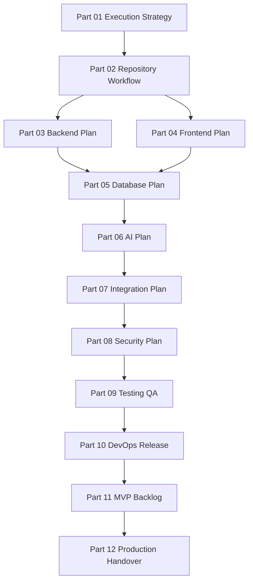

# BOOK V — Master Index

> *"Book V is the execution bridge between CLARA's product specification and production-ready implementation."*

---

# Purpose

This Master Index maps the entire **Book V — Engineering Execution Plan**.

Book V answers:

```text
How should CLARA be built?
What should be built first?
How should the repo be structured?
How should backend, frontend, database, AI, integrations, security, QA, and DevOps be executed?
How should MVP milestones be planned?
How should production readiness be proven?
```

---

# Master Files

| File | Purpose |
|---|---|
| `BOOK-05-PART-MAP.md` | Maps all Book V parts |
| `BOOK-05-CHAPTER-MAP.md` | Maps all chapters 01–225 |
| `BOOK-05-EXECUTION-DEPENDENCY-MAP.md` | Shows execution dependency order |
| `BOOK-05-MVP-MILESTONE-MAP.md` | Maps MVP phases and deliverables |
| `BOOK-05-SECURITY-QUALITY-GATE-MAP.md` | Maps required gates before merge/release |
| `BOOK-05-AI-AND-INTEGRATION-GOVERNANCE-MAP.md` | Maps AI and integration governance |
| `BOOK-05-PRODUCTION-READINESS-MAP.md` | Maps readiness and handover gates |
| `BOOK-05-CODING-START-GUIDE.md` | Practical guide before coding starts |
| `BOOK-05-CROSS-REFERENCE.md` | Links Book V with Book IV and engineering areas |
| `BOOK-05-NEXT-STEPS-TO-CODING.md` | Recommended next steps after Book V |

---

# Book V Structure



---

# How to Use Book V

Use Book V as:

```text
Implementation execution guide
Codex/Cursor instruction reference
PR review checklist source
Security and QA gate reference
MVP milestone planning source
Production readiness checklist source
```

---

# Next Recommended Step

After this Master Index, the next practical artifact is:

```text
Root README update for BOOK-05-Engineering-Execution-Plan
```

Then:

```text
AGENTS.md pack for coding CLARA with AI assistant support
```
