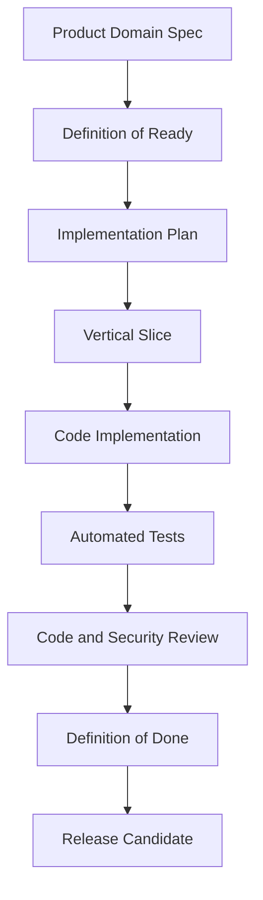

# Part 01 Summary

> *"Summarizes Book V Part 01 and defines readiness to continue into repository and development workflow planning."*

---

# Purpose

Summarizes Book V Part 01 and defines readiness to continue into repository and development workflow planning.

---

# Execution Problem

Repository structure and development workflow should be based on execution strategy, not chosen randomly.

---

# Engineering Decision

## Decision

CLARA should proceed to repository and development workflow design after execution principles, MVP strategy, vertical slice strategy, dependency order, and quality gates are defined.

## Status

Accepted.

## Expected Output

A closure document for Book V Part 01 and transition guide into Part 02.

---

# Context

Book V is built from the product-domain baseline defined in Book IV.

The engineering team must treat Book IV as the source of truth for:

- Product scope.
- Domain ownership.
- User roles.
- Permissions.
- AI behavior.
- Workflow boundaries.
- Integration boundaries.
- Audit requirements.
- MVP and future scope.

---

# Execution Model



---

# Practical Rules

- Build in small vertical slices.
- Do not build isolated technical layers without user-visible integration.
- Do not bypass backend authorization.
- Do not create tenant-scoped records without `organization_id`.
- Do not create workspace-scoped records without `workspace_id`.
- Do not let AI features bypass normal product permissions.
- Do not store secrets in code, repository, logs, or normal database config.
- Do not add advanced features outside MVP without explicit product approval.
- Do not mark work done without tests and documentation updates.
- Do not ship high-risk features without security review.

---

# Secure-by-Design Requirements

Every implementation derived from this chapter must consider:

| Area | Required Behavior |
|---|---|
| Authentication | User identity must be verified before protected actions |
| Authorization | Backend must enforce role and permission checks |
| Tenant Isolation | Organization and workspace boundaries must be enforced |
| Input Validation | External and user input must be validated before processing |
| Output Safety | UI must avoid XSS and unsafe rendering |
| Secrets | Secrets must use environment variables or secret manager |
| Audit | Sensitive actions must create audit events |
| Logging | Logs must avoid sensitive payloads and secrets |
| AI Safety | AI output is untrusted until reviewed |
| Testing | Unauthorized, invalid, and edge cases must be tested |

---

# Execution Checklist

- [ ] Related Book IV domain has been identified.
- [ ] MVP scope is clear.
- [ ] Primary user flow is clear.
- [ ] Required permissions are listed.
- [ ] Required data objects are listed.
- [ ] API behavior is known or planned.
- [ ] Database impact is known or planned.
- [ ] Security risks are documented.
- [ ] Tests are planned.
- [ ] Observability requirements are known.
- [ ] Documentation update path is known.

---

# Acceptance Criteria

- [ ] The chapter gives clear implementation direction.
- [ ] The chapter can be used by engineers and AI coding assistants.
- [ ] The chapter reinforces production-minded delivery.
- [ ] The chapter includes secure-by-design expectations.
- [ ] The chapter avoids prototype-only shortcuts.
- [ ] The chapter connects back to Book IV product-domain decisions.
- [ ] The chapter prepares the next Book V part.

---

# Anti-patterns

Avoid:

- Building features only because they are exciting.
- Building AI features before permissions and context boundaries are stable.
- Building integrations before webhook validation and idempotency are planned.
- Marking UI complete without API and backend validation.
- Marking backend complete without user-visible workflow.
- Treating tests as optional.
- Treating audit logs as future-only for sensitive actions.
- Letting AI coding assistants invent behavior outside documentation.

---

# Related Documents

- ../../BOOK-04-Product-Domain-Specification/README.md
- ../../BOOK-04-Product-Domain-Specification/BOOK-04-Master-Index/README.md
- ../../BOOK-04-Product-Domain-Specification/BOOK-04-Master-Index/BOOK-04-MVP-SCOPE-MAP.md
- ../../BOOK-04-Product-Domain-Specification/BOOK-04-Master-Index/BOOK-04-PERMISSION-MAP.md
- ../../BOOK-04-Product-Domain-Specification/BOOK-04-Master-Index/BOOK-04-AI-GOVERNANCE-MAP.md

---

# Navigation

**Previous:** `09-Execution-Risks.md`

**Next:** `../PART-02-Repository-and-Development-Workflow/README.md`

---

# Part 01 Completion

Part 01 establishes:

- Book V purpose.
- Execution principles.
- MVP build strategy.
- Vertical slice strategy.
- Module dependency order.
- Team workflow.
- Definition of Ready.
- Definition of Done.
- Execution risk management.

---

# Ready for Part 02

The next part should define:

```text
Repository and Development Workflow
```

It should include:

- Repository structure.
- Branching strategy.
- Commit conventions.
- Pull request process.
- Local development setup.
- Environment variable strategy.
- AGENTS.md rules.
- AI coding assistant workflow.
- Code review checklist.
- Documentation update workflow.
