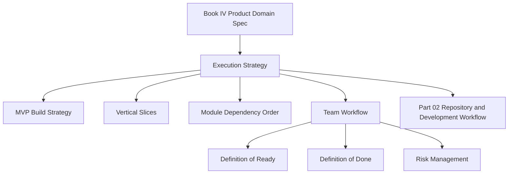

# PART-01 — Execution Strategy

> *"Engineering execution turns product intent into safe, testable, maintainable software."*

---

# Purpose

Part 01 defines the engineering execution strategy for CLARA.

Book IV already defines:

```text
What CLARA is.
What domains exist.
What users need.
What MVP includes.
What must be permission-controlled.
What AI can and cannot do.
What must be audited.
```

Book V starts answering:

```text
How CLARA should be built.
What should be built first.
How engineering work should be sliced.
How quality should be checked.
How security should be enforced.
How teams and AI coding assistants should work.
When a feature is ready.
When a feature is done.
```

---

# Chapter Map

| Chapter | Title |
|---:|---|
| 01 | Book V Overview |
| 02 | Execution Principles |
| 03 | MVP Build Strategy |
| 04 | Vertical Slice Strategy |
| 05 | Module Dependency Execution |
| 06 | Team Workflow |
| 07 | Definition of Ready |
| 08 | Definition of Done |
| 09 | Execution Risks |
| 10 | Part 01 Summary |

---

# Execution Strategy Map



---

# Core Execution Position

CLARA should not be built as a throwaway prototype.

CLARA should be built as:

```text
Small enough for MVP
Clean enough to extend
Secure enough for production
Observable enough to debug
Documented enough for AI coding assistants
Tested enough to trust
```

---

# Recommended Book V Part Map

```text
BOOK-05-Engineering-Execution-Plan/
├── PART-01-Execution-Strategy/
├── PART-02-Repository-and-Development-Workflow/
├── PART-03-Backend-Implementation-Plan/
├── PART-04-Frontend-Implementation-Plan/
├── PART-05-Database-and-Migration-Plan/
├── PART-06-AI-Implementation-Plan/
├── PART-07-Integration-Implementation-Plan/
├── PART-08-Security-Implementation-Plan/
├── PART-09-Testing-and-QA-Execution/
├── PART-10-DevOps-and-Release-Execution/
├── PART-11-MVP-Milestones-and-Backlog/
└── PART-12-Production-Readiness-and-Handover/
```

---

# MVP Execution Baseline

The CLARA MVP should be built around this vertical slice:

```text
Organization + Workspace
Roles + Permissions
Customer CRM
Conversation Inbox with one reliable channel
Knowledge Base
AI Reply Drafting with human review
Basic Ticketing
Basic Admin
Basic Audit
Basic Analytics
```

---

# Non-Negotiable Engineering Gates

Every CLARA feature must pass:

```text
Product alignment
Backend authorization
Tenant/workspace scope
Input validation
Output safety
Test coverage
Audit behavior when sensitive
Observability
Documentation update
Code review
Security review when high-risk
```

---

# Navigation

**Next:** `01-Book-V-Overview.md`
