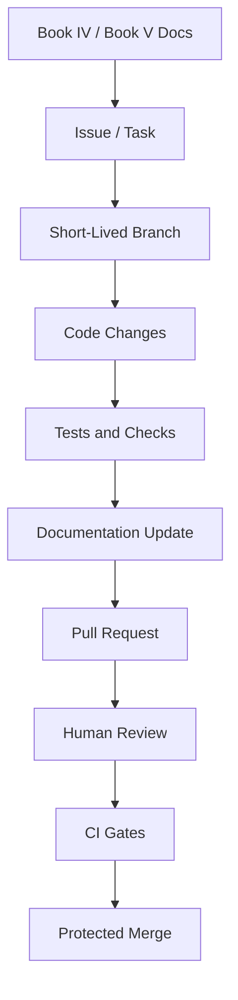

# Commit and Pull Request Convention

> *"Defines commit naming, pull request structure, PR size, and review expectations."*

---

# Purpose

Defines commit naming, pull request structure, PR size, and review expectations.

---

# Execution Problem

Unclear commits and oversized PRs make review harder, increase security risk, and reduce traceability.

---

# Engineering Decision

## Decision

CLARA should use conventional commits and small pull requests that map to documented tasks or vertical slices.

## Status

Accepted.

## Expected Output

A commit and PR convention suitable for human and AI-assisted development.

---

# Context

This chapter supports the Book V execution strategy.

It exists to make sure CLARA implementation work is:

- Traceable to documentation.
- Easy to review.
- Safe for production.
- Friendly to AI coding assistants.
- Secure by default.
- Consistent across backend, frontend, database, AI, integrations, and DevOps.

---

# Workflow Model



---

# Practical Rules

- Every non-trivial change must be linked to a documented task.
- Every feature task should reference the relevant Book IV domain.
- Every implementation task should reference the relevant Book V plan.
- Every protected backend action must include authorization checks.
- Every tenant-scoped record must include organization scope.
- Every workspace-scoped record must include workspace scope.
- Every AI-generated change must be reviewed by a human.
- Every PR must be small enough to review meaningfully.
- Every secrets/config change must avoid exposing sensitive values.
- Every docs-affecting implementation must update documentation.

---

# Secure-by-Design Requirements

| Area | Requirement |
|---|---|
| Repository | Secrets must not be committed |
| Branches | Main branch must be protected |
| Pull Requests | Security-sensitive changes require careful review |
| CI | Tests and checks must run before merge |
| Dependencies | Lockfiles must be committed and reviewed |
| AI Coding | AI output must be reviewed before merge |
| Docs | Documentation must not contain real credentials |
| Configuration | `.env.example` must use fake safe placeholders |

---

# Acceptance Criteria

- [ ] The workflow is understandable by junior and senior engineers.
- [ ] The workflow is usable with AI coding assistants.
- [ ] The workflow protects main branch quality.
- [ ] The workflow supports documentation-first development.
- [ ] The workflow includes security expectations.
- [ ] The workflow prevents obvious production-risk shortcuts.
- [ ] The workflow prepares the next implementation part.

---

# Anti-patterns

Avoid:

- Coding without reading related docs.
- Creating huge PRs with unrelated changes.
- Merging code without tests.
- Keeping long-lived branches alive for weeks.
- Putting secrets in repository files.
- Letting AI coding assistants modify architecture without review.
- Adding dependencies without review.
- Updating code without updating docs.

---

# Related Documents

- ../PART-01-Execution-Strategy/README.md
- ../../BOOK-04-Product-Domain-Specification/README.md
- ../../BOOK-04-Product-Domain-Specification/BOOK-04-Master-Index/BOOK-04-MVP-SCOPE-MAP.md
- ../../BOOK-04-Product-Domain-Specification/BOOK-04-Master-Index/BOOK-04-PERMISSION-MAP.md
- ../../BOOK-04-Product-Domain-Specification/BOOK-04-Master-Index/BOOK-04-AI-GOVERNANCE-MAP.md

---

# Navigation

**Previous:** `14-Branching-Strategy.md`

**Next:** `16-Local-Development-Environment.md`

---

# Conventional Commit Format

Use:

```text
type(scope): summary
```

Examples:

```text
feat(customers): add create customer endpoint
fix(auth): enforce workspace membership check
docs(book-05): add repository workflow
test(tickets): add unauthorized access tests
chore(ci): add lint workflow
security(ai): redact prompt metadata in logs
```

---

# Pull Request Template

Every PR should answer:

```text
What changed?
Why?
Which docs does this implement?
What permissions are affected?
What security risks were considered?
What tests were added?
What screenshots/logs are useful?
What is intentionally out of scope?
```

---

# PR Size Rule

Prefer:

```text
Small PRs
One feature slice per PR
One refactor purpose per PR
No mixed unrelated changes
```
