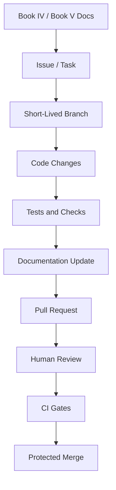

# Local Development Environment

> *"Defines how developers should run CLARA locally."*

---

# Purpose

Defines how developers should run CLARA locally.

---

# Execution Problem

If local setup is fragile, developers waste time and ship bugs that only appear in shared environments.

---

# Engineering Decision

## Decision

CLARA local development should be reproducible, documented, and close enough to production architecture to catch integration issues early.

## Status

Accepted.

## Expected Output

A local development baseline covering services, commands, environment files, and troubleshooting expectations.

---

# Context

This chapter supports the Book V execution strategy.

It exists to make sure CLARA implementation work is:

- Traceable to documentation.
- Easy to review.
- Safe for production.
- Friendly to AI coding assistants.
- Secure by default.
- Consistent across backend, frontend, database, AI, integrations, and DevOps.

---

# Workflow Model



---

# Practical Rules

- Every non-trivial change must be linked to a documented task.
- Every feature task should reference the relevant Book IV domain.
- Every implementation task should reference the relevant Book V plan.
- Every protected backend action must include authorization checks.
- Every tenant-scoped record must include organization scope.
- Every workspace-scoped record must include workspace scope.
- Every AI-generated change must be reviewed by a human.
- Every PR must be small enough to review meaningfully.
- Every secrets/config change must avoid exposing sensitive values.
- Every docs-affecting implementation must update documentation.

---

# Secure-by-Design Requirements

| Area | Requirement |
|---|---|
| Repository | Secrets must not be committed |
| Branches | Main branch must be protected |
| Pull Requests | Security-sensitive changes require careful review |
| CI | Tests and checks must run before merge |
| Dependencies | Lockfiles must be committed and reviewed |
| AI Coding | AI output must be reviewed before merge |
| Docs | Documentation must not contain real credentials |
| Configuration | `.env.example` must use fake safe placeholders |

---

# Acceptance Criteria

- [ ] The workflow is understandable by junior and senior engineers.
- [ ] The workflow is usable with AI coding assistants.
- [ ] The workflow protects main branch quality.
- [ ] The workflow supports documentation-first development.
- [ ] The workflow includes security expectations.
- [ ] The workflow prevents obvious production-risk shortcuts.
- [ ] The workflow prepares the next implementation part.

---

# Anti-patterns

Avoid:

- Coding without reading related docs.
- Creating huge PRs with unrelated changes.
- Merging code without tests.
- Keeping long-lived branches alive for weeks.
- Putting secrets in repository files.
- Letting AI coding assistants modify architecture without review.
- Adding dependencies without review.
- Updating code without updating docs.

---

# Related Documents

- ../PART-01-Execution-Strategy/README.md
- ../../BOOK-04-Product-Domain-Specification/README.md
- ../../BOOK-04-Product-Domain-Specification/BOOK-04-Master-Index/BOOK-04-MVP-SCOPE-MAP.md
- ../../BOOK-04-Product-Domain-Specification/BOOK-04-Master-Index/BOOK-04-PERMISSION-MAP.md
- ../../BOOK-04-Product-Domain-Specification/BOOK-04-Master-Index/BOOK-04-AI-GOVERNANCE-MAP.md

---

# Navigation

**Previous:** `15-Commit-and-Pull-Request-Convention.md`

**Next:** `17-Environment-Variables-and-Secrets.md`

---

# Local Development Goals

Local setup should be:

- Reproducible.
- Documented.
- Fast enough for daily work.
- Close to production architecture.
- Safe with fake/local secrets.

---

# Recommended Local Services

For MVP, local development may include:

```text
API service
Web app
Database
Redis/queue if needed
Worker service if needed
Mock email/webhook provider
AI provider mock or sandbox key
```

---

# Recommended Local Files

```text
.env.example
.env.local
docker-compose.yml
README.md
scripts/dev.sh
scripts/test.sh
```

Never commit real `.env.local`.
