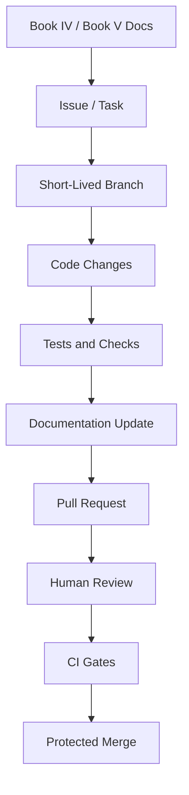

# AGENTS.md and AI Coding Assistant Workflow

> *"Defines how AI coding assistants should be guided inside the CLARA repository."*

---

# Purpose

Defines how AI coding assistants should be guided inside the CLARA repository.

---

# Execution Problem

AI coding assistants can generate fast but inconsistent or insecure code if repository instructions are missing or vague.

---

# Engineering Decision

## Decision

CLARA should use layered AGENTS.md files to instruct AI coding assistants to follow documentation, architecture, security rules, and module boundaries.

## Status

Accepted.

## Expected Output

A practical AGENTS.md strategy for root, backend, frontend, packages, and docs areas.

---

# Context

This chapter supports the Book V execution strategy.

It exists to make sure CLARA implementation work is:

- Traceable to documentation.
- Easy to review.
- Safe for production.
- Friendly to AI coding assistants.
- Secure by default.
- Consistent across backend, frontend, database, AI, integrations, and DevOps.

---

# Workflow Model



---

# Practical Rules

- Every non-trivial change must be linked to a documented task.
- Every feature task should reference the relevant Book IV domain.
- Every implementation task should reference the relevant Book V plan.
- Every protected backend action must include authorization checks.
- Every tenant-scoped record must include organization scope.
- Every workspace-scoped record must include workspace scope.
- Every AI-generated change must be reviewed by a human.
- Every PR must be small enough to review meaningfully.
- Every secrets/config change must avoid exposing sensitive values.
- Every docs-affecting implementation must update documentation.

---

# Secure-by-Design Requirements

| Area | Requirement |
|---|---|
| Repository | Secrets must not be committed |
| Branches | Main branch must be protected |
| Pull Requests | Security-sensitive changes require careful review |
| CI | Tests and checks must run before merge |
| Dependencies | Lockfiles must be committed and reviewed |
| AI Coding | AI output must be reviewed before merge |
| Docs | Documentation must not contain real credentials |
| Configuration | `.env.example` must use fake safe placeholders |

---

# Acceptance Criteria

- [ ] The workflow is understandable by junior and senior engineers.
- [ ] The workflow is usable with AI coding assistants.
- [ ] The workflow protects main branch quality.
- [ ] The workflow supports documentation-first development.
- [ ] The workflow includes security expectations.
- [ ] The workflow prevents obvious production-risk shortcuts.
- [ ] The workflow prepares the next implementation part.

---

# Anti-patterns

Avoid:

- Coding without reading related docs.
- Creating huge PRs with unrelated changes.
- Merging code without tests.
- Keeping long-lived branches alive for weeks.
- Putting secrets in repository files.
- Letting AI coding assistants modify architecture without review.
- Adding dependencies without review.
- Updating code without updating docs.

---

# Related Documents

- ../PART-01-Execution-Strategy/README.md
- ../../BOOK-04-Product-Domain-Specification/README.md
- ../../BOOK-04-Product-Domain-Specification/BOOK-04-Master-Index/BOOK-04-MVP-SCOPE-MAP.md
- ../../BOOK-04-Product-Domain-Specification/BOOK-04-Master-Index/BOOK-04-PERMISSION-MAP.md
- ../../BOOK-04-Product-Domain-Specification/BOOK-04-Master-Index/BOOK-04-AI-GOVERNANCE-MAP.md

---

# Navigation

**Previous:** `20-Documentation-Workflow.md`

**Next:** `22-Code-Review-Workflow.md`

---

# AGENTS.md Strategy

Use layered instructions:

```text
AGENTS.md
apps/api/AGENTS.md
apps/web/AGENTS.md
apps/worker/AGENTS.md
packages/AGENTS.md
docs/AGENTS.md
```

---

# Root AGENTS.md Should Include

```text
Read docs before coding.
Follow Book IV product-domain specs.
Follow Book V execution plan.
Do not invent product behavior.
Do not bypass auth.
Do not hard-code secrets.
Keep PRs small.
Add tests.
Update docs.
```

---

# Backend AGENTS.md Should Include

```text
Enforce organization/workspace scope.
Enforce permissions in backend.
Validate all inputs.
Do not return unauthorized resources.
Add tests for unauthorized access.
Audit sensitive actions.
```

---

# Frontend AGENTS.md Should Include

```text
Do not treat hidden UI as authorization.
Handle loading/empty/error states.
Escape/safely render user content.
Never expose secrets in client code.
Use typed API clients where available.
```
