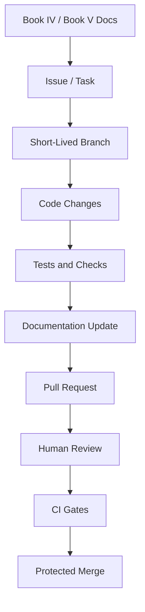

# Code Review Workflow

> *"Defines how code review should work for CLARA."*

---

# Purpose

Defines how code review should work for CLARA.

---

# Execution Problem

Superficial code review misses security bugs, architectural drift, and incomplete vertical slices.

---

# Engineering Decision

## Decision

CLARA code review should check correctness, security, maintainability, test coverage, documentation alignment, and production impact.

## Status

Accepted.

## Expected Output

A code review workflow and review checklist for CLARA.

---

# Context

This chapter supports the Book V execution strategy.

It exists to make sure CLARA implementation work is:

- Traceable to documentation.
- Easy to review.
- Safe for production.
- Friendly to AI coding assistants.
- Secure by default.
- Consistent across backend, frontend, database, AI, integrations, and DevOps.

---

# Workflow Model

---

# Practical Rules

- Every non-trivial change must be linked to a documented task.
- Every feature task should reference the relevant Book IV domain.
- Every implementation task should reference the relevant Book V plan.
- Every protected backend action must include authorization checks.
- Every tenant-scoped record must include organization scope.
- Every workspace-scoped record must include workspace scope.
- Every AI-generated change must be reviewed by a human.
- Every PR must be small enough to review meaningfully.
- Every secrets/config change must avoid exposing sensitive values.
- Every docs-affecting implementation must update documentation.

---

# Secure-by-Design Requirements

| Area | Requirement |
|---|---|
| Repository | Secrets must not be committed |
| Branches | Main branch must be protected |
| Pull Requests | Security-sensitive changes require careful review |
| CI | Tests and checks must run before merge |
| Dependencies | Lockfiles must be committed and reviewed |
| AI Coding | AI output must be reviewed before merge |
| Docs | Documentation must not contain real credentials |
| Configuration | `.env.example` must use fake safe placeholders |

---

# Acceptance Criteria

- [ ] The workflow is understandable by junior and senior engineers.
- [ ] The workflow is usable with AI coding assistants.
- [ ] The workflow protects main branch quality.
- [ ] The workflow supports documentation-first development.
- [ ] The workflow includes security expectations.
- [ ] The workflow prevents obvious production-risk shortcuts.
- [ ] The workflow prepares the next implementation part.

---

# Anti-patterns

Avoid:

- Coding without reading related docs.
- Creating huge PRs with unrelated changes.
- Merging code without tests.
- Keeping long-lived branches alive for weeks.
- Putting secrets in repository files.
- Letting AI coding assistants modify architecture without review.
- Adding dependencies without review.
- Updating code without updating docs.

---

# Related Documents

- ../PART-01-Execution-Strategy/README.md
- ../../BOOK-04-Product-Domain-Specification/README.md
- ../../BOOK-04-Product-Domain-Specification/BOOK-04-Master-Index/BOOK-04-MVP-SCOPE-MAP.md
- ../../BOOK-04-Product-Domain-Specification/BOOK-04-Master-Index/BOOK-04-PERMISSION-MAP.md
- ../../BOOK-04-Product-Domain-Specification/BOOK-04-Master-Index/BOOK-04-AI-GOVERNANCE-MAP.md

---

# Navigation

**Previous:** `21-AGENTS-md-and-AI-Coding-Assistant-Workflow.md`

**Next:** `23-CI-Quality-Gates.md`

---

# Code Review Checklist

Reviewers should check:

- Does this match Book IV/Book V docs?
- Is the feature scoped correctly?
- Are permissions enforced in backend?
- Are tenant/workspace boundaries enforced?
- Are inputs validated?
- Are outputs rendered safely?
- Are tests meaningful?
- Are logs safe?
- Are secrets protected?
- Are docs updated?
- Is the code understandable by future maintainers?

---

# Security Review Required When

- New auth/permission logic is added.
- Data export is added.
- AI context or prompts change.
- Webhooks/integrations change.
- Workflow automation actions change.
- Billing/admin/security settings change.
- Customer-visible messaging behavior changes.
- Secrets or credentials handling changes.
