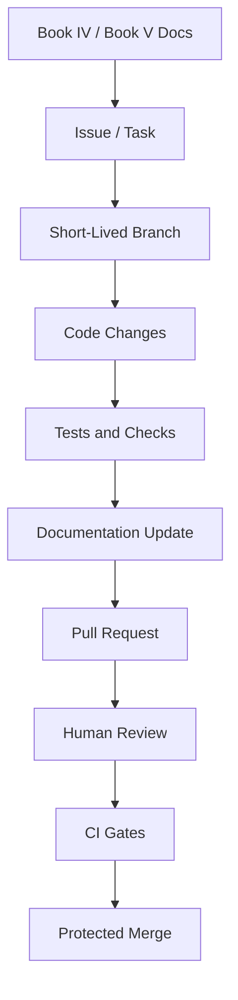

# Issue and Task Management

> *"Defines how work should be broken down, tracked, prioritized, and connected to documentation."*

---

# Purpose

Defines how work should be broken down, tracked, prioritized, and connected to documentation.

---

# Execution Problem

Large vague tasks cause implementation drift, missed security requirements, and poor estimation.

---

# Engineering Decision

## Decision

CLARA tasks should be small, traceable to documentation, and mapped to vertical slices or clear technical enablers.

## Status

Accepted.

## Expected Output

A task management model for issues, labels, milestones, and backlog planning.

---

# Context

This chapter supports the Book V execution strategy.

It exists to make sure CLARA implementation work is:

- Traceable to documentation.
- Easy to review.
- Safe for production.
- Friendly to AI coding assistants.
- Secure by default.
- Consistent across backend, frontend, database, AI, integrations, and DevOps.

---

# Workflow Model



---

# Practical Rules

- Every non-trivial change must be linked to a documented task.
- Every feature task should reference the relevant Book IV domain.
- Every implementation task should reference the relevant Book V plan.
- Every protected backend action must include authorization checks.
- Every tenant-scoped record must include organization scope.
- Every workspace-scoped record must include workspace scope.
- Every AI-generated change must be reviewed by a human.
- Every PR must be small enough to review meaningfully.
- Every secrets/config change must avoid exposing sensitive values.
- Every docs-affecting implementation must update documentation.

---

# Secure-by-Design Requirements

| Area | Requirement |
|---|---|
| Repository | Secrets must not be committed |
| Branches | Main branch must be protected |
| Pull Requests | Security-sensitive changes require careful review |
| CI | Tests and checks must run before merge |
| Dependencies | Lockfiles must be committed and reviewed |
| AI Coding | AI output must be reviewed before merge |
| Docs | Documentation must not contain real credentials |
| Configuration | `.env.example` must use fake safe placeholders |

---

# Acceptance Criteria

- [ ] The workflow is understandable by junior and senior engineers.
- [ ] The workflow is usable with AI coding assistants.
- [ ] The workflow protects main branch quality.
- [ ] The workflow supports documentation-first development.
- [ ] The workflow includes security expectations.
- [ ] The workflow prevents obvious production-risk shortcuts.
- [ ] The workflow prepares the next implementation part.

---

# Anti-patterns

Avoid:

- Coding without reading related docs.
- Creating huge PRs with unrelated changes.
- Merging code without tests.
- Keeping long-lived branches alive for weeks.
- Putting secrets in repository files.
- Letting AI coding assistants modify architecture without review.
- Adding dependencies without review.
- Updating code without updating docs.

---

# Related Documents

- ../PART-01-Execution-Strategy/README.md
- ../../BOOK-04-Product-Domain-Specification/README.md
- ../../BOOK-04-Product-Domain-Specification/BOOK-04-Master-Index/BOOK-04-MVP-SCOPE-MAP.md
- ../../BOOK-04-Product-Domain-Specification/BOOK-04-Master-Index/BOOK-04-PERMISSION-MAP.md
- ../../BOOK-04-Product-Domain-Specification/BOOK-04-Master-Index/BOOK-04-AI-GOVERNANCE-MAP.md

---

# Navigation

**Previous:** `23-CI-Quality-Gates.md`

**Next:** `25-Part-02-Summary.md`

---

# Issue Structure

Every issue should include:

```text
Context
Related docs
User story or technical goal
Scope
Out of scope
Acceptance criteria
Security considerations
Test expectations
Dependencies
```

---

# Recommended Labels

```text
area:backend
area:frontend
area:database
area:ai
area:security
area:docs
area:integration
area:devops
type:feature
type:bug
type:refactor
type:test
type:chore
risk:high
risk:medium
risk:low
mvp
post-mvp
```

---

# Task Size Rule

Good task:

```text
Add backend endpoint to create workspace-scoped customer with permission checks and tests.
```

Bad task:

```text
Build CRM.
```
