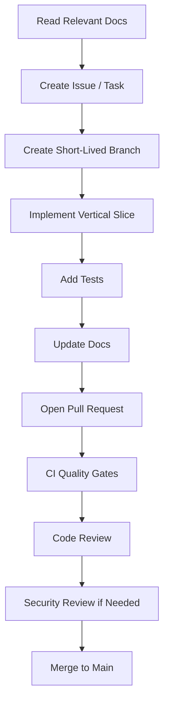

# PART-02 — Repository and Development Workflow

> *"A clean repository is not just organization. It is an engineering control system."*

---

# Purpose

Part 02 defines how the CLARA repository should be structured and how engineering work should flow from documentation to code review and merge.

This part covers:

- Repository structure.
- Monorepo vs multi-repo decision.
- Branching strategy.
- Commit and pull request conventions.
- Local development environment.
- Environment variables and secrets.
- Dependency management.
- Code style and formatting.
- Documentation workflow.
- `AGENTS.md` and AI coding assistant workflow.
- Code review workflow.
- CI quality gates.
- Issue and task management.

---

# Why This Part Matters

CLARA will be built with human engineers and AI coding assistants.

That means the repository must be:

```text
Easy to navigate
Easy to test
Easy to review
Easy to secure
Easy to document
Easy for AI assistants to understand
Hard to accidentally misuse
```

A messy repo makes AI-assisted development dangerous because the assistant may infer wrong patterns.

A clean repo gives both humans and AI coding assistants strong boundaries.

---

# Chapter Map

| Chapter | Title |
|---:|---|
| 11 | Repository Development Workflow Overview |
| 12 | Repository Structure Strategy |
| 13 | Monorepo vs Multi Repo Decision |
| 14 | Branching Strategy |
| 15 | Commit and Pull Request Convention |
| 16 | Local Development Environment |
| 17 | Environment Variables and Secrets |
| 18 | Dependency Management |
| 19 | Code Style and Formatting |
| 20 | Documentation Workflow |
| 21 | AGENTS.md and AI Coding Assistant Workflow |
| 22 | Code Review Workflow |
| 23 | CI Quality Gates |
| 24 | Issue and Task Management |
| 25 | Part 02 Summary |

---

# Recommended Repository Shape

```text
CLARA/
├── apps/
│   ├── api/
│   ├── web/
│   └── worker/
├── packages/
│   ├── config/
│   ├── database/
│   ├── domain/
│   ├── ui/
│   └── utils/
├── docs/
│   ├── BOOK-01-Foundation/
│   ├── BOOK-02-Master-Blueprint/
│   ├── BOOK-03-Implementation-Architecture/
│   ├── BOOK-04-Product-Domain-Specification/
│   └── BOOK-05-Engineering-Execution-Plan/
├── infra/
├── scripts/
├── tools/
├── tests/
├── AGENTS.md
├── README.md
└── package.json
```

---

# Workflow Summary



---

# Non-Negotiable Rule

No code should be merged if it:

```text
Bypasses backend authorization
Breaks organization/workspace isolation
Hard-codes secrets
Skips required tests
Contradicts Book IV product-domain behavior
Ignores Book V execution rules
Adds undocumented behavior
```

---

# Navigation

**Previous:** `../PART-01-Execution-Strategy/10-Part-01-Summary.md`

**Next:** `11-Repository-Development-Workflow-Overview.md`
