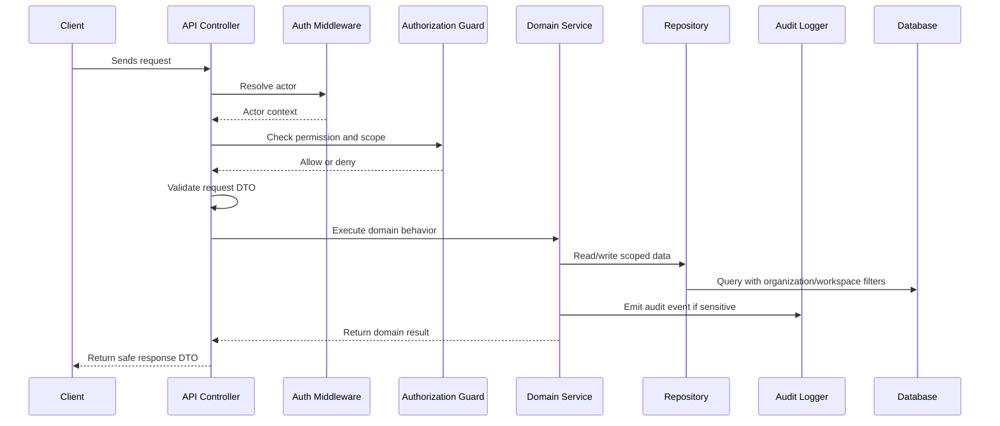

# Backend Implementation Plan Overview

> *"Defines the backend execution plan for implementing CLARA's API, domain modules, security boundaries, validation, audit, jobs, and operational behavior."*

---

# Purpose

Defines the backend execution plan for implementing CLARA's API, domain modules, security boundaries, validation, audit, jobs, and operational behavior.

---

# Execution Problem

Without backend implementation standards, CLARA can become insecure, inconsistent, hard to test, and difficult for AI coding assistants to modify safely.

---

# Engineering Decision

## Decision

CLARA backend should be implemented as a modular, domain-oriented API service with clear boundaries, strict authorization, tenant/workspace scoping, validation, audit, and tests.

## Status

Accepted.

---

# Backend Implementation Rule

Every backend feature must be designed as:

```text
Request -> Authentication -> Authorization -> Scope Check -> Validation -> Domain Logic -> Persistence -> Audit/Events -> Safe Response
```

Do not put business rules only in controllers.

Do not rely on frontend-only checks.

Do not query tenant-scoped records without organization/workspace filters.

---

# Recommended Flow



---

# Secure-by-Design Checklist

- [ ] Actor identity is available.
- [ ] Permission check is backend-enforced.
- [ ] Organization scope is checked.
- [ ] Workspace scope is checked where relevant.
- [ ] Input DTO/schema validation exists.
- [ ] Domain service owns business rules.
- [ ] Repository queries are scoped.
- [ ] Response DTO does not leak sensitive fields.
- [ ] Sensitive action emits audit event.
- [ ] Logs do not include secrets or unnecessary PII.
- [ ] Tests include unauthorized and cross-scope cases.
- [ ] Errors return safe messages.

---

# Acceptance Criteria

- [ ] Implementation direction is clear.
- [ ] Security requirements are explicit.
- [ ] Backend boundaries are respected.
- [ ] MVP behavior is separated from future behavior.
- [ ] Testing expectations are included.
- [ ] Documentation references are included.
- [ ] AI coding assistants can follow this chapter safely.

---

# Anti-patterns

Avoid:

- Fat controllers with business logic.
- Direct database access from random modules.
- Missing organization/workspace filters.
- Returning database rows directly as API responses.
- Throwing raw errors to clients.
- Logging raw request bodies with sensitive data.
- Skipping tests for authorization.
- Using AI or automation without backend permission checks.

---

# Related Documents

- ../PART-01-Execution-Strategy/README.md
- ../PART-02-Repository-and-Development-Workflow/README.md
- ../../BOOK-04-Product-Domain-Specification/README.md
- ../../BOOK-04-Product-Domain-Specification/BOOK-04-Master-Index/BOOK-04-PERMISSION-MAP.md
- ../../BOOK-04-Product-Domain-Specification/BOOK-04-Master-Index/BOOK-04-AI-GOVERNANCE-MAP.md

---

# Navigation

**Previous:** `../PART-02-Repository-and-Development-Workflow/25-Part-02-Summary.md`

**Next:** `27-Backend-Architecture-Execution.md`

---

# Backend MVP Scope

Backend MVP should support:

```text
Auth identity context
Organization/workspace scope
RBAC permission checks
Customer CRM APIs
Conversation APIs
Knowledge APIs
AI reply draft endpoint
Basic ticket APIs
Audit event pipeline
Basic admin/settings APIs
Integration/webhook baseline if channel requires it
```

---

# Backend Out of Scope for Early MVP

Defer:

```text
Microservice split
Complex event-sourcing
Full workflow engine
Advanced BI query engine
Full payment provider integration
Custom RBAC/ABAC engine
Autonomous AI tool execution
```
