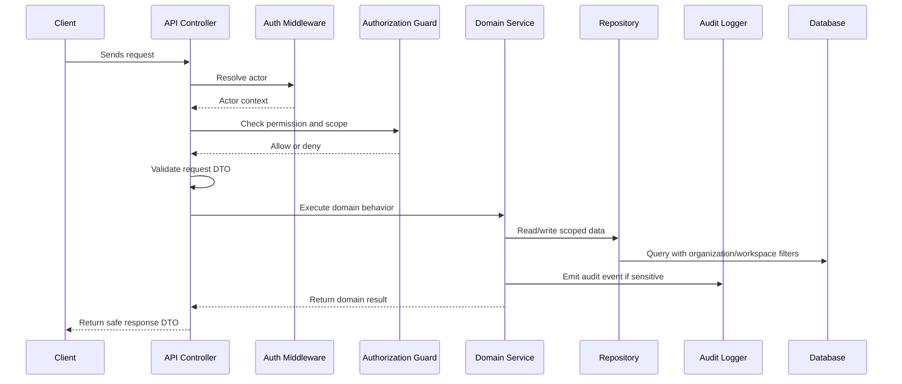

# Authorization RBAC Implementation Plan

> *"Defines backend execution plan for role-based access control and permission checks."*

---

# Purpose

Defines backend execution plan for role-based access control and permission checks.

---

# Execution Problem

Frontend-only checks or scattered ad-hoc authorization create high risk of privilege bypass.

---

# Engineering Decision

## Decision

CLARA backend must enforce permissions server-side using a centralized authorization layer.

## Status

Accepted.

---

# Backend Implementation Rule

Every backend feature must be designed as:

```text
Request -> Authentication -> Authorization -> Scope Check -> Validation -> Domain Logic -> Persistence -> Audit/Events -> Safe Response
```

Do not put business rules only in controllers.

Do not rely on frontend-only checks.

Do not query tenant-scoped records without organization/workspace filters.

---

# Recommended Flow



---

# Secure-by-Design Checklist

- [ ] Actor identity is available.
- [ ] Permission check is backend-enforced.
- [ ] Organization scope is checked.
- [ ] Workspace scope is checked where relevant.
- [ ] Input DTO/schema validation exists.
- [ ] Domain service owns business rules.
- [ ] Repository queries are scoped.
- [ ] Response DTO does not leak sensitive fields.
- [ ] Sensitive action emits audit event.
- [ ] Logs do not include secrets or unnecessary PII.
- [ ] Tests include unauthorized and cross-scope cases.
- [ ] Errors return safe messages.

---

# Acceptance Criteria

- [ ] Implementation direction is clear.
- [ ] Security requirements are explicit.
- [ ] Backend boundaries are respected.
- [ ] MVP behavior is separated from future behavior.
- [ ] Testing expectations are included.
- [ ] Documentation references are included.
- [ ] AI coding assistants can follow this chapter safely.

---

# Anti-patterns

Avoid:

- Fat controllers with business logic.
- Direct database access from random modules.
- Missing organization/workspace filters.
- Returning database rows directly as API responses.
- Throwing raw errors to clients.
- Logging raw request bodies with sensitive data.
- Skipping tests for authorization.
- Using AI or automation without backend permission checks.

---

# Related Documents

- ../PART-01-Execution-Strategy/README.md
- ../PART-02-Repository-and-Development-Workflow/README.md
- ../../BOOK-04-Product-Domain-Specification/README.md
- ../../BOOK-04-Product-Domain-Specification/BOOK-04-Master-Index/BOOK-04-PERMISSION-MAP.md
- ../../BOOK-04-Product-Domain-Specification/BOOK-04-Master-Index/BOOK-04-AI-GOVERNANCE-MAP.md

---

# Navigation

**Previous:** `30-Authentication-Implementation-Plan.md`

**Next:** `32-Organization-Workspace-Scope-Implementation.md`

---

# RBAC Implementation Pattern

Use centralized helpers like:

```text
requirePermission(actor, "customer:create", { organizationId, workspaceId })
requireWorkspaceAccess(actor, workspaceId)
requireOrganizationAccess(actor, organizationId)
```

---

# Permission Check Requirements

Every protected mutation must check:

```text
actor identity
permission key
organization scope
workspace scope
resource existence
resource visibility
risk/approval rule if applicable
```

---

# Test Requirements

Add tests for:

- Missing authentication.
- Missing permission.
- Wrong organization.
- Wrong workspace.
- Valid permission.
- Archived/deleted resource behavior.
