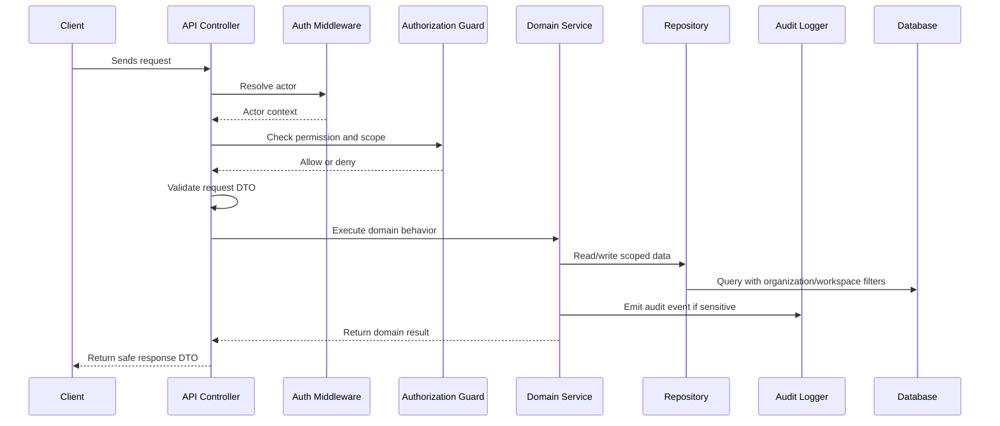

# Request Validation and DTO Strategy

> *"Defines how backend should validate inputs, transform request data, and return safe response objects."*

---

# Purpose

Defines how backend should validate inputs, transform request data, and return safe response objects.

---

# Execution Problem

Unvalidated input can cause injection, logic bugs, broken state, and unsafe data exposure.

---

# Engineering Decision

## Decision

CLARA backend should validate all external input through schemas/DTOs before business logic and return explicit safe DTOs.

## Status

Accepted.

---

# Backend Implementation Rule

Every backend feature must be designed as:

```text
Request -> Authentication -> Authorization -> Scope Check -> Validation -> Domain Logic -> Persistence -> Audit/Events -> Safe Response
```

Do not put business rules only in controllers.

Do not rely on frontend-only checks.

Do not query tenant-scoped records without organization/workspace filters.

---

# Recommended Flow



---

# Secure-by-Design Checklist

- [ ] Actor identity is available.
- [ ] Permission check is backend-enforced.
- [ ] Organization scope is checked.
- [ ] Workspace scope is checked where relevant.
- [ ] Input DTO/schema validation exists.
- [ ] Domain service owns business rules.
- [ ] Repository queries are scoped.
- [ ] Response DTO does not leak sensitive fields.
- [ ] Sensitive action emits audit event.
- [ ] Logs do not include secrets or unnecessary PII.
- [ ] Tests include unauthorized and cross-scope cases.
- [ ] Errors return safe messages.

---

# Acceptance Criteria

- [ ] Implementation direction is clear.
- [ ] Security requirements are explicit.
- [ ] Backend boundaries are respected.
- [ ] MVP behavior is separated from future behavior.
- [ ] Testing expectations are included.
- [ ] Documentation references are included.
- [ ] AI coding assistants can follow this chapter safely.

---

# Anti-patterns

Avoid:

- Fat controllers with business logic.
- Direct database access from random modules.
- Missing organization/workspace filters.
- Returning database rows directly as API responses.
- Throwing raw errors to clients.
- Logging raw request bodies with sensitive data.
- Skipping tests for authorization.
- Using AI or automation without backend permission checks.

---

# Related Documents

- ../PART-01-Execution-Strategy/README.md
- ../PART-02-Repository-and-Development-Workflow/README.md
- ../../BOOK-04-Product-Domain-Specification/README.md
- ../../BOOK-04-Product-Domain-Specification/BOOK-04-Master-Index/BOOK-04-PERMISSION-MAP.md
- ../../BOOK-04-Product-Domain-Specification/BOOK-04-Master-Index/BOOK-04-AI-GOVERNANCE-MAP.md

---

# Navigation

**Previous:** `32-Organization-Workspace-Scope-Implementation.md`

**Next:** `34-Error-Handling-and-Response-Standard.md`

---

# DTO Strategy

Use separate DTO/schema objects for:

```text
Create request
Update request
Query params
Response
Internal domain object
```

Do not return raw database entities.

---

# Validation Rules

Validate:

- Required fields.
- String length.
- Enum values.
- UUID format.
- Pagination limits.
- Date range limits.
- File/attachment metadata.
- External provider payload shape.
- AI prompt size/context limit.

---

# Output Safety

Response DTOs should hide:

- Internal IDs not needed by client.
- Secrets or credential values.
- Hidden prompts.
- Sensitive provider metadata.
- Deleted/private fields.
