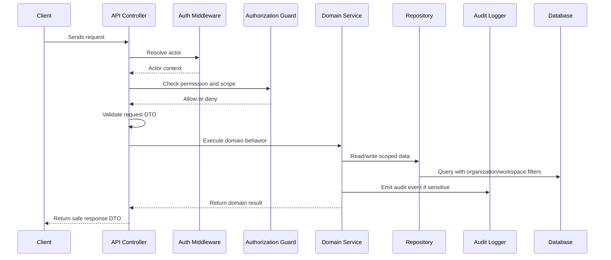

# Application Logging and Observability

> *"Defines backend logging, tracing, metrics, correlation IDs, and operational observability."*

---

# Purpose

Defines backend logging, tracing, metrics, correlation IDs, and operational observability.

---

# Execution Problem

Poor observability makes production incidents slow to diagnose and easy to misunderstand.

---

# Engineering Decision

## Decision

CLARA backend should produce safe structured logs, request correlation IDs, metrics, and traces where practical.

## Status

Accepted.

---

# Backend Implementation Rule

Every backend feature must be designed as:

```text
Request -> Authentication -> Authorization -> Scope Check -> Validation -> Domain Logic -> Persistence -> Audit/Events -> Safe Response
```

Do not put business rules only in controllers.

Do not rely on frontend-only checks.

Do not query tenant-scoped records without organization/workspace filters.

---

# Recommended Flow



---

# Secure-by-Design Checklist

- [ ] Actor identity is available.
- [ ] Permission check is backend-enforced.
- [ ] Organization scope is checked.
- [ ] Workspace scope is checked where relevant.
- [ ] Input DTO/schema validation exists.
- [ ] Domain service owns business rules.
- [ ] Repository queries are scoped.
- [ ] Response DTO does not leak sensitive fields.
- [ ] Sensitive action emits audit event.
- [ ] Logs do not include secrets or unnecessary PII.
- [ ] Tests include unauthorized and cross-scope cases.
- [ ] Errors return safe messages.

---

# Acceptance Criteria

- [ ] Implementation direction is clear.
- [ ] Security requirements are explicit.
- [ ] Backend boundaries are respected.
- [ ] MVP behavior is separated from future behavior.
- [ ] Testing expectations are included.
- [ ] Documentation references are included.
- [ ] AI coding assistants can follow this chapter safely.

---

# Anti-patterns

Avoid:

- Fat controllers with business logic.
- Direct database access from random modules.
- Missing organization/workspace filters.
- Returning database rows directly as API responses.
- Throwing raw errors to clients.
- Logging raw request bodies with sensitive data.
- Skipping tests for authorization.
- Using AI or automation without backend permission checks.

---

# Related Documents

- ../PART-01-Execution-Strategy/README.md
- ../PART-02-Repository-and-Development-Workflow/README.md
- ../../BOOK-04-Product-Domain-Specification/README.md
- ../../BOOK-04-Product-Domain-Specification/BOOK-04-Master-Index/BOOK-04-PERMISSION-MAP.md
- ../../BOOK-04-Product-Domain-Specification/BOOK-04-Master-Index/BOOK-04-AI-GOVERNANCE-MAP.md

---

# Navigation

**Previous:** `35-Audit-Logging-Implementation-Plan.md`

**Next:** `37-Background-Jobs-and-Workers.md`

---

# Logging Rules

Use structured logs.

Include:

```text
request_id
actor_id when safe
organization_id
workspace_id
route
status_code
duration_ms
error_code
```

Avoid:

```text
passwords
tokens
API keys
raw message content
full AI prompts
full webhook payloads with PII/secrets
payment details
```

---

# Observability Baseline

MVP backend should include:

- Request logs.
- Error logs.
- Basic metrics.
- Correlation/request ID.
- Health endpoint.
- Worker job failure logs.
- Integration failure logs.
