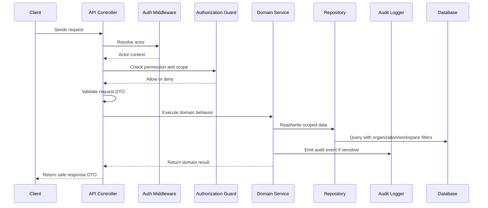

# Part 03 Summary

> *"Summarizes backend implementation plan and defines readiness to continue into frontend implementation planning."*

---

# Purpose

Summarizes backend implementation plan and defines readiness to continue into frontend implementation planning.

---

# Execution Problem

Frontend planning depends on stable backend behavior, API contracts, permission expectations, and error response standards.

---

# Engineering Decision

## Decision

CLARA should proceed to frontend implementation planning after backend module boundaries, security enforcement, validation, audit, jobs, and core module plans are defined.

## Status

Accepted.

---

# Backend Implementation Rule

Every backend feature must be designed as:

```text
Request -> Authentication -> Authorization -> Scope Check -> Validation -> Domain Logic -> Persistence -> Audit/Events -> Safe Response
```

Do not put business rules only in controllers.

Do not rely on frontend-only checks.

Do not query tenant-scoped records without organization/workspace filters.

---

# Recommended Flow



---

# Secure-by-Design Checklist

- [ ] Actor identity is available.
- [ ] Permission check is backend-enforced.
- [ ] Organization scope is checked.
- [ ] Workspace scope is checked where relevant.
- [ ] Input DTO/schema validation exists.
- [ ] Domain service owns business rules.
- [ ] Repository queries are scoped.
- [ ] Response DTO does not leak sensitive fields.
- [ ] Sensitive action emits audit event.
- [ ] Logs do not include secrets or unnecessary PII.
- [ ] Tests include unauthorized and cross-scope cases.
- [ ] Errors return safe messages.

---

# Acceptance Criteria

- [ ] Implementation direction is clear.
- [ ] Security requirements are explicit.
- [ ] Backend boundaries are respected.
- [ ] MVP behavior is separated from future behavior.
- [ ] Testing expectations are included.
- [ ] Documentation references are included.
- [ ] AI coding assistants can follow this chapter safely.

---

# Anti-patterns

Avoid:

- Fat controllers with business logic.
- Direct database access from random modules.
- Missing organization/workspace filters.
- Returning database rows directly as API responses.
- Throwing raw errors to clients.
- Logging raw request bodies with sensitive data.
- Skipping tests for authorization.
- Using AI or automation without backend permission checks.

---

# Related Documents

- ../PART-01-Execution-Strategy/README.md
- ../PART-02-Repository-and-Development-Workflow/README.md
- ../../BOOK-04-Product-Domain-Specification/README.md
- ../../BOOK-04-Product-Domain-Specification/BOOK-04-Master-Index/BOOK-04-PERMISSION-MAP.md
- ../../BOOK-04-Product-Domain-Specification/BOOK-04-Master-Index/BOOK-04-AI-GOVERNANCE-MAP.md

---

# Navigation

**Previous:** `44-Integrations-Channels-Backend-Plan.md`

**Next:** `../PART-04-Frontend-Implementation-Plan/README.md`

---

# Part 03 Completion

Part 03 establishes:

- Backend architecture strategy.
- API structure.
- Module boundaries.
- Authentication plan.
- RBAC authorization plan.
- Organization/workspace scope enforcement.
- Validation/DTO strategy.
- Error response standard.
- Audit implementation plan.
- Logging and observability.
- Background jobs and workers.
- Backend plans for core CLARA product modules.

---

# Ready for Part 04

The next part should be:

```text
BOOK V — PART 04: Frontend Implementation Plan
```

It should define:

- Frontend app structure.
- Routing plan.
- Layout strategy.
- Authenticated UI shell.
- Role/permission-aware UI.
- Customer CRM UI.
- Inbox UI.
- Ticketing UI.
- Knowledge UI.
- AI assistant UI.
- Admin UI.
- Frontend testing strategy.
