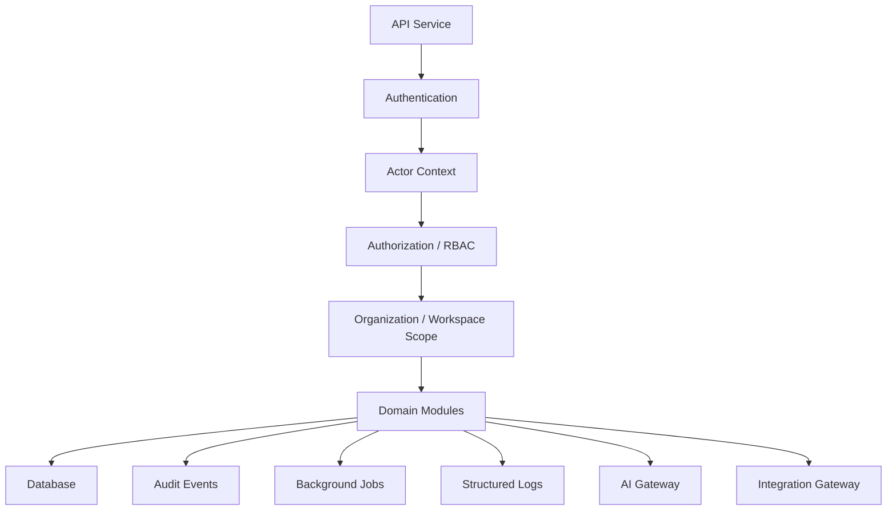

# PART-03 — Backend Implementation Plan

> *"The backend is where CLARA's product promises become enforceable rules."*

---

# Purpose

Part 03 defines how CLARA backend should be implemented.

It covers:

- Backend architecture execution.
- API service structure.
- Module boundaries.
- Authentication.
- RBAC authorization.
- Organization/workspace scope enforcement.
- Request validation and DTO strategy.
- Error handling and response standards.
- Audit logging.
- Application logging and observability.
- Background jobs and workers.
- Customer CRM backend plan.
- Conversations and Inbox backend plan.
- Ticketing backend plan.
- Knowledge Base backend plan.
- AI backend integration plan.
- Workflow Automation backend plan.
- Integrations and Channels backend plan.

---

# Chapter Map

| Chapter | Title |
|---:|---|
| 26 | Backend Implementation Plan Overview |
| 27 | Backend Architecture Execution |
| 28 | API Service Structure |
| 29 | Backend Module Boundaries |
| 30 | Authentication Implementation Plan |
| 31 | Authorization RBAC Implementation Plan |
| 32 | Organization Workspace Scope Implementation |
| 33 | Request Validation and DTO Strategy |
| 34 | Error Handling and Response Standard |
| 35 | Audit Logging Implementation Plan |
| 36 | Application Logging and Observability |
| 37 | Background Jobs and Workers |
| 38 | Customer CRM Backend Plan |
| 39 | Conversations Inbox Backend Plan |
| 40 | Ticketing Backend Plan |
| 41 | Knowledge Base Backend Plan |
| 42 | AI Backend Integration Plan |
| 43 | Workflow Automation Backend Plan |
| 44 | Integrations Channels Backend Plan |
| 45 | Part 03 Summary |

---

# Backend Execution Map



---

# Backend Non-Negotiables

Backend implementation must enforce:

```text
Authentication
Backend authorization
Organization scope
Workspace scope
Input validation
Safe DTO responses
Safe error responses
Audit for sensitive actions
Safe structured logging
Idempotency for external events
No hard-coded secrets
No AI permission bypass
```

---

# Recommended Backend Style

For MVP, CLARA should start as:

```text
Modular monolith API
Domain-oriented modules
Shared authorization layer
Shared validation patterns
Shared error response standard
Shared audit event pipeline
Background worker for async jobs
```

Not as:

```text
Premature microservices
Unstructured controller-heavy API
Frontend-authorized-only app
Database-first CRUD without domain rules
AI-connected backend without context boundaries
```

---

# Navigation

**Previous:** `../PART-02-Repository-and-Development-Workflow/25-Part-02-Summary.md`

**Next:** `26-Backend-Implementation-Plan-Overview.md`
