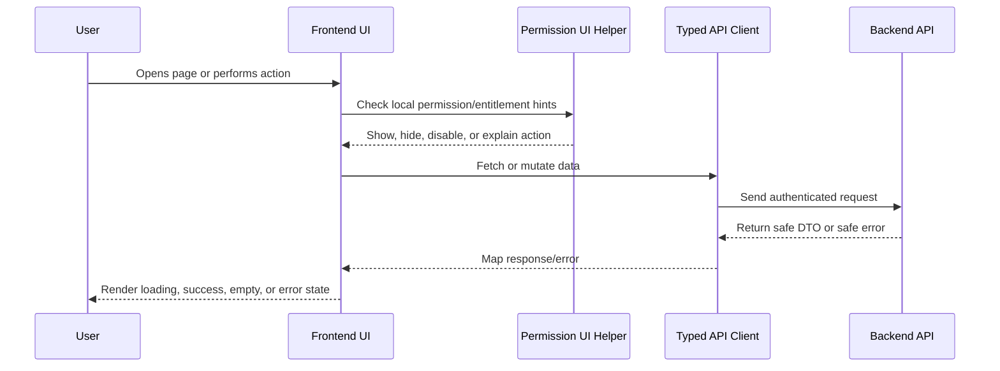

# Frontend Implementation Plan Overview

> *"Defines the frontend execution plan for implementing CLARA's web application, authenticated UI shell, product screens, permission-aware UI, data fetching, forms, and frontend quality gates."*

---

# Purpose

Defines the frontend execution plan for implementing CLARA's web application, authenticated UI shell, product screens, permission-aware UI, data fetching, forms, and frontend quality gates.

---

# Execution Problem

Without frontend implementation standards, CLARA UI can become inconsistent, insecure, hard to test, and difficult for AI coding assistants to modify safely.

---

# Engineering Decision

## Decision

CLARA frontend should be implemented as a modular, route-driven, permission-aware web application that consumes safe backend APIs and never becomes the source of authorization truth.

## Status

Accepted.

---

# Frontend Implementation Rule

Every frontend feature must be designed as:

```text
Route/Page -> Permission-aware UI -> Data Fetching -> Safe Rendering -> User Action -> API Call -> Loading/Error/Success State
```

Frontend may improve usability with permission-aware visibility and disabled states.

Frontend must not be the final authorization layer.

Backend remains the source of truth for access control.

---

# Recommended Flow



---

# Secure-by-Design Checklist

- [ ] No secrets are exposed in frontend code.
- [ ] Backend authorization is still required.
- [ ] User-generated content is safely rendered.
- [ ] Dangerous actions use confirmation.
- [ ] AI-generated output is labeled.
- [ ] AI-generated output is editable/rejectable where customer-visible.
- [ ] Loading, empty, error, and success states are handled.
- [ ] Forms validate obvious input client-side.
- [ ] Server validation errors are displayed safely.
- [ ] Permission-denied states are safe and understandable.
- [ ] Tests cover critical user interactions.
- [ ] Accessibility basics are considered.

---

# Acceptance Criteria

- [ ] Implementation direction is clear.
- [ ] UX behavior is consistent with Book IV.
- [ ] Frontend responsibilities are separated from backend responsibilities.
- [ ] Permission-aware UI is defined without replacing backend authorization.
- [ ] Testing expectations are included.
- [ ] Security and accessibility expectations are included.
- [ ] AI coding assistants can follow this chapter safely.

---

# Anti-patterns

Avoid:

- Hiding buttons and assuming that means authorization.
- Calling APIs directly from random deeply nested components.
- Rendering raw HTML from user/customer/AI content without sanitization.
- Putting API keys or secrets in frontend environment variables.
- Duplicating table/form/modal logic across modules.
- Showing generic broken UI for every error state.
- Treating AI output as normal human-written text.
- Building complex UI builders before simple workflows work.

---

# Related Documents

- ../PART-01-Execution-Strategy/README.md
- ../PART-02-Repository-and-Development-Workflow/README.md
- ../PART-03-Backend-Implementation-Plan/README.md
- ../../BOOK-04-Product-Domain-Specification/README.md
- ../../BOOK-04-Product-Domain-Specification/BOOK-04-Master-Index/BOOK-04-PERMISSION-MAP.md
- ../../BOOK-04-Product-Domain-Specification/BOOK-04-Master-Index/BOOK-04-AI-GOVERNANCE-MAP.md

---

# Navigation

**Previous:** `../PART-03-Backend-Implementation-Plan/45-Part-03-Summary.md`

**Next:** `47-Frontend-Architecture-Execution.md`

---

# Frontend MVP Scope

Frontend MVP should support:

```text
Authenticated app shell
Organization/workspace context
Customer CRM screens
Conversation inbox screens
Knowledge base screens
AI reply draft review UI
Basic ticket screens
Basic admin/settings screens
Basic analytics/audit screens
```

---

# Frontend Out of Scope for Early MVP

Defer:

```text
Full workflow visual builder
Advanced dashboard builder
Public help center customization
Complex theme editor
Advanced drag-and-drop automation
Full billing self-service UI
Multi-channel social DM admin console
```
