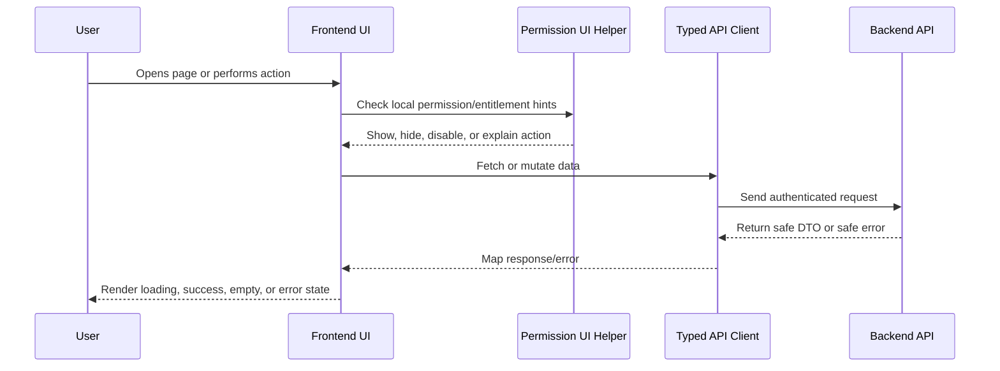

# Web App Structure

> *"Defines recommended folder structure for the CLARA web application."*

---

# Purpose

Defines recommended folder structure for the CLARA web application.

---

# Execution Problem

Poor frontend structure causes duplicated UI logic, inconsistent patterns, and fragile feature development.

---

# Engineering Decision

## Decision

CLARA web app should organize code by app-level routing, feature modules, shared components, API clients, hooks, utilities, and tests.

## Status

Accepted.

---

# Frontend Implementation Rule

Every frontend feature must be designed as:

```text
Route/Page -> Permission-aware UI -> Data Fetching -> Safe Rendering -> User Action -> API Call -> Loading/Error/Success State
```

Frontend may improve usability with permission-aware visibility and disabled states.

Frontend must not be the final authorization layer.

Backend remains the source of truth for access control.

---

# Recommended Flow



---

# Secure-by-Design Checklist

- [ ] No secrets are exposed in frontend code.
- [ ] Backend authorization is still required.
- [ ] User-generated content is safely rendered.
- [ ] Dangerous actions use confirmation.
- [ ] AI-generated output is labeled.
- [ ] AI-generated output is editable/rejectable where customer-visible.
- [ ] Loading, empty, error, and success states are handled.
- [ ] Forms validate obvious input client-side.
- [ ] Server validation errors are displayed safely.
- [ ] Permission-denied states are safe and understandable.
- [ ] Tests cover critical user interactions.
- [ ] Accessibility basics are considered.

---

# Acceptance Criteria

- [ ] Implementation direction is clear.
- [ ] UX behavior is consistent with Book IV.
- [ ] Frontend responsibilities are separated from backend responsibilities.
- [ ] Permission-aware UI is defined without replacing backend authorization.
- [ ] Testing expectations are included.
- [ ] Security and accessibility expectations are included.
- [ ] AI coding assistants can follow this chapter safely.

---

# Anti-patterns

Avoid:

- Hiding buttons and assuming that means authorization.
- Calling APIs directly from random deeply nested components.
- Rendering raw HTML from user/customer/AI content without sanitization.
- Putting API keys or secrets in frontend environment variables.
- Duplicating table/form/modal logic across modules.
- Showing generic broken UI for every error state.
- Treating AI output as normal human-written text.
- Building complex UI builders before simple workflows work.

---

# Related Documents

- ../PART-01-Execution-Strategy/README.md
- ../PART-02-Repository-and-Development-Workflow/README.md
- ../PART-03-Backend-Implementation-Plan/README.md
- ../../BOOK-04-Product-Domain-Specification/README.md
- ../../BOOK-04-Product-Domain-Specification/BOOK-04-Master-Index/BOOK-04-PERMISSION-MAP.md
- ../../BOOK-04-Product-Domain-Specification/BOOK-04-Master-Index/BOOK-04-AI-GOVERNANCE-MAP.md

---

# Navigation

**Previous:** `47-Frontend-Architecture-Execution.md`

**Next:** `49-Routing-and-Navigation-Plan.md`

---

# Recommended Web App Structure

```text
apps/web/src/
├── app/
│   ├── routes/
│   ├── layouts/
│   └── providers/
├── features/
│   ├── customers/
│   ├── conversations/
│   ├── tickets/
│   ├── knowledge/
│   ├── ai/
│   ├── workflows/
│   ├── integrations/
│   ├── admin/
│   └── analytics/
├── shared/
│   ├── api/
│   ├── auth/
│   ├── permissions/
│   ├── ui/
│   ├── hooks/
│   ├── utils/
│   └── types/
└── tests/
```

---

# Folder Responsibility

| Folder | Responsibility |
|---|---|
| `app/routes` | Route definitions and page composition |
| `app/layouts` | Authenticated and public layouts |
| `features` | Domain-specific UI and hooks |
| `shared/api` | Typed API client and request helpers |
| `shared/ui` | Reusable design system components |
| `shared/permissions` | Permission-aware UI helpers |
| `shared/auth` | Current user/session UI state |
| `tests` | Shared test utilities and critical flow tests |
