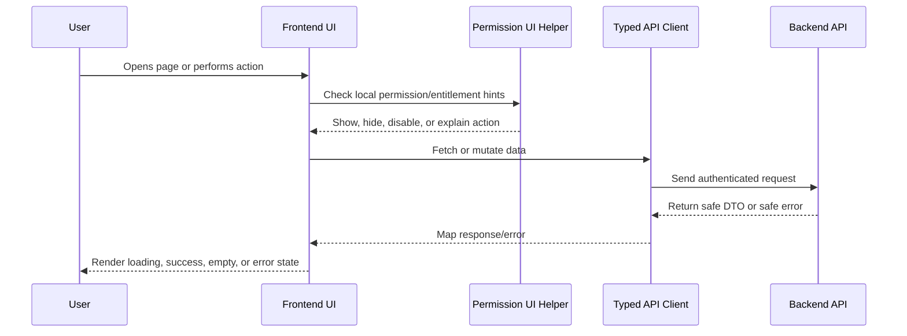

# Design System and UI Components

> *"Defines UI component standards, reusable patterns, accessibility, and visual consistency."*

---

# Purpose

Defines UI component standards, reusable patterns, accessibility, and visual consistency.

---

# Execution Problem

Inconsistent UI components slow development, increase bugs, and make AI-generated UI code harder to review.

---

# Engineering Decision

## Decision

CLARA frontend should use a shared design system for common components such as buttons, forms, tables, cards, modals, drawers, empty states, and alerts.

## Status

Accepted.

---

# Frontend Implementation Rule

Every frontend feature must be designed as:

```text
Route/Page -> Permission-aware UI -> Data Fetching -> Safe Rendering -> User Action -> API Call -> Loading/Error/Success State
```

Frontend may improve usability with permission-aware visibility and disabled states.

Frontend must not be the final authorization layer.

Backend remains the source of truth for access control.

---

# Recommended Flow



---

# Secure-by-Design Checklist

- [ ] No secrets are exposed in frontend code.
- [ ] Backend authorization is still required.
- [ ] User-generated content is safely rendered.
- [ ] Dangerous actions use confirmation.
- [ ] AI-generated output is labeled.
- [ ] AI-generated output is editable/rejectable where customer-visible.
- [ ] Loading, empty, error, and success states are handled.
- [ ] Forms validate obvious input client-side.
- [ ] Server validation errors are displayed safely.
- [ ] Permission-denied states are safe and understandable.
- [ ] Tests cover critical user interactions.
- [ ] Accessibility basics are considered.

---

# Acceptance Criteria

- [ ] Implementation direction is clear.
- [ ] UX behavior is consistent with Book IV.
- [ ] Frontend responsibilities are separated from backend responsibilities.
- [ ] Permission-aware UI is defined without replacing backend authorization.
- [ ] Testing expectations are included.
- [ ] Security and accessibility expectations are included.
- [ ] AI coding assistants can follow this chapter safely.

---

# Anti-patterns

Avoid:

- Hiding buttons and assuming that means authorization.
- Calling APIs directly from random deeply nested components.
- Rendering raw HTML from user/customer/AI content without sanitization.
- Putting API keys or secrets in frontend environment variables.
- Duplicating table/form/modal logic across modules.
- Showing generic broken UI for every error state.
- Treating AI output as normal human-written text.
- Building complex UI builders before simple workflows work.

---

# Related Documents

- ../PART-01-Execution-Strategy/README.md
- ../PART-02-Repository-and-Development-Workflow/README.md
- ../PART-03-Backend-Implementation-Plan/README.md
- ../../BOOK-04-Product-Domain-Specification/README.md
- ../../BOOK-04-Product-Domain-Specification/BOOK-04-Master-Index/BOOK-04-PERMISSION-MAP.md
- ../../BOOK-04-Product-Domain-Specification/BOOK-04-Master-Index/BOOK-04-AI-GOVERNANCE-MAP.md

---

# Navigation

**Previous:** `51-Authorization-Aware-UI.md`

**Next:** `53-State-Management-and-Data-Fetching.md`

---

# Component Baseline

Shared UI should include:

```text
Button
Input
Textarea
Select
Checkbox
Dialog/Modal
Drawer
Table
Badge
Card
Tabs
Toast
Alert
Empty State
Skeleton
Error State
Confirm Dialog
Pagination
```

---

# Accessibility Baseline

- Use semantic HTML where possible.
- Keyboard navigation must work for dialogs and menus.
- Labels must be connected to inputs.
- Color should not be the only status signal.
- Loading and error states should be screen-reader friendly where practical.
