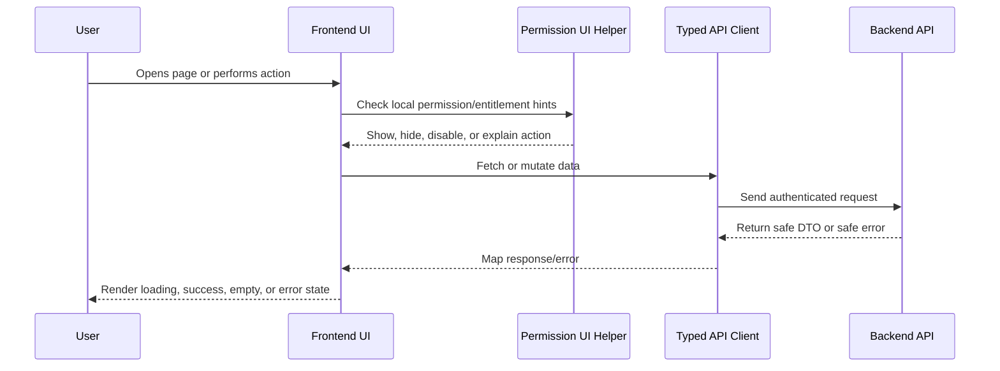

# State Management and Data Fetching

> *"Defines how frontend should manage server state, local UI state, caching, invalidation, and optimistic updates."*

---

# Purpose

Defines how frontend should manage server state, local UI state, caching, invalidation, and optimistic updates.

---

# Execution Problem

Ad-hoc state management creates stale UI, duplicated requests, hard-to-debug bugs, and inconsistent error states.

---

# Engineering Decision

## Decision

CLARA frontend should treat API data as server state and use consistent data fetching/caching patterns instead of scattered manual request logic.

## Status

Accepted.

---

# Frontend Implementation Rule

Every frontend feature must be designed as:

```text
Route/Page -> Permission-aware UI -> Data Fetching -> Safe Rendering -> User Action -> API Call -> Loading/Error/Success State
```

Frontend may improve usability with permission-aware visibility and disabled states.

Frontend must not be the final authorization layer.

Backend remains the source of truth for access control.

---

# Recommended Flow



---

# Secure-by-Design Checklist

- [ ] No secrets are exposed in frontend code.
- [ ] Backend authorization is still required.
- [ ] User-generated content is safely rendered.
- [ ] Dangerous actions use confirmation.
- [ ] AI-generated output is labeled.
- [ ] AI-generated output is editable/rejectable where customer-visible.
- [ ] Loading, empty, error, and success states are handled.
- [ ] Forms validate obvious input client-side.
- [ ] Server validation errors are displayed safely.
- [ ] Permission-denied states are safe and understandable.
- [ ] Tests cover critical user interactions.
- [ ] Accessibility basics are considered.

---

# Acceptance Criteria

- [ ] Implementation direction is clear.
- [ ] UX behavior is consistent with Book IV.
- [ ] Frontend responsibilities are separated from backend responsibilities.
- [ ] Permission-aware UI is defined without replacing backend authorization.
- [ ] Testing expectations are included.
- [ ] Security and accessibility expectations are included.
- [ ] AI coding assistants can follow this chapter safely.

---

# Anti-patterns

Avoid:

- Hiding buttons and assuming that means authorization.
- Calling APIs directly from random deeply nested components.
- Rendering raw HTML from user/customer/AI content without sanitization.
- Putting API keys or secrets in frontend environment variables.
- Duplicating table/form/modal logic across modules.
- Showing generic broken UI for every error state.
- Treating AI output as normal human-written text.
- Building complex UI builders before simple workflows work.

---

# Related Documents

- ../PART-01-Execution-Strategy/README.md
- ../PART-02-Repository-and-Development-Workflow/README.md
- ../PART-03-Backend-Implementation-Plan/README.md
- ../../BOOK-04-Product-Domain-Specification/README.md
- ../../BOOK-04-Product-Domain-Specification/BOOK-04-Master-Index/BOOK-04-PERMISSION-MAP.md
- ../../BOOK-04-Product-Domain-Specification/BOOK-04-Master-Index/BOOK-04-AI-GOVERNANCE-MAP.md

---

# Navigation

**Previous:** `52-Design-System-and-UI-Components.md`

**Next:** `54-API-Client-and-Error-Handling.md`

---

# State Categories

Separate:

```text
Server state
Form state
URL state
Local UI state
Global app state
```

---

# Data Fetching Rules

- Use centralized query keys or equivalent pattern.
- Use pagination for lists.
- Invalidate related queries after mutations.
- Avoid refetch storms.
- Avoid storing server data in random global state.
- Handle stale/empty/error states consistently.

---

# Optimistic Update Rule

Use optimistic updates only when rollback is safe and simple.

Avoid optimistic updates for:

```text
billing changes
admin/security settings
AI output send
workflow execution
integration credential changes
```
