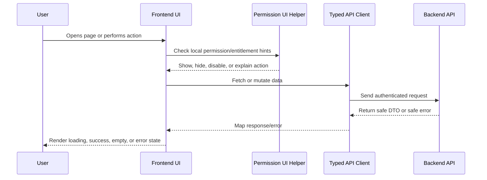

# AI Assistant Frontend Plan

> *"Defines frontend implementation plan for AI Assistant UX, reply drafts, summaries, feedback, safety labels, and human review."*

---

# Purpose

Defines frontend implementation plan for AI Assistant UX, reply drafts, summaries, feedback, safety labels, and human review.

---

# Execution Problem

AI UI that hides uncertainty or encourages blind sending can create customer trust and security issues.

---

# Engineering Decision

## Decision

AI Assistant frontend should make AI output visible, editable, rejectable, reviewable, labeled, and clearly separate from human-authored content.

## Status

Accepted.

---

# Frontend Implementation Rule

Every frontend feature must be designed as:

```text
Route/Page -> Permission-aware UI -> Data Fetching -> Safe Rendering -> User Action -> API Call -> Loading/Error/Success State
```

Frontend may improve usability with permission-aware visibility and disabled states.

Frontend must not be the final authorization layer.

Backend remains the source of truth for access control.

---

# Recommended Flow



---

# Secure-by-Design Checklist

- [ ] No secrets are exposed in frontend code.
- [ ] Backend authorization is still required.
- [ ] User-generated content is safely rendered.
- [ ] Dangerous actions use confirmation.
- [ ] AI-generated output is labeled.
- [ ] AI-generated output is editable/rejectable where customer-visible.
- [ ] Loading, empty, error, and success states are handled.
- [ ] Forms validate obvious input client-side.
- [ ] Server validation errors are displayed safely.
- [ ] Permission-denied states are safe and understandable.
- [ ] Tests cover critical user interactions.
- [ ] Accessibility basics are considered.

---

# Acceptance Criteria

- [ ] Implementation direction is clear.
- [ ] UX behavior is consistent with Book IV.
- [ ] Frontend responsibilities are separated from backend responsibilities.
- [ ] Permission-aware UI is defined without replacing backend authorization.
- [ ] Testing expectations are included.
- [ ] Security and accessibility expectations are included.
- [ ] AI coding assistants can follow this chapter safely.

---

# Anti-patterns

Avoid:

- Hiding buttons and assuming that means authorization.
- Calling APIs directly from random deeply nested components.
- Rendering raw HTML from user/customer/AI content without sanitization.
- Putting API keys or secrets in frontend environment variables.
- Duplicating table/form/modal logic across modules.
- Showing generic broken UI for every error state.
- Treating AI output as normal human-written text.
- Building complex UI builders before simple workflows work.

---

# Related Documents

- ../PART-01-Execution-Strategy/README.md
- ../PART-02-Repository-and-Development-Workflow/README.md
- ../PART-03-Backend-Implementation-Plan/README.md
- ../../BOOK-04-Product-Domain-Specification/README.md
- ../../BOOK-04-Product-Domain-Specification/BOOK-04-Master-Index/BOOK-04-PERMISSION-MAP.md
- ../../BOOK-04-Product-Domain-Specification/BOOK-04-Master-Index/BOOK-04-AI-GOVERNANCE-MAP.md

---

# Navigation

**Previous:** `59-Knowledge-Base-Frontend-Plan.md`

**Next:** `61-Workflow-Automation-Frontend-Plan.md`

---

# AI Assistant UI Rules

AI output must be:

```text
Labeled as AI-generated
Reviewable
Editable where customer-visible
Rejectable
Not automatically sent
Associated with source context where practical
Feedback-enabled where practical
```

---

# AI Reply Draft UX

Recommended states:

```text
Generate draft
Generating
Draft ready
Edited draft
Rejected draft
Sent by human
Generation failed
Permission denied
```

---

# Safety Warning

Never design AI reply UI where pressing generate also sends to customer.
