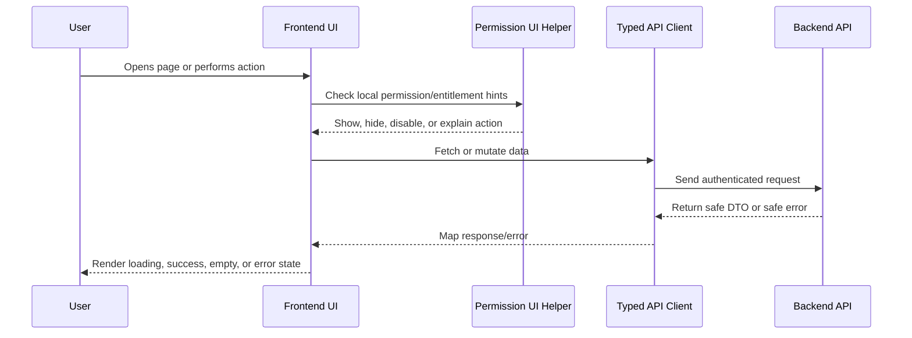

# Integrations Billing Admin Frontend Plan

> *"Defines frontend implementation plan for integrations, channels, billing/admin, entitlements, and admin controls."*

---

# Purpose

Defines frontend implementation plan for integrations, channels, billing/admin, entitlements, and admin controls.

---

# Execution Problem

Admin and integration UI can affect credentials, external data, billing, and security posture; weak UX can cause high-impact mistakes.

---

# Engineering Decision

## Decision

Admin-oriented frontend screens should expose integration status, channel configuration, organization/workspace settings, plan information, entitlement limits, and sensitive controls with clear confirmation flows.

## Status

Accepted.

---

# Frontend Implementation Rule

Every frontend feature must be designed as:

```text
Route/Page -> Permission-aware UI -> Data Fetching -> Safe Rendering -> User Action -> API Call -> Loading/Error/Success State
```

Frontend may improve usability with permission-aware visibility and disabled states.

Frontend must not be the final authorization layer.

Backend remains the source of truth for access control.

---

# Recommended Flow



---

# Secure-by-Design Checklist

- [ ] No secrets are exposed in frontend code.
- [ ] Backend authorization is still required.
- [ ] User-generated content is safely rendered.
- [ ] Dangerous actions use confirmation.
- [ ] AI-generated output is labeled.
- [ ] AI-generated output is editable/rejectable where customer-visible.
- [ ] Loading, empty, error, and success states are handled.
- [ ] Forms validate obvious input client-side.
- [ ] Server validation errors are displayed safely.
- [ ] Permission-denied states are safe and understandable.
- [ ] Tests cover critical user interactions.
- [ ] Accessibility basics are considered.

---

# Acceptance Criteria

- [ ] Implementation direction is clear.
- [ ] UX behavior is consistent with Book IV.
- [ ] Frontend responsibilities are separated from backend responsibilities.
- [ ] Permission-aware UI is defined without replacing backend authorization.
- [ ] Testing expectations are included.
- [ ] Security and accessibility expectations are included.
- [ ] AI coding assistants can follow this chapter safely.

---

# Anti-patterns

Avoid:

- Hiding buttons and assuming that means authorization.
- Calling APIs directly from random deeply nested components.
- Rendering raw HTML from user/customer/AI content without sanitization.
- Putting API keys or secrets in frontend environment variables.
- Duplicating table/form/modal logic across modules.
- Showing generic broken UI for every error state.
- Treating AI output as normal human-written text.
- Building complex UI builders before simple workflows work.

---

# Related Documents

- ../PART-01-Execution-Strategy/README.md
- ../PART-02-Repository-and-Development-Workflow/README.md
- ../PART-03-Backend-Implementation-Plan/README.md
- ../../BOOK-04-Product-Domain-Specification/README.md
- ../../BOOK-04-Product-Domain-Specification/BOOK-04-Master-Index/BOOK-04-PERMISSION-MAP.md
- ../../BOOK-04-Product-Domain-Specification/BOOK-04-Master-Index/BOOK-04-AI-GOVERNANCE-MAP.md

---

# Navigation

**Previous:** `61-Workflow-Automation-Frontend-Plan.md`

**Next:** `63-Analytics-Audit-Settings-Frontend-Plan.md`

---

# Admin Screens

MVP screens:

```text
Organization settings
Workspace settings
Members/roles link or screen
Integration/channel status
AI enable/disable control if AI exists
Plan/entitlement display
Usage limit display
```

---

# Integration UI Rules

- Show connection status.
- Show last sync/error where available.
- Never show raw secrets.
- Disconnect actions require confirmation.
- Provider errors should be clear but safe.
- Credential metadata is okay; credential values are not.

---

# Billing/Admin UI Rules

- Billing data visible only to authorized roles.
- Plan limits should explain blocked features.
- Entitlement/upgrade messages should not leak hidden internal plan logic.
