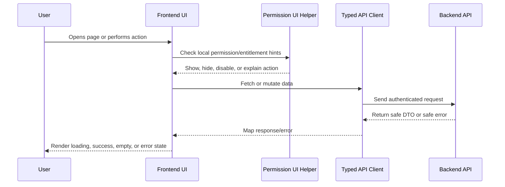

# Part 04 Summary

> *"Summarizes frontend implementation plan and defines readiness to continue into database and migration planning."*

---

# Purpose

Summarizes frontend implementation plan and defines readiness to continue into database and migration planning.

---

# Execution Problem

Database planning should follow known frontend and backend product workflows so schema design supports real user behavior.

---

# Engineering Decision

## Decision

CLARA should proceed to database and migration planning after frontend architecture, routing, app shell, data fetching, module UI plans, and frontend quality gates are defined.

## Status

Accepted.

---

# Frontend Implementation Rule

Every frontend feature must be designed as:

```text
Route/Page -> Permission-aware UI -> Data Fetching -> Safe Rendering -> User Action -> API Call -> Loading/Error/Success State
```

Frontend may improve usability with permission-aware visibility and disabled states.

Frontend must not be the final authorization layer.

Backend remains the source of truth for access control.

---

# Recommended Flow



---

# Secure-by-Design Checklist

- [ ] No secrets are exposed in frontend code.
- [ ] Backend authorization is still required.
- [ ] User-generated content is safely rendered.
- [ ] Dangerous actions use confirmation.
- [ ] AI-generated output is labeled.
- [ ] AI-generated output is editable/rejectable where customer-visible.
- [ ] Loading, empty, error, and success states are handled.
- [ ] Forms validate obvious input client-side.
- [ ] Server validation errors are displayed safely.
- [ ] Permission-denied states are safe and understandable.
- [ ] Tests cover critical user interactions.
- [ ] Accessibility basics are considered.

---

# Acceptance Criteria

- [ ] Implementation direction is clear.
- [ ] UX behavior is consistent with Book IV.
- [ ] Frontend responsibilities are separated from backend responsibilities.
- [ ] Permission-aware UI is defined without replacing backend authorization.
- [ ] Testing expectations are included.
- [ ] Security and accessibility expectations are included.
- [ ] AI coding assistants can follow this chapter safely.

---

# Anti-patterns

Avoid:

- Hiding buttons and assuming that means authorization.
- Calling APIs directly from random deeply nested components.
- Rendering raw HTML from user/customer/AI content without sanitization.
- Putting API keys or secrets in frontend environment variables.
- Duplicating table/form/modal logic across modules.
- Showing generic broken UI for every error state.
- Treating AI output as normal human-written text.
- Building complex UI builders before simple workflows work.

---

# Related Documents

- ../PART-01-Execution-Strategy/README.md
- ../PART-02-Repository-and-Development-Workflow/README.md
- ../PART-03-Backend-Implementation-Plan/README.md
- ../../BOOK-04-Product-Domain-Specification/README.md
- ../../BOOK-04-Product-Domain-Specification/BOOK-04-Master-Index/BOOK-04-PERMISSION-MAP.md
- ../../BOOK-04-Product-Domain-Specification/BOOK-04-Master-Index/BOOK-04-AI-GOVERNANCE-MAP.md

---

# Navigation

**Previous:** `64-Frontend-Testing-and-Quality.md`

**Next:** `../PART-05-Database-and-Migration-Plan/README.md`

---

# Part 04 Completion

Part 04 establishes:

- Frontend architecture strategy.
- Web app structure.
- Routing and navigation plan.
- Authenticated app shell.
- Permission-aware UI.
- Design system baseline.
- State/data fetching strategy.
- API client/error handling.
- Form validation and UX.
- UI plans for core CLARA modules.
- Frontend testing strategy.

---

# Ready for Part 05

The next part should be:

```text
BOOK V — PART 05: Database and Migration Plan
```

It should define:

- Database architecture execution.
- Schema ownership.
- Migration workflow.
- Tenant/workspace columns.
- Core table plan.
- Index strategy.
- Soft delete/archive behavior.
- Audit table/event strategy.
- Data retention.
- Seed data.
- Migration testing.
