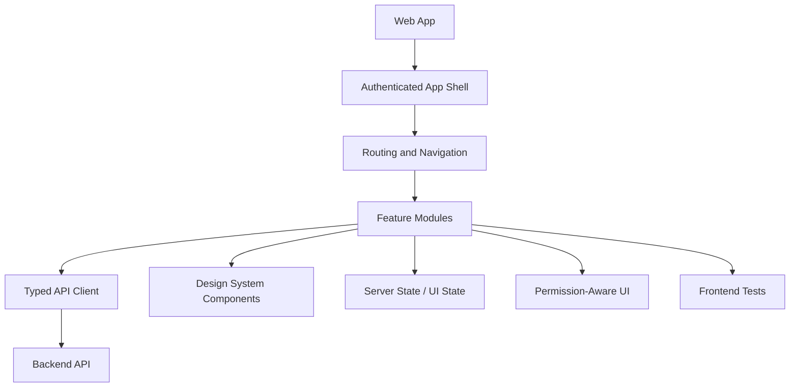

# PART-04 — Frontend Implementation Plan

> *"The frontend is where CLARA's product behavior becomes visible, usable, and trustworthy."*

---

# Purpose

Part 04 defines how CLARA frontend should be implemented.

It covers:

- Frontend architecture execution.
- Web app structure.
- Routing and navigation.
- Authenticated app shell.
- Authorization-aware UI.
- Design system and UI components.
- State management and data fetching.
- API client and error handling.
- Forms, validation, and UX.
- Customer CRM frontend plan.
- Conversations and Inbox frontend plan.
- Ticketing frontend plan.
- Knowledge Base frontend plan.
- AI Assistant frontend plan.
- Workflow Automation frontend plan.
- Integrations, Billing, and Admin frontend plan.
- Analytics, Audit, and Settings frontend plan.
- Frontend testing and quality.

---

# Chapter Map

| Chapter | Title |
|---:|---|
| 46 | Frontend Implementation Plan Overview |
| 47 | Frontend Architecture Execution |
| 48 | Web App Structure |
| 49 | Routing and Navigation Plan |
| 50 | Authenticated App Shell |
| 51 | Authorization Aware UI |
| 52 | Design System and UI Components |
| 53 | State Management and Data Fetching |
| 54 | API Client and Error Handling |
| 55 | Forms Validation and UX |
| 56 | Customer CRM Frontend Plan |
| 57 | Conversations Inbox Frontend Plan |
| 58 | Ticketing Frontend Plan |
| 59 | Knowledge Base Frontend Plan |
| 60 | AI Assistant Frontend Plan |
| 61 | Workflow Automation Frontend Plan |
| 62 | Integrations Billing Admin Frontend Plan |
| 63 | Analytics Audit Settings Frontend Plan |
| 64 | Frontend Testing and Quality |
| 65 | Part 04 Summary |

---

# Frontend Execution Map



---

# Frontend Non-Negotiables

Frontend implementation must enforce:

```text
No frontend-only authorization
No secrets in client code
Safe rendering of user-generated content
Consistent loading/empty/error states
Permission-aware actions
Accessible UI patterns
Typed API usage where possible
Human review for AI output
Clear distinction between AI-generated and human-authored content
No unsafe direct HTML rendering
```

---

# Recommended Frontend Style

For MVP, CLARA should start with:

```text
Route-driven web app
Feature-based modules
Shared design system components
Centralized API client
Server-state library/pattern
Simple local UI state
Permission-aware UI helpers
Component and critical flow tests
```

Not as:

```text
Random page-by-page code
Scattered fetch calls
Duplicated form logic
Client-side authorization only
Inline secrets/config
Unsafe HTML rendering
Unreviewed AI-generated UI patterns
```

---

# Navigation

**Previous:** `../PART-03-Backend-Implementation-Plan/45-Part-03-Summary.md`

**Next:** `46-Frontend-Implementation-Plan-Overview.md`
