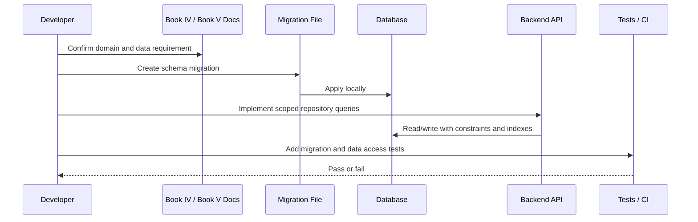

# Tenant and Workspace Data Model

> *"Defines how organization and workspace scope should be represented in database tables."*

---

# Purpose

Defines how organization and workspace scope should be represented in database tables.

---

# Execution Problem

Cross-tenant and cross-workspace leakage is one of the most severe risks in CLARA.

---

# Engineering Decision

## Decision

Tenant-scoped tables must include `organization_id`, and workspace-scoped tables must include both `organization_id` and `workspace_id` where applicable.

## Status

Accepted.

---

# Database Implementation Rule

Every database change must be designed as:

```text
Product requirement -> Data model -> Migration -> Constraints -> Indexes -> Access pattern -> Tests -> Rollback/forward-fix plan
```

Do not change schema manually in production.

Do not add tenant-scoped tables without tenant scope.

Do not store sensitive secrets as normal visible data.

---

# Recommended Data Flow



---

# Secure-by-Design Checklist

- [ ] Table ownership is clear.
- [ ] Tenant/workspace scope is included where required.
- [ ] Foreign keys are defined where practical.
- [ ] Unique constraints prevent duplicate critical records.
- [ ] Indexes support common scoped queries.
- [ ] Sensitive values are not stored raw.
- [ ] Audit impact is considered.
- [ ] Retention/deletion behavior is considered.
- [ ] Migration can be tested locally and in CI.
- [ ] Rollback or forward-fix strategy exists.
- [ ] Seed data is fake and safe.
- [ ] Cross-tenant query tests are planned.

---

# Acceptance Criteria

- [ ] Data ownership is defined.
- [ ] Table scope is clear.
- [ ] Migration strategy is clear.
- [ ] Security risks are considered.
- [ ] Query patterns are considered.
- [ ] Indexing needs are considered.
- [ ] Retention needs are considered.
- [ ] Testing expectations are included.
- [ ] AI coding assistants can follow this safely.

---

# Anti-patterns

Avoid:

- Creating global tables for tenant-specific resources.
- Returning raw database records directly to clients.
- Storing provider secrets or API keys in plain columns.
- Using JSON blobs to avoid schema design.
- Adding migrations without reviewing data impact.
- Ignoring indexes until performance breaks.
- Hard-deleting business records without retention rules.
- Using real customer data in seed or test data.
- Running destructive migrations without backup/rollback planning.

---

# Related Documents

- ../PART-03-Backend-Implementation-Plan/README.md
- ../PART-04-Frontend-Implementation-Plan/README.md
- ../../BOOK-04-Product-Domain-Specification/README.md
- ../../BOOK-04-Product-Domain-Specification/BOOK-04-Master-Index/BOOK-04-MVP-SCOPE-MAP.md
- ../../BOOK-04-Product-Domain-Specification/BOOK-04-Master-Index/BOOK-04-PERMISSION-MAP.md
- ../../BOOK-04-Product-Domain-Specification/BOOK-04-Master-Index/BOOK-04-AI-GOVERNANCE-MAP.md

---

# Navigation

**Previous:** `68-Schema-Ownership-and-Naming-Strategy.md`

**Next:** `70-Migration-Workflow.md`

---

# Tenant Scope Pattern

Organization-level table:

```text
organizations
organization_memberships
billing_accounts
organization_settings
```

Workspace-level table:

```text
customers
conversations
tickets
knowledge_articles
workflow_rules
integration_channels
```

---

# Required Query Pattern

Every workspace-scoped query should filter by:

```text
organization_id
workspace_id
resource_id if applicable
```

---

# Cross-Tenant Test Rule

Every repository/service that loads a scoped resource by ID must have a test proving that a user from another organization/workspace cannot access it.
