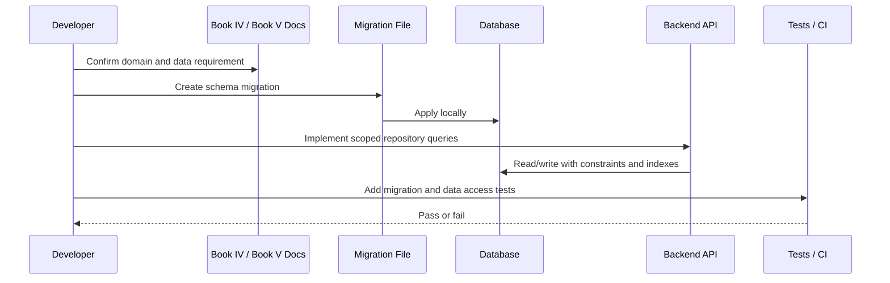

# Migration Workflow

> *"Defines how database migrations should be created, reviewed, tested, applied, and rolled back."*

---

# Purpose

Defines how database migrations should be created, reviewed, tested, applied, and rolled back.

---

# Execution Problem

Unsafe migrations can corrupt data, break deployments, lock tables, or cause irreversible production incidents.

---

# Engineering Decision

## Decision

CLARA migrations should be small, reviewed, deterministic, reversible where practical, and tested before production deployment.

## Status

Accepted.

---

# Database Implementation Rule

Every database change must be designed as:

```text
Product requirement -> Data model -> Migration -> Constraints -> Indexes -> Access pattern -> Tests -> Rollback/forward-fix plan
```

Do not change schema manually in production.

Do not add tenant-scoped tables without tenant scope.

Do not store sensitive secrets as normal visible data.

---

# Recommended Data Flow



---

# Secure-by-Design Checklist

- [ ] Table ownership is clear.
- [ ] Tenant/workspace scope is included where required.
- [ ] Foreign keys are defined where practical.
- [ ] Unique constraints prevent duplicate critical records.
- [ ] Indexes support common scoped queries.
- [ ] Sensitive values are not stored raw.
- [ ] Audit impact is considered.
- [ ] Retention/deletion behavior is considered.
- [ ] Migration can be tested locally and in CI.
- [ ] Rollback or forward-fix strategy exists.
- [ ] Seed data is fake and safe.
- [ ] Cross-tenant query tests are planned.

---

# Acceptance Criteria

- [ ] Data ownership is defined.
- [ ] Table scope is clear.
- [ ] Migration strategy is clear.
- [ ] Security risks are considered.
- [ ] Query patterns are considered.
- [ ] Indexing needs are considered.
- [ ] Retention needs are considered.
- [ ] Testing expectations are included.
- [ ] AI coding assistants can follow this safely.

---

# Anti-patterns

Avoid:

- Creating global tables for tenant-specific resources.
- Returning raw database records directly to clients.
- Storing provider secrets or API keys in plain columns.
- Using JSON blobs to avoid schema design.
- Adding migrations without reviewing data impact.
- Ignoring indexes until performance breaks.
- Hard-deleting business records without retention rules.
- Using real customer data in seed or test data.
- Running destructive migrations without backup/rollback planning.

---

# Related Documents

- ../PART-03-Backend-Implementation-Plan/README.md
- ../PART-04-Frontend-Implementation-Plan/README.md
- ../../BOOK-04-Product-Domain-Specification/README.md
- ../../BOOK-04-Product-Domain-Specification/BOOK-04-Master-Index/BOOK-04-MVP-SCOPE-MAP.md
- ../../BOOK-04-Product-Domain-Specification/BOOK-04-Master-Index/BOOK-04-PERMISSION-MAP.md
- ../../BOOK-04-Product-Domain-Specification/BOOK-04-Master-Index/BOOK-04-AI-GOVERNANCE-MAP.md

---

# Navigation

**Previous:** `69-Tenant-and-Workspace-Data-Model.md`

**Next:** `71-Core-Identity-and-Access-Tables.md`

---

# Migration Rules

- One migration should have one clear purpose.
- Migration files must be committed.
- Migrations must be reviewed in PRs.
- Migrations must run locally before merge.
- Migrations must run in CI where practical.
- Destructive migrations require special review.
- Production migrations require backup/rollback planning.

---

# Migration Naming

Use descriptive names:

```text
202607070001_create_organizations.sql
202607070002_create_workspaces.sql
202607070003_create_customers.sql
202607070004_add_customer_search_indexes.sql
```

---

# Expand-and-Contract Pattern

For risky changes:

```text
1. Add new nullable column/table
2. Backfill data safely
3. Deploy code that writes both or reads new
4. Verify
5. Remove old column/table later
```
