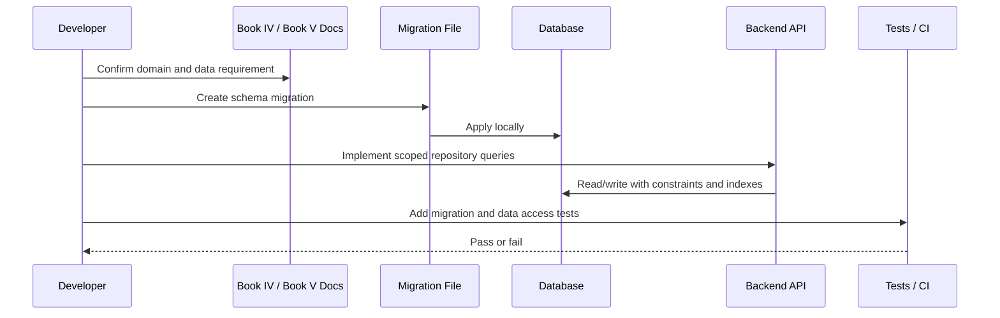

# Part 05 Summary

> *"Summarizes database and migration plan and defines readiness to continue into AI implementation planning."*

---

# Purpose

Summarizes database and migration plan and defines readiness to continue into AI implementation planning.

---

# Execution Problem

AI implementation depends on reliable data models, scoped context, knowledge eligibility, audit events, and safe retention behavior.

---

# Engineering Decision

## Decision

CLARA should proceed to AI implementation planning after database ownership, tenant scope, migrations, core data models, indexing, retention, and migration testing are defined.

## Status

Accepted.

---

# Database Implementation Rule

Every database change must be designed as:

```text
Product requirement -> Data model -> Migration -> Constraints -> Indexes -> Access pattern -> Tests -> Rollback/forward-fix plan
```

Do not change schema manually in production.

Do not add tenant-scoped tables without tenant scope.

Do not store sensitive secrets as normal visible data.

---

# Recommended Data Flow



---

# Secure-by-Design Checklist

- [ ] Table ownership is clear.
- [ ] Tenant/workspace scope is included where required.
- [ ] Foreign keys are defined where practical.
- [ ] Unique constraints prevent duplicate critical records.
- [ ] Indexes support common scoped queries.
- [ ] Sensitive values are not stored raw.
- [ ] Audit impact is considered.
- [ ] Retention/deletion behavior is considered.
- [ ] Migration can be tested locally and in CI.
- [ ] Rollback or forward-fix strategy exists.
- [ ] Seed data is fake and safe.
- [ ] Cross-tenant query tests are planned.

---

# Acceptance Criteria

- [ ] Data ownership is defined.
- [ ] Table scope is clear.
- [ ] Migration strategy is clear.
- [ ] Security risks are considered.
- [ ] Query patterns are considered.
- [ ] Indexing needs are considered.
- [ ] Retention needs are considered.
- [ ] Testing expectations are included.
- [ ] AI coding assistants can follow this safely.

---

# Anti-patterns

Avoid:

- Creating global tables for tenant-specific resources.
- Returning raw database records directly to clients.
- Storing provider secrets or API keys in plain columns.
- Using JSON blobs to avoid schema design.
- Adding migrations without reviewing data impact.
- Ignoring indexes until performance breaks.
- Hard-deleting business records without retention rules.
- Using real customer data in seed or test data.
- Running destructive migrations without backup/rollback planning.

---

# Related Documents

- ../PART-03-Backend-Implementation-Plan/README.md
- ../PART-04-Frontend-Implementation-Plan/README.md
- ../../BOOK-04-Product-Domain-Specification/README.md
- ../../BOOK-04-Product-Domain-Specification/BOOK-04-Master-Index/BOOK-04-MVP-SCOPE-MAP.md
- ../../BOOK-04-Product-Domain-Specification/BOOK-04-Master-Index/BOOK-04-PERMISSION-MAP.md
- ../../BOOK-04-Product-Domain-Specification/BOOK-04-Master-Index/BOOK-04-AI-GOVERNANCE-MAP.md

---

# Navigation

**Previous:** `84-Migration-Testing-and-Rollback-Strategy.md`

**Next:** `../PART-06-AI-Implementation-Plan/README.md`

---

# Part 05 Completion

Part 05 establishes:

- Database architecture strategy.
- Schema naming and ownership.
- Tenant/workspace scope model.
- Migration workflow.
- Core identity/access tables.
- Domain data model plans.
- Audit and analytics persistence baseline.
- Indexing strategy.
- Retention/archive/delete strategy.
- Seed/test data rules.
- Migration testing and rollback strategy.

---

# Ready for Part 06

The next part should be:

```text
BOOK V — PART 06: AI Implementation Plan
```

It should define:

- AI gateway implementation.
- Model provider abstraction.
- Prompt/template management.
- Context assembly.
- RAG/knowledge retrieval.
- AI reply drafting.
- AI summaries.
- Human review.
- Safety guardrails.
- AI audit and feedback.
- AI testing/evaluation.
- Cost and rate limits.
