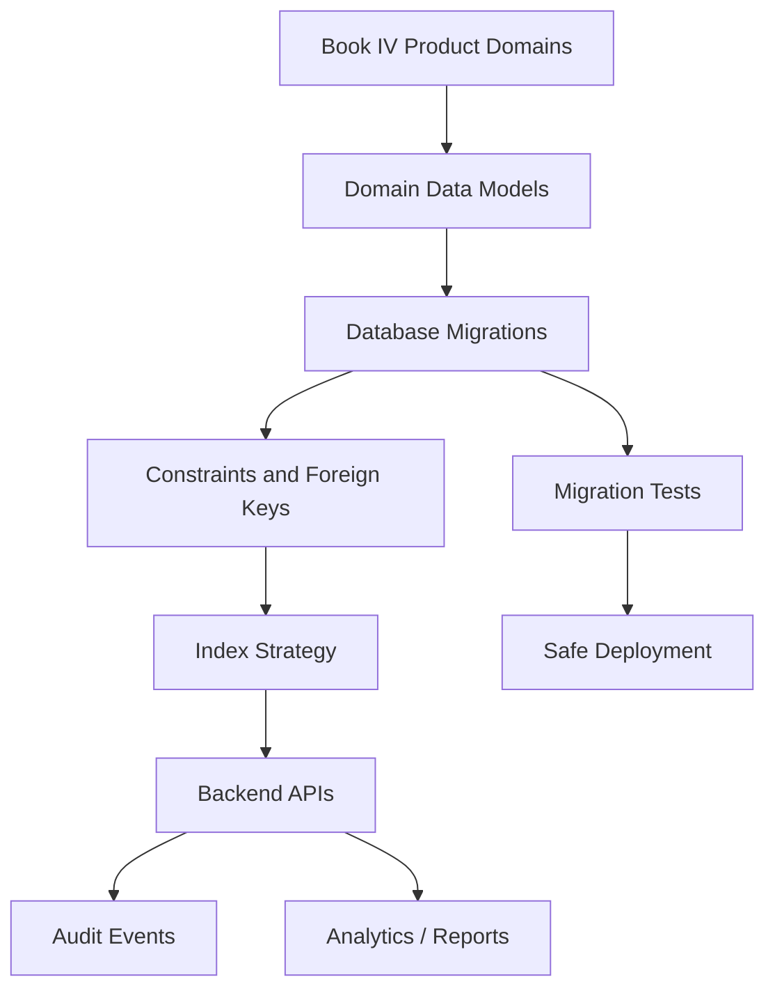

# PART-05 — Database and Migration Plan

> *"The database is not just storage. It is CLARA's trust boundary, history, and source of truth."*

---

# Purpose

Part 05 defines how CLARA database and migration work should be implemented.

It covers:

- Database architecture execution.
- Schema ownership and naming.
- Tenant and workspace data model.
- Migration workflow.
- Core identity and access tables.
- Customer CRM data model.
- Conversations and messages data model.
- Ticketing data model.
- Knowledge Base data model.
- AI data model.
- Workflow Automation data model.
- Integrations and Channels data model.
- Billing/Admin/Entitlements data model.
- Analytics/Audit/Settings data model.
- Indexing and query performance.
- Soft delete, archive, and retention.
- Seed data, fixtures, and test data.
- Migration testing and rollback.

---

# Chapter Map

| Chapter | Title |
|---:|---|
| 66 | Database and Migration Plan Overview |
| 67 | Database Architecture Execution |
| 68 | Schema Ownership and Naming Strategy |
| 69 | Tenant and Workspace Data Model |
| 70 | Migration Workflow |
| 71 | Core Identity and Access Tables |
| 72 | Customer CRM Data Model Plan |
| 73 | Conversations and Messages Data Model Plan |
| 74 | Ticketing Data Model Plan |
| 75 | Knowledge Base Data Model Plan |
| 76 | AI Data Model Plan |
| 77 | Workflow Automation Data Model Plan |
| 78 | Integrations and Channels Data Model Plan |
| 79 | Billing Admin Entitlements Data Model Plan |
| 80 | Analytics Audit Settings Data Model Plan |
| 81 | Indexing and Query Performance Strategy |
| 82 | Soft Delete Archive and Retention Strategy |
| 83 | Seed Data Fixtures and Test Data Strategy |
| 84 | Migration Testing and Rollback Strategy |
| 85 | Part 05 Summary |

---

# Database Execution Map



---

# Database Non-Negotiables

Database implementation must enforce:

```text
organization_id on tenant-scoped records
workspace_id on workspace-scoped records
foreign keys where practical
unique constraints for identity/external references
indexes for common access patterns
safe migration workflow
no raw secrets in normal tables
audit event persistence
privacy-aware retention design
deterministic seed/test data
migration testing before deployment
```

---

# Recommended Database Style

For MVP, CLARA should start with:

```text
Relational database
Migration-first schema changes
Domain-owned tables
Explicit tenant/workspace columns
Consistent timestamps
Soft-delete/archive fields where needed
Audit event table
Safe external reference tables
Indexes based on access patterns
```

Not as:

```text
Ad-hoc schema changes
Unscoped global records
Raw JSON blobs for everything
No foreign keys
No migration history
No audit persistence
Real customer data in development
Raw credential values in database config
```

---

# Navigation

**Previous:** `../PART-04-Frontend-Implementation-Plan/65-Part-04-Summary.md`

**Next:** `66-Database-and-Migration-Plan-Overview.md`
