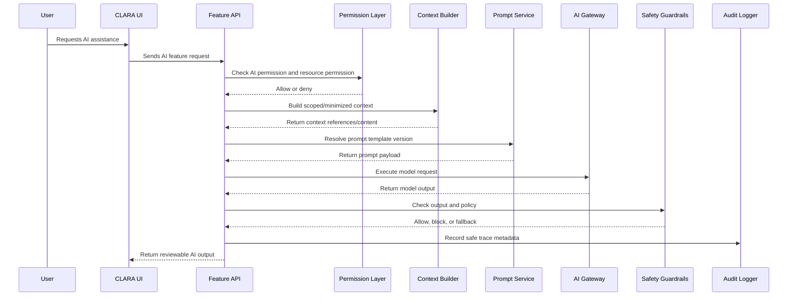

# Part 06 Summary

> *"Summarizes AI implementation plan and defines readiness to continue into integration implementation planning."*

---

# Purpose

Summarizes AI implementation plan and defines readiness to continue into integration implementation planning.

---

# Execution Problem

Integrations should be planned after AI boundaries because channels, webhooks, and external systems may become AI context sources or AI-assisted action targets.

---

# Engineering Decision

## Decision

CLARA should proceed to integration implementation planning after AI Gateway, provider abstraction, prompts, context, RAG, review, safety, audit, evaluation, cost, privacy, and monitoring are defined.

## Status

Accepted.

---

# AI Implementation Rule

Every AI feature must be designed as:

```text
User Intent -> AI Permission -> Resource Permission -> Scoped Context -> Prompt Template -> AI Gateway -> Safety Checks -> Human Review -> Audit/Feedback
```

Do not call model providers directly from UI.

Do not call model providers directly from random product services.

Do not allow AI to access data the actor cannot access.

---

# Recommended Flow



---

# Secure-by-Design Checklist

- [ ] AI feature permission is checked.
- [ ] Underlying resource permission is checked.
- [ ] Organization scope is enforced.
- [ ] Workspace scope is enforced.
- [ ] Context sources are explicit.
- [ ] Sensitive data is minimized or redacted.
- [ ] Prompt template version is recorded.
- [ ] Provider/model metadata is recorded safely.
- [ ] Output is labeled as AI-generated.
- [ ] Human review is required where customer-visible or sensitive.
- [ ] Audit event is emitted where required.
- [ ] Feedback path exists where practical.
- [ ] Cost/rate limit is considered.
- [ ] Failure fallback is safe.

---

# Acceptance Criteria

- [ ] Implementation direction is clear.
- [ ] AI behavior is aligned with Book IV.
- [ ] Security boundaries are explicit.
- [ ] Audit and traceability are considered.
- [ ] Human review behavior is defined.
- [ ] Testing expectations are included.
- [ ] AI coding assistants can follow this safely.

---

# Anti-patterns

Avoid:

- Direct AI provider calls from frontend.
- Direct AI provider calls from random product modules.
- AI context without permission checks.
- Sending full customer history by default.
- Storing full prompts/outputs without policy.
- Auto-sending AI replies.
- Letting AI execute destructive actions without approval.
- Treating AI output as verified truth.
- Logging secrets, tokens, hidden prompts, or private context.
- Expanding autonomy before evaluation and audit exist.

---

# Related Documents

- ../PART-03-Backend-Implementation-Plan/README.md
- ../PART-05-Database-and-Migration-Plan/README.md
- ../../BOOK-04-Product-Domain-Specification/PART-07-Knowledge-Base/README.md
- ../../BOOK-04-Product-Domain-Specification/PART-08-AI-Assistant-Product/README.md
- ../../BOOK-04-Product-Domain-Specification/BOOK-04-Master-Index/BOOK-04-AI-GOVERNANCE-MAP.md
- ../../BOOK-04-Product-Domain-Specification/BOOK-04-Master-Index/BOOK-04-PERMISSION-MAP.md

---

# Navigation

**Previous:** `104-AI-Monitoring-Fallback-and-Incident-Handling.md`

**Next:** `../PART-07-Integration-Implementation-Plan/README.md`

---

# Part 06 Completion

Part 06 establishes:

- AI Gateway architecture.
- Model provider abstraction.
- Prompt template management.
- Context assembly.
- RAG implementation.
- Reply drafting.
- Summaries.
- Classification/extraction.
- Tool actions.
- Human review.
- Safety guardrails.
- Permissions and scope enforcement.
- Audit and traceability.
- Feedback and evaluation.
- Testing and red-team strategy.
- Cost/rate-limit/quota control.
- Privacy and retention.
- Monitoring and fallback behavior.

---

# Ready for Part 07

The next part should be:

```text
BOOK V — PART 07: Integration Implementation Plan
```

It should define:

- Integration gateway.
- Provider adapter pattern.
- Webhook ingestion.
- Outbound webhook delivery.
- Credential handling.
- Channel adapters.
- Idempotency.
- Retry/dead-letter behavior.
- Integration observability.
- Security testing for external inputs.
