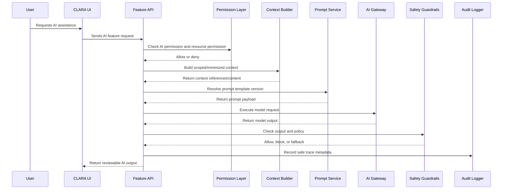

# AI Context Assembly

> *"Defines how CLARA builds scoped AI context from customers, conversations, tickets, knowledge, user intent, and workspace settings."*

---

# Purpose

Defines how CLARA builds scoped AI context from customers, conversations, tickets, knowledge, user intent, and workspace settings.

---

# Execution Problem

AI context is where most AI data leakage risk happens if resource boundaries are not enforced.

---

# Engineering Decision

## Decision

AI context assembly must be explicit, permission-checked, scoped, minimized, and traceable.

## Status

Accepted.

---

# AI Implementation Rule

Every AI feature must be designed as:

```text
User Intent -> AI Permission -> Resource Permission -> Scoped Context -> Prompt Template -> AI Gateway -> Safety Checks -> Human Review -> Audit/Feedback
```

Do not call model providers directly from UI.

Do not call model providers directly from random product services.

Do not allow AI to access data the actor cannot access.

---

# Recommended Flow



---

# Secure-by-Design Checklist

- [ ] AI feature permission is checked.
- [ ] Underlying resource permission is checked.
- [ ] Organization scope is enforced.
- [ ] Workspace scope is enforced.
- [ ] Context sources are explicit.
- [ ] Sensitive data is minimized or redacted.
- [ ] Prompt template version is recorded.
- [ ] Provider/model metadata is recorded safely.
- [ ] Output is labeled as AI-generated.
- [ ] Human review is required where customer-visible or sensitive.
- [ ] Audit event is emitted where required.
- [ ] Feedback path exists where practical.
- [ ] Cost/rate limit is considered.
- [ ] Failure fallback is safe.

---

# Acceptance Criteria

- [ ] Implementation direction is clear.
- [ ] AI behavior is aligned with Book IV.
- [ ] Security boundaries are explicit.
- [ ] Audit and traceability are considered.
- [ ] Human review behavior is defined.
- [ ] Testing expectations are included.
- [ ] AI coding assistants can follow this safely.

---

# Anti-patterns

Avoid:

- Direct AI provider calls from frontend.
- Direct AI provider calls from random product modules.
- AI context without permission checks.
- Sending full customer history by default.
- Storing full prompts/outputs without policy.
- Auto-sending AI replies.
- Letting AI execute destructive actions without approval.
- Treating AI output as verified truth.
- Logging secrets, tokens, hidden prompts, or private context.
- Expanding autonomy before evaluation and audit exist.

---

# Related Documents

- ../PART-03-Backend-Implementation-Plan/README.md
- ../PART-05-Database-and-Migration-Plan/README.md
- ../../BOOK-04-Product-Domain-Specification/PART-07-Knowledge-Base/README.md
- ../../BOOK-04-Product-Domain-Specification/PART-08-AI-Assistant-Product/README.md
- ../../BOOK-04-Product-Domain-Specification/BOOK-04-Master-Index/BOOK-04-AI-GOVERNANCE-MAP.md
- ../../BOOK-04-Product-Domain-Specification/BOOK-04-Master-Index/BOOK-04-PERMISSION-MAP.md

---

# Navigation

**Previous:** `89-Prompt-Template-Management.md`

**Next:** `91-Knowledge-Retrieval-and-RAG-Implementation.md`

---

# Context Sources

Possible context sources:

```text
current conversation
recent messages
customer profile summary
ticket summary
published knowledge articles
workspace settings
brand/tone policy
user instruction for current request
```

---

# Context Assembly Rules

- Fetch only what is needed.
- Check permission for every resource.
- Respect organization/workspace scope.
- Prefer summaries over full raw histories where practical.
- Redact secrets and unnecessary PII.
- Record context references for audit.
- Apply token budget limits.

---

# Context Leakage Test

Every AI feature must have tests or checks for:

```text
wrong organization
wrong workspace
unauthorized customer
unauthorized conversation
private/draft knowledge
```
